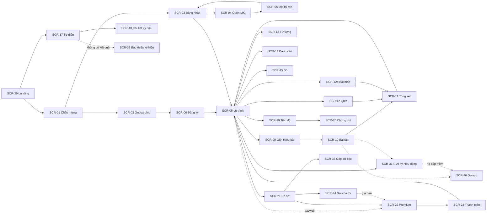

# FSD — Đặc tả chức năng theo màn hình — SignLight

| Phiên bản | **v0.2** | Ngày | 2026-09-20 | Trạng thái | DRAFT — chờ GATE-3 |
|-----------|------|------|------------|------------|---------------------|

**Thay đổi so với v0.1:** thêm **5 màn hình** cho module AI và các chức năng mới (SCR-31→35) · viết lại
SCR-22/23/24 cho **VNPay + MoMo không tự động gia hạn** · sửa SCR-08/10/13 theo khảo sát thực tế (BRD §9).

**Tiền đề:** `docs/ba/SRS.md` v0.2 (nguồn sự thật về YÊU CẦU), `docs/design/design.md`, `docs/sa/api-spec.md` v0.2

> **Ranh giới với SRS:** FSD **tham chiếu FR-ID/BR-ID, không chép lại** quy tắc nghiệp vụ hay bảng validate.
> Mâu thuẫn với SRS → **SRS thắng**, phải cập nhật SRS (qua PO) trước rồi mới sửa FSD.

---

## 1. Giới thiệu

**Mục đích.** Đặc tả **hành vi trên màn hình** của các FR trong `SRS.md`: element, tương tác, điều hướng,
trạng thái UI, ánh xạ mã lỗi → thông điệp hiển thị, và ma trận truy vết FR ↔ SCR ↔ API ↔ dữ liệu.

**Phạm vi.** **35 màn hình**, phủ **FR-01 → FR-46** (trừ FR-32 webhook và FR-40 nhật ký — không có giao diện
người học; FR-32 có mặt gián tiếp qua SCR-23).

**Thuật ngữ bổ sung:** *Khay phản hồi* = vùng trượt lên từ đáy màn sau khi chấm câu trả lời.
*Màn giới thiệu Premium* = SCR-22, hiển thị thay cho màn lỗi khi bị chặn paywall.

## 2. Bản đồ chức năng & màn hình

| Mã | Tên màn hình | Chức năng phủ (FR) | Vai trò truy cập |
|----|--------------|--------------------|------------------|
| SCR-01 | Chào mừng (app shell) | FR-05 | GUEST |
| SCR-02 | Onboarding 11 bước | FR-05 | GUEST |
| SCR-03 | Đăng nhập | FR-02, FR-03 | GUEST |
| SCR-04 | Quên mật khẩu | FR-04 | GUEST |
| SCR-05 | Đặt lại mật khẩu | FR-04 | GUEST (có token) |
| SCR-06 | Đăng ký (bước 9–11 của onboarding) | FR-01 | GUEST |
| SCR-07 | Xác thực email | FR-01 | GUEST/LEARNER |
| SCR-08 | Lộ trình học | FR-09, FR-10 | LEARNER |
| SCR-09 | Giới thiệu bài học | FR-11 | LEARNER |
| SCR-10 | Bài tập | FR-11, FR-12 | LEARNER |
| SCR-11 | Tổng kết bài học | FR-15, FR-16, FR-23, FR-25 | LEARNER |
| SCR-12 | Quiz cuối chương | FR-13 | LEARNER |
| SCR-12b | Bài mốc | FR-14 | LEARNER |
| SCR-13 | Trainer — từ vựng | FR-17 | LEARNER |
| SCR-14 | Trainer — đánh vần (camera) | FR-18 | LEARNER |
| SCR-15 | Trainer — số | FR-19 | LEARNER |
| SCR-16 | Chế độ Gương | FR-20 | LEARNER |
| SCR-17 | Từ điển — tìm kiếm | FR-21 | GUEST (hạn mức) / LEARNER |
| SCR-18 | Từ điển — chi tiết ký hiệu | FR-22 | GUEST / LEARNER |
| SCR-19 | Trang tiến độ | FR-23, FR-24, FR-25, FR-26 | LEARNER |
| SCR-20 | Chứng chỉ | FR-27 | PREMIUM |
| SCR-21 | Hồ sơ & cài đặt | FR-06, 07, 08, 10, 24, 39 | LEARNER |
| SCR-22 | Giới thiệu & bảng giá Premium | FR-28, FR-30 | LEARNER |
| SCR-23 | Thanh toán / đang xử lý | FR-29 (+ FR-32 gián tiếp) | LEARNER |
| SCR-24 | Gói của tôi (gia hạn & lịch sử giao dịch) | FR-31 | LEARNER |
| SCR-25 | CMS — quản lý ký hiệu | FR-33 | CONTENT_EDITOR+ |
| SCR-26 | CMS — soạn bài học & bài tập | FR-34 | CONTENT_EDITOR+ |
| SCR-27 | CMS — hàng đợi duyệt | FR-35 | CONTENT_APPROVER |
| SCR-28 | CMS — tra cứu CSKH | FR-36 | SUPPORT |
| SCR-29 | Landing & blog | FR-37 | công khai |
| SCR-30 | Form liên hệ doanh nghiệp | FR-38 | công khai |
| **SCR-31** 🤖 | **Luyện ký hiệu động với AI** | **FR-41, FR-42, FR-43** | LEARNER |
| **SCR-32** | **Báo thiếu ký hiệu** | **FR-45** | LEARNER |
| **SCR-33** | **Cài đặt góp dữ liệu luyện tập** | **FR-46** | LEARNER |
| **SCR-34** | **CMS — Vốn ký hiệu AI & nhãn mồ côi** | **FR-44** | CONTENT_EDITOR+ |
| **SCR-35** | **CMS — Yêu cầu bổ sung ký hiệu** | **FR-45** | CONTENT_EDITOR+ |

## 3. Đặc tả từng màn hình

---

### SCR-02 — Onboarding 11 bước *(phủ FR-05)*

- **Wireframe:** `design.md` §3 UC-01 · **Tiền điều kiện vào màn:** chưa đăng nhập, hoặc người dùng mới chưa hoàn tất onboarding.

- **Bảng element:**

  | # | Element | Loại | Hành vi / điều kiện hiển thị·enable | Nguồn dữ liệu / API | Validate hiển thị (ref SRS) | Thông báo trên UI |
  |---|---------|------|--------------------------------------|---------------------|------------------------------|--------------------|
  | 1 | Thanh tiến trình `n/11` | progress | Luôn hiện ở đầu màn; cập nhật mỗi bước | cục bộ | — | — |
  | 2 | Nút ← Quay lại | icon button | Ẩn ở bước 1; giữ nguyên lựa chọn đã chọn khi quay lại | cục bộ | — | — |
  | 3 | Danh sách khoá (bước 2) | radio list | Khoá `PUBLISHED` bật; khoá khác hiện nhãn **"Sắp có"** và **disable** | `GET /courses` | — | — |
  | 4 | Lưới 7 lý do học (bước 4) | radio grid | Chọn 1; chọn xong mới bật nút "Tiếp" | cục bộ | FR-05 bảng validate | — |
  | 5 | 4 thẻ mục tiêu phút (bước 6) | radio cards | 5/10/15/20; nút ghi **"Cam kết mục tiêu"** | cục bộ | FR-05 bảng validate | — |
  | 6 | Màn dựng lộ trình (bước 8) | loading | Hiện tối đa **3 giây**; quá 3 giây **vẫn phải đi tiếp được** | `POST /onboarding/answers` | — | — |
  | 7 | Ô nhập Tên (bước 9) | input | Nút "Tiếp" **disable** khi rỗng | cục bộ | FR-01 bảng validate | "Tên hiển thị phải từ 2 đến 50 ký tự." |
  | 8 | Ô nhập Email (bước 10) | input | Kiểm định dạng khi rời ô | cục bộ | FR-01 bảng validate | "Email không đúng định dạng." |
  | 9 | Ô Mật khẩu + thang độ mạnh (bước 11) | input | Hiện/ẩn mật khẩu; thang 4 mức | cục bộ | FR-01 bảng validate | "Mật khẩu phải từ 10 đến 128 ký tự, gồm cả chữ và số." |
  | 10 | Checkbox Điều khoản (bước 11) | checkbox | Nút "Tạo tài khoản" disable tới khi tick | — | FR-01 bảng validate | "Bạn cần đồng ý Điều khoản sử dụng để tiếp tục." |
  | 11 | Nút hành động chính | button | Nhãn đổi theo bước: "Chọn ngôn ngữ" → "Tiếp" → "Cam kết mục tiêu" → "Tạo tài khoản" | — | — | — |

- **Luồng thao tác trên màn hình (UI flow)** — *bám FR-05*:

  | # | Người dùng thao tác | Màn hình phản hồi | API gọi | Điều hướng |
  |---|---------------------|-------------------|---------|------------|
  | 1 | Mở SCR-01, bấm "Bắt đầu" | Vào bước 1/11 | — | SCR-02 |
  | 2 | Chọn khoá (bước 2), bấm "Tiếp" | Lưu tạm, sang bước 3 | `POST /onboarding/answers` (currentStep=2) | — |
  | 3 | Chọn lý do (bước 4), bấm "Tiếp" | Sang bước 5 | `POST /onboarding/answers` | — |
  | 4 | Chọn mục tiêu (bước 6), bấm "Cam kết mục tiêu" | Sang bước 7, hiện dự báo theo đúng mục tiêu vừa chọn | `POST /onboarding/answers` | — |
  | 5 | Bấm "Tiếp" (bước 7) | Màn dựng lộ trình ≤ 3s | — | — |
  | 6 | Nhập tên/email/mật khẩu (bước 9–11), tick Điều khoản, bấm "Tạo tài khoản" | Spinner trên nút | `POST /auth/register` | SCR-08 |

- **Luồng thay thế / ngoại lệ trên UI:**
  - 2a. Chọn khoá "Sắp có" → thẻ không bấm được, hiện chú thích nhỏ "Khoá này đang được xây dựng".
  - 6a. errorCode `01102` → hiện lỗi **ngay dưới ô mật khẩu**, **giữ nguyên bước 11**, không mất dữ liệu đã nhập.
  - 6b. errorCode `01103` → tick đỏ ở checkbox + chữ lỗi.
  - 6c. errorCode `00105` (429) → hộp thoại "Bạn thao tác quá nhanh, vui lòng thử lại sau {Retry-After} phút." + nút Đóng.
  - 6d. **Email đã tồn tại** → theo AC-01.2, giao diện **không biết** điều này; hiển thị **như thành công** và vào SCR-08. *(Người dùng sẽ nhận email hướng dẫn đăng nhập.)*
  - 6e. Mất mạng → toast "Không có kết nối. Dữ liệu của bạn đã được lưu tạm." + nút "Thử lại"; giữ nguyên bước.
  - 7a. Quay lại sau **> 24 giờ** (token hết hạn, `00404` ở `GET /onboarding/answers/{token}`) → bắt đầu lại bước 1, hiện chú thích "Phiên trước đã hết hạn, mời bạn chọn lại."

- **Trạng thái UI:** Loading: skeleton danh sách khoá · Empty: không áp dụng · Lỗi: banner có nút "Thử lại" · Thành công: chuyển thẳng SCR-08, không toast (đã có màn chào).
- **Phân quyền hiển thị:** chỉ GUEST; người đã đăng nhập vào URL này → điều hướng thẳng SCR-08.

---

### SCR-08 — Lộ trình học *(phủ FR-09, FR-10)*

- **Wireframe:** `design.md` §4 SCR-08 · **Tiền điều kiện:** đã đăng nhập, có `activeCourseId`.

- **Bảng element:**

  | # | Element | Loại | Hành vi / điều kiện | Nguồn dữ liệu / API | Validate | Thông báo trên UI |
  |---|---------|------|----------------------|---------------------|----------|--------------------|
  | 1 | Huy hiệu streak (🔥 n) | badge | Hiện `streak.current`; **kèm chữ "n ngày"** (a11y) | `GET /progress/overview` | — | — |
  | 2 | Vòng mục tiêu ngày | progress ring | `today.minutes / today.goalMinutes`; đạt → dấu ✓ + chữ "Đã đạt" | `GET /progress/overview` | — | — |
  | 3 | Thẻ Unit | card | Hiện tên + sao mốc; Unit Premium có viền + nhãn 🔒 | `GET /courses/{id}/path` | — | — |
  | 4 | Hàng bài học | list item | 4 trạng thái: ✓ xong (kèm %) · ▶ đang ở đây · ○ mở · 🔒 khoá | idem | — | — |
  | 5 | Bài khoá do chưa học bài trước | list item | **Disable**, biểu tượng ổ khoá xám | idem (`locked: true`) | — | tooltip "Hoàn thành bài trước để mở bài này" |
  | 6 | Bài khoá do Premium | list item | **Vẫn đọc được tên bài** (BR-A14); bấm được | idem (`premiumLocked: true`) | — | — |
  | 7 | Nút "Tiếp tục học" | button primary | Trỏ `nextLessonId`; ẩn nếu đã hoàn thành toàn khoá | idem | — | — |
  | 8 | Bộ chọn khoá (⇄) | dropdown | Đổi khoá đang học | `PATCH /me/preferences` | — | — |
  | 9 | Thanh điều hướng dưới | tab bar | Học · Luyện · Từ điển · Tiến độ | — | — | — |

- **Luồng thao tác** — *bám FR-09*:

  | # | Người dùng thao tác | Màn hình phản hồi | API gọi | Điều hướng |
  |---|---------------------|-------------------|---------|------------|
  | 1 | Mở màn | Skeleton → cây lộ trình, cuộn tới bài đang học | `GET /courses/{courseId}/path` + `GET /progress/overview` | — |
  | 2 | Bấm "Tiếp tục học" | — | — | SCR-09 (`nextLessonId`) |
  | 3 | Bấm một bài đã mở | — | — | SCR-09 |
  | 4 | Bấm bài khoá Premium | — | — | **SCR-22** (không phải màn lỗi) |
  | 5 | Đổi khoá ở bộ chọn | Tải lại toàn bộ cây | `PATCH /me/preferences` → `GET .../path` | ở lại SCR-08 |

- **Luồng thay thế / ngoại lệ trên UI:**
  - 3a. Bài `locked: true` → không điều hướng; hiện tooltip/toast "Hoàn thành bài trước để mở bài này".
  - 4a. Nếu người dùng gọi thẳng URL bài Premium → API trả `06203` → điều hướng SCR-22 kèm ngữ cảnh bài đó.
  - 1a. errorCode `02201` (khoá chưa xuất bản) → trạng thái rỗng "Khoá học này chưa sẵn sàng" + nút đổi khoá.
  - 5a. Đổi khoá → **nhắc rõ**: "Tiến độ khoá {A} được giữ nguyên, bạn quay lại bất cứ lúc nào." *(giảm khiếu nại 'mất tiến độ' — BR-A15)*

- **Trạng thái UI:** Loading: skeleton 3 Unit · Empty: "Khoá học đang được xây dựng" + nút đổi khoá · Lỗi mạng: banner + nút "Thử lại", giữ dữ liệu cache gần nhất · Thành công: —
- **Phân quyền hiển thị:** `LEARNER_FREE` thấy ổ khoá Premium; `LEARNER_PREMIUM` không thấy ổ khoá nào.

---

### SCR-10 — Bài tập *(phủ FR-11, FR-12)*

- **Wireframe:** `design.md` §4 SCR-10 · **Tiền điều kiện:** bài đã mở khoá và đủ quyền paywall.

- **Bảng element:**

  | # | Element | Loại | Hành vi / điều kiện | Nguồn dữ liệu / API | Validate (ref SRS) | Thông báo trên UI |
  |---|---------|------|----------------------|---------------------|--------------------|--------------------|
  | 1 | Thanh tiến trình `i/n` | progress | Cả **thanh và số** | `GET /lessons/{id}` | — | — |
  | 2 | Nút ✕ thoát | icon button | Mở hộp thoại xác nhận | — | — | "Thoát bài học? Tiến độ câu đã làm được giữ lại." |
  | 3 | Trình phát video | player | Tự phát 1 lần, **không lặp vô hạn**; điều khiển luôn hiện trên mobile | `exercises[].videoUrl` | — | "Không tải được video" + nút Thử lại |
  | 4 | Nút 🐢 chậm 0.5× | toggle | Sáng lên khi bật; **nhớ theo người dùng** | `PATCH /me/preferences` (`videoSpeed`) | FR-11 ràng buộc tốc độ | — |
  | 5 | Nút ↻ lặp đoạn | button | Phát lại video hiện tại | — | — | — |
  | 6 | 4 thẻ đáp án | option cards | Chọn 1 → bật nút "Kiểm tra"; sau khi chấm thì **disable toàn bộ** | `exercises[].options[]` (**không có `isCorrect`**) | FR-12 bảng validate | — |
  | 7 | Ô gõ đáp án | input | Chỉ với `TYPE_WHAT_YOU_SEE`; tối đa 200 ký tự | — | FR-12 bảng validate | "Vui lòng nhập câu trả lời (tối đa 200 ký tự)." |
  | 8 | Thẻ từ kéo-thả | drag list | Chỉ với `SENTENCE_ORDER`; hỗ trợ **bàn phím** (mũi tên + Space) | `exercises[].tokens[]` | FR-12 bảng validate | "Thứ tự câu chưa hợp lệ." |
  | 9 | Khung camera nhúng | camera | Chỉ với `FINGERSPELL_RECOGNITION`; xem SCR-14 | cục bộ | FR-18 bảng validate | — |
  | 10 | Nút "Kiểm tra" | button primary | Disable tới khi có câu trả lời | `POST .../answer` | — | — |
  | 11 | Khay phản hồi | sheet | Trượt lên sau khi chấm; **biểu tượng + chữ + video đáp án** | response của bước 10 | — | ✓ "Chính xác" / ✗ "Chưa đúng" |
  | 12 | Nút "Tiếp tục" | button | Trong khay phản hồi | — | — | — |

- **Luồng thao tác** — *bám FR-12 luồng chính*:

  | # | Người dùng thao tác | Màn hình phản hồi | API gọi | Điều hướng |
  |---|---------------------|-------------------|---------|------------|
  | 1 | Vào màn | Tải bài tập, nhảy tới `resumeAtIndex` | `GET /lessons/{lessonId}` | — |
  | 2 | Xem video, chọn đáp án | Thẻ được chọn đổi nền + dấu ✓; bật "Kiểm tra" | — | — |
  | 3 | Bấm "Kiểm tra" | Nút sang trạng thái loading; khay phản hồi trượt lên | `POST /lessons/{id}/exercises/{eid}/answer` | — |
  | 4 | Bấm "Tiếp tục" | Sang câu kế; nếu `willRepeat` thì câu này được xếp lại cuối hàng đợi | — | — |
  | 5 | Trả lời câu cuối | Gửi hoàn thành bài | `POST /lessons/{id}/complete` | SCR-11 |

- **Luồng thay thế / ngoại lệ trên UI:**
  - 3a. errorCode `03201` (bài chưa mở khoá) → toast "Bạn cần hoàn thành bài trước đó." → điều hướng SCR-08.
  - 3b. errorCode `06203` (cần Premium) → điều hướng **SCR-22**.
  - 3c. errorCode `03102` → toast "Loại câu trả lời không khớp bài tập." + tải lại bài tập *(lỗi này chỉ xảy ra khi client lệch phiên bản)*.
  - 3d. Mất mạng → lưu câu trả lời vào hàng đợi cục bộ, hiện biểu tượng "⟳ sẽ đồng bộ", **cho phép làm tiếp**; đồng bộ lại khi có mạng (FR-12 3a).
  - 9a. Camera bị từ chối ở câu `FINGERSPELL_RECOGNITION` → **tự chuyển** sang chế độ tự đánh giá với 2 nút "Tôi làm được" / "Cho tôi xem lại"; **không chặn bài học** (BR-A18).
  - 2a. Bấm ✕ thoát → hộp thoại xác nhận; đồng ý → lưu `IN_PROGRESS` + chỉ số câu → SCR-08.

- **Trạng thái UI:** Loading: khung xương video + 4 ô đáp án · Empty: không áp dụng · Lỗi video: khung tối + "Không tải được video" + nút Thử lại (không chặn câu hỏi nếu còn chữ) · Thành công: khay phản hồi xanh + chữ "Chính xác".
- **Phân quyền hiển thị:** chỉ chủ tài khoản; không có chế độ xem của người khác.

---

### SCR-14 — Trainer đánh vần (camera) *(phủ FR-18)*

- **Wireframe:** `design.md` §4 SCR-14 · **Tiền điều kiện:** đã đăng nhập.

- **Bảng element:**

  | # | Element | Loại | Hành vi / điều kiện | Nguồn dữ liệu / API | Validate (ref SRS) | Thông báo trên UI |
  |---|---------|------|----------------------|---------------------|--------------------|--------------------|
  | 1 | Màn giải thích quyền camera | screen | **Hiện TRƯỚC khi trình duyệt hỏi quyền** (BR-A38); chỉ hiện lần đầu | cục bộ | — | "Camera chỉ chạy trên máy bạn. Hình ảnh không được gửi đi đâu cả." |
  | 2 | Nút "Bật camera" | button primary | Gọi `getUserMedia` | — | — | — |
  | 3 | Thanh tải mô hình | progress | Hiện khi tải mô hình lần đầu (≤ 5 MB), sau đó dùng cache | `GET /practice/fingerspell/session` (`modelUrl`) | — | "Đang chuẩn bị bộ nhận dạng…" |
  | 4 | Video mẫu chữ cái | player | Kèm nút 🐢 | `letters[].videoUrl` | — | — |
  | 5 | Khung camera (đã lật gương) | camera | Nền tối `--bg-video`; **đèn báo camera đang bật** | luồng cục bộ | — | — |
  | 6 | Thanh độ tin cậy | progress | Cập nhật ≥ 15 khung hình/giây; **cục bộ, không gọi API** | suy luận tại chỗ | — | `aria-live`: "Đang nhận dạng…" |
  | 7 | Dòng cam kết riêng tư | text | **Luôn hiển thị** trong suốt phiên | — | — | "🔒 Hình ảnh camera chỉ xử lý trên máy bạn" |
  | 8 | Nút "Xem lại cách ký hiệu" | button | Hiện sau 20 giây chưa đạt | — | — | — |
  | 9 | Nút "Bỏ qua chữ này" | button | Hiện sau 20 giây chưa đạt | — | — | — |
  | 10 | Nút "Dùng chế độ tự đánh giá" | button | Hiện khi từ chối quyền / không có camera / trình duyệt không hỗ trợ | — | — | — |

- **Luồng thao tác** — *bám FR-18 luồng chính*:

  | # | Người dùng thao tác | Màn hình phản hồi | API gọi | Điều hướng |
  |---|---------------------|-------------------|---------|------------|
  | 1 | Mở Trainer đánh vần | Màn giải thích quyền | `GET /practice/fingerspell/session` | — |
  | 2 | Bấm "Bật camera", cấp quyền | Tải mô hình → hiện khung camera | — | — |
  | 3 | — | Hiện chữ mục tiêu + đếm ngược 3 giây | — | — |
  | 4 | Tạo hình tay | Thanh tin cậy chạy theo thời gian thực | **không gọi API** | — |
  | 5 | Giữ đúng ≥ 1 giây | ✓ "Chính xác" + chuyển chữ kế | `POST /practice/fingerspell/attempt` | — |
  | 6 | Hết bộ chữ | Màn tổng kết: chữ đúng / chữ cần luyện | — | SCR-13 hoặc SCR-08 |

- **Luồng thay thế / ngoại lệ trên UI:**
  - 2a. **Từ chối quyền** → màn hướng dẫn bật lại quyền theo trình duyệt + nút "Dùng chế độ tự đánh giá". **Không hỏi quyền lần hai trong phiên** (AC-18.4).
  - 2b. **Không có camera** → vào thẳng chế độ tự đánh giá, **không** hiện lời nhắc quyền.
  - 2c. **Trình duyệt không hỗ trợ WebAssembly SIMD** → chế độ tự đánh giá + gợi ý "Thử mở bằng Chrome hoặc Edge phiên bản mới".
  - 4a. Không thấy bàn tay > 5 giây → chú thích "Đưa tay vào khung hình, tăng ánh sáng".
  - 4b. 20 giây chưa đạt → hiện nút (8) và (9).
  - 5a. errorCode `00101` (payload bị từ chối) → toast "Đã xảy ra lỗi, vui lòng tải lại trang" *(chỉ xảy ra khi client lỗi)*.
  - 5b. errorCode `01101` (`modelVersion` không hỗ trợ) → hộp thoại "Phiên bản mới đã sẵn sàng" + nút "Tải lại trang".
  - **Rời màn hình / tab ẩn > 30 giây** → **tự tắt camera** (BR-A37), hiện nút "Bật lại camera".

- **Trạng thái UI:** Loading: thanh tải mô hình · Empty: không áp dụng · Lỗi: chế độ tự đánh giá · Thành công: ✓ + chữ "Chính xác".
- **Phân quyền hiển thị:** mọi `LEARNER_*` — **kể cả miễn phí, không giới hạn lượt** (FR-30 bảng phân quyền, chủ đích tăng chuyển đổi).

---

### SCR-22 — Giới thiệu & bảng giá Premium *(phủ FR-28, FR-30)*

- **Tiền điều kiện:** đã đăng nhập. Vào màn này từ: bài khoá Premium, hết lượt Trainer, nút tải chứng chỉ, hoặc menu Hồ sơ.

- **Bảng element:**

  | # | Element | Loại | Hành vi / điều kiện | Nguồn dữ liệu / API | Validate | Thông báo trên UI |
  |---|---------|------|----------------------|---------------------|----------|--------------------|
  | 1 | Ngữ cảnh vào màn | banner | Đổi theo nguồn: "Mở khoá bài *Bố, mẹ*" / "Luyện tập không giới hạn" / "Tải chứng chỉ" | tham số điều hướng | — | — |
  | 2 | Bảng so sánh Free ↔ Premium | table | Theo bảng FR-30 | tĩnh | — | — |
  | 3 | 3 thẻ gói | cards | 1T/3T/12T; thẻ 12T gắn nhãn "Tiết kiệm {n}%" | `GET /billing/plans` | — | — |
  | 4 | Giá hiển thị | text | **Định dạng theo tiền tệ vùng**; lấy từ server (BR-A60) | idem | — | — |
  | 5 | **Dòng minh bạch thanh toán** | text | **Bắt buộc hiện trước nút mua** (BR-A61) | tĩnh | — | "Thanh toán một lần cho kỳ đã chọn. Hệ thống **KHÔNG** tự động trừ tiền lần sau." |
  | 5b | Ngày hết hạn dự kiến | text | Hôm nay + số ngày gói; **cộng dồn** nếu đang còn hạn | `GET /billing/plans` | — | "Premium sẽ có hiệu lực tới {ngày}." |
  | 5c | Chọn phương thức | radio | **VNPay** hoặc **MoMo**; bắt buộc chọn | tĩnh | FR-28 validate | "Vui lòng chọn phương thức thanh toán." |
  | 6 | Nút "Nâng cấp" | button primary | Disable khi đang có thuê bao hiệu lực | `POST /billing/checkout` | — | — |
  | 7 | Nhắc xác thực email | alert | Hiện khi `emailVerified = false` | `GET /me` | — | "Vui lòng xác thực email trước khi nâng cấp." + nút "Gửi lại thư" |

- **Luồng thao tác:** 1· Vào màn → tải bảng giá | 2· Chọn gói → bấm "Nâng cấp" → gọi `POST /billing/checkout` | 3· Chuyển sang trang cổng thanh toán → SCR-23.
- **Luồng thay thế / ngoại lệ trên UI:**
  - 2a. errorCode `06103` → hiện alert (7), **không** chuyển cổng thanh toán.
  - 2b. Đang có Premium còn hiệu lực → **không chặn**; nút đổi nhãn thành **"Gia hạn ngay"**, hiện rõ ngày hết hạn mới sau khi cộng dồn (BR-A66b).
  - 2c. errorCode `06301` (cổng lỗi) → "Không kết nối được cổng thanh toán, vui lòng thử lại." + nút Thử lại.
- **Trạng thái UI:** Loading: skeleton 3 thẻ giá · Lỗi tải giá: "Không tải được bảng giá" + nút Thử lại · Thành công: chuyển cổng.

---

### SCR-23 — Thanh toán / đang xử lý *(phủ FR-29; nhận kết quả từ FR-32)*

- **Bảng element:**

  | # | Element | Loại | Hành vi / điều kiện | Nguồn dữ liệu / API | Thông báo trên UI |
  |---|---------|------|----------------------|---------------------|--------------------|
  | 1 | Màn "Đang xử lý" | status | Hỏi lại **mỗi 3 giây, tối đa 60 giây** (FR-29 5a) | `GET /billing/subscription` | "Đang xác nhận thanh toán…" |
  | 2 | Màn thành công | status | Khi `status = ACTIVE` | idem | "🎉 Premium đã được kích hoạt!" + nút "Bắt đầu học" |
  | 3 | Màn quá hạn chờ | status | Sau 60 giây chưa có kết quả | — | "Thanh toán đang được xử lý. Premium sẽ kích hoạt trong ít phút và chúng tôi đã gửi email xác nhận." |
  | 4 | Màn thất bại | status | Khi cổng trả thất bại | — | "Thanh toán chưa thành công." + nút "Thử lại" (về SCR-22) |

- **Luồng thay thế / ngoại lệ trên UI:**
  - Người dùng **huỷ ở trang cổng** → quay về SCR-22, **không hiện lỗi đỏ**, không trách móc.
  - **Thẻ bị từ chối** → màn (4). **Không hiển thị mã lỗi kỹ thuật của cổng** (AC-29.5).
  - Người dùng **đóng tab rồi quay lại** → vào lại SCR-23, tiếp tục hỏi trạng thái từ đầu.
- **Trạng thái UI:** Loading: spinner + chữ + gợi ý "Việc này thường mất vài giây" · Lỗi: màn (4) · Thành công: màn (2).

---

### SCR-19 — Trang tiến độ *(phủ FR-23, FR-24, FR-25, FR-26)*

- **Bảng element:**

  | # | Element | Loại | Hành vi / điều kiện | Nguồn dữ liệu / API | Thông báo trên UI |
  |---|---------|------|----------------------|---------------------|--------------------|
  | 1 | **Tên khoá đang học** | header | **Đặt ở vị trí nổi bật nhất** (BR-A56) | `GET /progress/overview` | — |
  | 2 | Streak + kỷ lục | stat | 🔥 kèm **chữ** "n ngày liên tiếp" | idem | — |
  | 3 | Số Freeze | stat | ❄ n | idem | tooltip "Freeze giúp giữ chuỗi khi bạn nghỉ một ngày" |
  | 4 | Vòng mục tiêu hôm nay | ring | Kèm chữ `11.5/10 phút` | idem | "Đã đạt mục tiêu hôm nay ✓" |
  | 5 | Biểu đồ 7/30 ngày | bar chart | Có bảng dữ liệu thay thế cho trình đọc màn hình | `GET /progress/activity?days=` | — |
  | 6 | 4 chỉ số tổng | stats | ký hiệu · bài · chương · sao | `GET /progress/overview` | — |
  | 7 | Danh sách huy hiệu | list | Cấp hiện tại + `currentValue → nextTierAt` | `GET /awards` | — |
  | 8 | Màn chúc mừng lên cấp | modal | Hiện **một lần**; đóng xong gọi API đánh dấu | `POST /awards/{code}/celebrated` | — |
  | 9 | Bộ sưu tập Curiosity | grid | Đã mở: hiện đầy đủ; **chưa mở: chỉ ô trống + số lượng** (BR-A29) | `GET /curiosities` | — |
  | 10 | Nút "Tải chứng chỉ" | button | Premium → SCR-20; Free → SCR-22 | — | — |

- **Luồng thay thế / ngoại lệ trên UI:**
  - 8a. Tải lại trang sau khi đã xem chúc mừng → **không hiện lại** (AC-25.3).
  - 5a. Chưa có hoạt động nào → biểu đồ rỗng + chữ "Bắt đầu học để thấy tiến độ của bạn ở đây."
  - **Vừa mất streak** → banner nhẹ nhàng, **không trách móc**: "Chuỗi đã kết thúc ở {n} ngày. Kỷ lục của bạn: {m} ngày." + nút "Học 5 phút".
- **Trạng thái UI:** Loading: skeleton các thẻ · Empty: như 5a · Lỗi: banner + Thử lại.

---

### SCR-21 — Hồ sơ & cài đặt *(phủ FR-06, 07, 08, 10, 24, 39)*

- **Bảng element:**

  | # | Element | Loại | Hành vi / điều kiện | API | Thông báo trên UI |
  |---|---------|------|----------------------|-----|--------------------|
  | 1 | Ảnh đại diện + tên | form | Sửa tại chỗ | `PATCH /me/profile`, `PUT /me/avatar` | "Ảnh phải là JPG/PNG/WebP, tối đa 2 MB." (`01602`) |
  | 2 | Email + trạng thái xác thực | text + action | Hiện nhãn "Chưa xác thực" + nút gửi lại | `POST /auth/email/resend` | — |
  | 3 | **Đổi ngôn ngữ ký hiệu** | select | Đổi khoá đang học | `PATCH /me/preferences` | "Tiến độ khoá cũ được giữ nguyên." (BR-A15) |
  | 4 | Mục tiêu phút/ngày | select | 5/10/15/20 | idem | **"Mục tiêu mới áp dụng từ ngày mai."** (BR-A52) |
  | 5 | Múi giờ | select | Ảnh hưởng cách tính streak | idem | — |
  | 6 | Tuỳ chọn email | switches | Nhắc học · cảnh báo streak · tiếp thị. **Email hoá đơn/bảo mật không tắt được** | `POST /me/notifications/preferences` | "Email hoá đơn và bảo mật luôn được gửi." |
  | 7 | Đổi mật khẩu | form | Yêu cầu mật khẩu hiện tại | `POST /me/password/change` | "Mật khẩu hiện tại không đúng." (`01601`) · "Đã đăng xuất {n} thiết bị khác." |
  | 8 | Đổi email | form | Yêu cầu mật khẩu hiện tại | `POST /me/email/change` | "Đã gửi thư xác nhận tới {email mới}." |
  | 9 | Gói hiện tại | card | Link sang SCR-24 hoặc SCR-22 | `GET /me` | — |
  | 10 | **Đặt lại tiến độ** | danger action | Hộp thoại liệt kê thứ **mất** và thứ **giữ**; yêu cầu gõ đúng `RESET` | `POST /me/progress/reset` | "Huy hiệu và Khám phá của bạn được giữ lại." (BR-A09) |
  | 11 | **Xoá tài khoản** | danger action | Yêu cầu mật khẩu; cảnh báo thuê bao không tự hoàn tiền | `POST /me/deletion` | "Tài khoản sẽ bị xoá vĩnh viễn sau 30 ngày. Đăng nhập lại trong thời gian này để khôi phục." |
  | 12 | Tải dữ liệu cá nhân | button | PDPL | `GET /me/export` | "Đã gửi liên kết tải về email của bạn." |

- **Luồng thay thế / ngoại lệ trên UI:**
  - 10a. Gõ `reset` chữ thường → nút xác nhận **vẫn disable** (AC-07.2).
  - 11a. Đang có thuê bao `ACTIVE` → hộp thoại thêm dòng "Bạn đang có gói Premium còn hiệu lực tới {ngày}. Xoá tài khoản **không** hoàn lại phần chưa dùng." + link SCR-24.
  - **Không có nút "huỷ gia hạn"** ở bất kỳ đâu — không có gia hạn tự động để huỷ (BR-A69, AC-31.6).
  - **Nút "Gia hạn ngay" phải trong ≤ 3 thao tác** từ màn này (BR-A70, AC-31.3): Hồ sơ → thẻ Gói → "Gia hạn ngay".

---

### SCR-17 — Từ điển, tìm kiếm *(phủ FR-21)*

- **Bảng element:** ô tìm kiếm (gợi ý khi gõ, debounce 300 ms) · bộ lọc chủ đề & cấp độ · danh sách kết quả (ảnh thu nhỏ + từ + nghĩa + số biến thể) · phân trang cuộn vô hạn · **bộ đếm lượt còn lại (chỉ với khách)**.
- **Luồng:** 1· Gõ từ khoá → debounce → `GET /dictionary/search` | 2· Bấm kết quả → SCR-18.
- **Ngoại lệ UI:**
  - errorCode `04201` → **thẻ mời đăng ký** (không phải màn lỗi): "Bạn đã hết 10 lượt tra miễn phí hôm nay. Đăng ký miễn phí để tra không giới hạn." + nút "Đăng ký".
  - errorCode `00105` (429) → "Bạn tìm kiếm quá nhanh, thử lại sau giây lát."
  - Không có kết quả → trạng thái rỗng + `suggestions[]` "Có phải bạn muốn tìm: …".
- **Trạng thái UI:** Loading: skeleton 6 dòng · Empty: như trên · Lỗi: banner + Thử lại.

---

### SCR-25 → SCR-28 — Nhóm màn hình CMS

| Màn | Element chính | Luồng chính | Ngoại lệ UI quan trọng |
|-----|---------------|-------------|------------------------|
| **SCR-25** Quản lý ký hiệu *(FR-33)* | Bảng ký hiệu (lọc theo trạng thái/chủ đề) · form ký hiệu · vùng kéo-thả video · danh sách biến thể kèm **trạng thái chuyển mã** | Tạo ký hiệu → tải video → chờ `READY` → gửi duyệt | `07101` → "Video phải là MP4/WebM, tối đa 100 MB và 60 giây." · `07201` → hộp thoại **liệt kê bài học đang dùng**, chặn xoá · Video `TRANSCODING` → nhãn "Đang xử lý…", nút gửi duyệt **disable** · `FAILED` → nút "Tải lại video" |
| **SCR-26** Soạn bài học *(FR-34)* | Cây Unit/Chapter/Lesson kéo-thả · trình soạn bài tập theo 6 loại · công tắc miễn phí/Premium · chọn Curiosity | Tạo bài → thêm bài tập → chọn ký hiệu → đặt đáp án đúng → gửi duyệt | `07202` → panel **liệt kê chính xác bài tập lỗi** (ví dụ "Bài tập 3: cần đúng 4 lựa chọn và 1 đáp án đúng") · Kéo-thả đổi thứ tự → chú thích "Đổi thứ tự không ảnh hưởng tiến độ người học" (BR-A78) |
| **SCR-27** Hàng đợi duyệt *(FR-35)* | Danh sách `IN_REVIEW` · khung xem trước đúng như người học thấy · ô ghi chú · nút **Duyệt & xuất bản** / **Trả lại** | Chọn mục → xem trước → duyệt hoặc trả lại kèm ghi chú | **Với `CONTENT_EDITOR`: nút "Duyệt & xuất bản" KHÔNG hiển thị**; nếu gọi API vẫn trả `00403` (AC-35.1) · Gỡ xuất bản → cảnh báo "Người đang học dở vẫn hoàn thành được bài này" (BR-A81) |
| **SCR-28** Tra cứu CSKH *(FR-36)* | Ô nhập **email chính xác** (không có nút "liệt kê tất cả") · thẻ thông tin người dùng (**PII che một phần**) · nút "Hiện đầy đủ" · form cấp Premium bù với **ô lý do bắt buộc** | Nhập email → xem → thao tác kèm lý do | `00403` khi thiếu email chính xác · `07103` → "Vui lòng nhập lý do thực hiện." · Bấm "Hiện đầy đủ" → hộp thoại "Thao tác này được ghi nhật ký" + xác nhận (BR-A84) |

---

### Các màn hình còn lại — đặc tả rút gọn

| Màn | Element chính | Ngoại lệ UI & thông điệp |
|-----|---------------|---------------------------|
| **SCR-01** Chào mừng | Minh hoạ · nút "Bắt đầu" · liên kết "Tôi đã có tài khoản" · dòng Điều khoản | — |
| **SCR-03** Đăng nhập *(FR-02, 03)* | Email · mật khẩu (hiện/ẩn) · "Đăng nhập" · "Quên mật khẩu?" · nút "Tiếp tục với Google" | `01201` → "Email hoặc mật khẩu không đúng." *(cùng thông điệp cho mọi nguyên nhân — NFR-08)* · `01202` → "Bạn đã nhập sai quá nhiều lần. Vui lòng thử lại sau 15 phút." · `01203` → "Tài khoản đang bị tạm khoá. Liên hệ hỗ trợ." · `pendingDeletion: true` → hộp thoại "Khôi phục tài khoản?" · `01301`/`01302` → "Đăng nhập Google thất bại, vui lòng thử lại." |
| **SCR-04** Quên mật khẩu *(FR-04)* | Email · nút "Gửi hướng dẫn" | **Luôn** hiện "Nếu email này có tài khoản, chúng tôi đã gửi hướng dẫn đặt lại." *(kể cả email không tồn tại — AC-04.1)* |
| **SCR-05** Đặt lại mật khẩu *(FR-04)* | Mật khẩu mới + thang độ mạnh · xác nhận | `01401` → "Liên kết đặt lại đã hết hạn hoặc đã được dùng." + nút "Gửi lại" · Thành công → "Đã đổi mật khẩu. Các thiết bị khác đã được đăng xuất." → SCR-03 |
| **SCR-07** Xác thực email *(FR-01)* | Thông báo trạng thái · nút gửi lại | `01401` → "Liên kết xác thực đã hết hạn." + nút "Gửi lại thư" |
| **SCR-09** Giới thiệu bài học *(FR-11)* | Tên bài · số ký hiệu sẽ học · ước lượng phút · nút "Bắt đầu" | `06203` → SCR-22 |
| **SCR-11** Tổng kết bài học *(FR-15, 16, 23, 25)* | Điểm % · ký hiệu mới · thay đổi streak · **Freeze vừa nhận** · huy hiệu vừa lên cấp · **thẻ Curiosity** · nút "Học bài tiếp theo" | Freeze nhận được → "🎉 Bạn nhận 1 Freeze nhờ làm đúng 100%!" · Đạt trần 3 Freeze → **không** hiện thông báo nhận thêm (AC-23.6) · Curiosity → thẻ lật mở |
| **SCR-12** Quiz *(FR-13)* | 10–15 câu · **không hiện đáp án cho tới khi nộp xong** (BR-A25) · màn kết quả | Không đạt (`03202`) → "Bạn đạt {n}%. Cần 80% để hoàn thành chương." + danh sách ký hiệu cần ôn + nút "Ôn lại" / "Làm lại quiz" *(đề khác — AC-13.2)* |
| **SCR-12b** Bài mốc *(FR-14)* | Bài tổng hợp · màn chấm **1–5 sao** có hoạt ảnh | Điểm thấp hơn lần trước → hiện sao mới **và** "Kỷ lục của bạn: ★{n} vẫn được giữ." (BR-A26) · Chưa mở (`03201`) → "Hoàn thành toàn bộ bài trong Unit để mở bài mốc." |
| **SCR-13** Trainer từ vựng *(FR-17)* | Số ký hiệu đến hạn · thẻ luyện · **bộ đếm lượt còn lại với người dùng Free** | `06201` → SCR-22 với ngữ cảnh "Luyện tập không giới hạn" · Chưa tới hạn ôn → trạng thái rỗng "Bạn đã ôn hết hôm nay. Quay lại vào {ngày}." + nút "Học bài mới" |
| **SCR-15** Trainer số *(FR-19)* | Như SCR-13/14 cho số | Số thuộc nhóm **chuyển động** → **không** hiện chế độ camera (BR-A39) |
| **SCR-16** Chế độ Gương *(FR-20)* | Video mẫu + camera cạnh nhau · **nút lật gương (mặc định bật)** · dòng cam kết riêng tư | **Không có** nút ghi/tải xuống ở bất kỳ đâu (BR-A94) · Rời màn → camera tự tắt |
| **SCR-18** Chi tiết ký hiệu *(FR-22)* | Video chính · **tất cả biến thể kèm nhãn vùng/người ký hiệu** · loại từ · mô tả · ký hiệu liên quan · bài học chứa ký hiệu | `02201` → "Nội dung này hiện chưa có." · Bài học chứa ký hiệu mà người dùng chưa mở → hiện tên, bấm vào ra SCR-22 hoặc thông báo khoá |
| **SCR-20** Chứng chỉ *(FR-27)* | Chọn chương/Unit đã hoàn thành · xem trước · nút "Tải PDF" · **dòng giới hạn trách nhiệm** | `06202` → SCR-22 · `05201` → "Bạn chưa hoàn thành phần này." · Luôn hiện: "Chứng nhận hoàn thành khoá học, không phải chứng chỉ thông dịch." (BR-A58) |
| **SCR-24** Gói của tôi *(FR-31)* | Gói hiện tại · **ngày hết hạn + số ngày còn lại** · **nút "Gia hạn ngay"** (nổi bật khi còn ≤ 7 ngày) · lịch sử giao dịch (mã, gói, số tiền, phương thức, thời gian, trạng thái) · tải biên nhận | **Không có** nút "Huỷ" (AC-31.6) · Còn ≤ 7 ngày → banner nhắc + nút gia hạn · Đã hết hạn → "Premium đã hết hạn ngày {ngày}. **Tiến độ học của bạn vẫn còn nguyên.**" + nút gia hạn · Có giao dịch `PENDING` → "Đang xác nhận giao dịch {orderRef}…" |
| **SCR-29** Landing & blog *(FR-37)* | Hero · giá trị · đánh giá · CTA · blog "Ký hiệu của từ X" kèm **1 video miễn phí** · banner cookie | **Đọc được toàn bộ khi tắt JavaScript** (AC-37.1) · Banner cookie **mặc định từ chối** cookie không thiết yếu (AC-37.2) |
| **SCR-30** Form doanh nghiệp *(FR-38)* | Tên tổ chức · email · số tài khoản · lời nhắn · gửi | `00105` (429) → "Bạn đã gửi quá nhiều yêu cầu, vui lòng thử lại sau." · Thành công → "Cảm ơn bạn. Chúng tôi sẽ liên hệ trong 2 ngày làm việc." |

---

### SCR-31 🤖 — Luyện ký hiệu động với AI *(phủ FR-41, FR-42, FR-43)*

- **Tiền điều kiện vào màn:** đã đăng nhập; ký hiệu mục tiêu **nằm trong `recognizableSignIds`**; còn hạn mức.
- **Vào màn từ:** thẻ "Luyện với AI" ở mục Luyện · bước `SIGN_PERFORMANCE` trong bài học (SCR-10) ·
  nút "Luyện ký hiệu này" ở trang chi tiết ký hiệu (SCR-18).

- **Bảng element:**

  | # | Element | Loại | Hành vi / điều kiện hiển thị·enable | Nguồn dữ liệu / API | Validate (ref SRS) | Thông báo trên UI |
  |---|---------|------|--------------------------------------|---------------------|--------------------|--------------------|
  | 1 | Màn giải thích quyền camera | screen | **Hiện TRƯỚC khi trình duyệt hỏi quyền**; chỉ lần đầu | cục bộ | — | "Camera chỉ chạy trên máy bạn. Hình ảnh không được gửi đi." |
  | 2 | Video mẫu | player | Có nút 🐢 chậm 0.5× và ↻ lặp | `GET /ai/practice/session` | — | — |
  | 3 | Khung camera (lật gương) | camera | Nền tối; **đèn báo camera đang bật** | luồng cục bộ | — | — |
  | 4 | Nút **"Bắt đầu quay"** | button primary | Disable khi mô hình chưa tải xong | — | — | — |
  | 5 | Đếm ngược 3-2-1 | overlay | Sau khi bấm (4) | — | — | — |
  | 6 | Đồng hồ thời lượng ghi | timer | Hiện khi đang ghi; **tự dừng ở 5 giây** | cục bộ | FR-42 BR-A119 | — |
  | 7 | Chỉ báo chất lượng thời gian thực | badge | "Thấy tay ✓" / "Không thấy tay" — **cục bộ, không gọi API** | MediaPipe tại chỗ | — | "Đưa tay vào khung hình" |
  | 8 | Nút **"Kết thúc"** | button | Chỉ hiện khi đang ghi | `POST /ai/attempts` | FR-41 bảng validate | — |
  | 9 | Khay kết quả | sheet | Trượt lên sau khi chấm | phản hồi của (8) | — | ✓ "Chính xác!" / ✗ "Chưa đúng" |
  | 10 | Thanh độ tin cậy | progress | Kèm **số phần trăm** | idem | — | — |
  | 11 | Danh sách top-3 | list | Chỉ khi `wrong_target` / `uncertain_intent` | idem | — | "Hệ thống thấy: *Cái cửa* 71%…" |
  | 12 | Gợi ý sửa | text | **Tối đa 2 câu** (BR-A121) | `qualityHints[]` | — | *(theo bảng FR-43)* |
  | 13 | Nút "Thử lại" / "Ký hiệu tiếp theo" | buttons | — | — | — | — |
  | 14 | **Lối thoát sau 3 lần sai** | panel | Hiện khi `consecutiveFailures ≥ 3` | idem | — | "Xem lại mẫu" · "Chuyển chế độ Gương" · "Bỏ qua ký hiệu này" |
  | 15 | Bộ đếm hạn mức | badge | Chỉ hiện với người dùng miễn phí | `GET /ai/quota` | — | "Còn 3/5 lượt hôm nay" |
  | 16 | **Dòng ghi nguồn + tuyên bố** | text | **LUÔN hiển thị** (SC-12, SC-13) | `GET /ai/capabilities` | — | "Công cụ hỗ trợ luyện tập, không phải thông dịch viên · Dữ liệu: VSL400 (CC BY 4.0)" |

- **Luồng thao tác trên màn hình** — *bám FR-41 luồng chính*:

  | # | Người dùng thao tác | Màn hình phản hồi | API gọi | Điều hướng |
  |---|---------------------|-------------------|---------|------------|
  | 1 | Vào màn | Tải vốn ký hiệu + mô hình MediaPipe | `GET /ai/capabilities`, `GET /ai/practice/session` | — |
  | 2 | Bấm "Bật camera", cấp quyền | Hiện khung camera + chỉ báo chất lượng | — | — |
  | 3 | Bấm "Bắt đầu quay" | Đếm ngược 3 giây rồi ghi | **không gọi API** | — |
  | 4 | Thực hiện ký hiệu | Chỉ báo chất lượng cập nhật liên tục | **không gọi API** | — |
  | 5 | Bấm "Kết thúc" | **Cổng chất lượng tại chỗ**; đạt thì chuẩn hoá tensor rồi gửi | `POST /ai/attempts` | — |
  | 6 | — | Khay kết quả + gợi ý | — | — |
  | 7 | Bấm "Ký hiệu tiếp theo" | Sang ký hiệu kế | — | ở lại SCR-31 |

- **Luồng thay thế / ngoại lệ trên UI:**
  - 1a. Ký hiệu **không** có trong `recognizableSignIds` → **không vào được màn này**; nút luyện AI không hiển thị ở nơi gọi tới (BR-A111). Nếu gọi thẳng URL → `10201` → điều hướng SCR-16 (Gương) kèm chú thích "Ký hiệu này chưa có chấm tự động".
  - 2a. **Từ chối quyền camera** → hướng dẫn bật lại + nút "Dùng chế độ Gương"; không hỏi quyền lần hai trong phiên.
  - 2b. Không có camera / trình duyệt không hỗ trợ WASM → thẳng sang SCR-16, **không** hiện lời nhắc quyền.
  - 5a. **Cổng chất lượng chặn tại chỗ** (`no_hand`, `too_short`) → hiện gợi ý ngay, **không gọi API**, **không trừ hạn mức**, nút "Thử lại" sáng.
  - 5b. `10104` (`frameCount` ngoài 8–32) → "Hãy thực hiện trọn động tác trong khoảng hai giây."
  - 5c. `10101` (mô hình đổi phiên bản) → hộp thoại "Đã có phiên bản mới" + nút **"Tải lại trang"**.
  - 5d. **`10301` / `10302`** (dịch vụ AI bận/timeout) → "Hệ thống chấm tự động đang bận, bạn thử lại sau ít phút nhé." + nút "Thử lại" + nút "Chuyển chế độ Gương". **Bộ đếm hạn mức KHÔNG giảm** — giao diện phải thể hiện rõ điều này.
  - 5e. `06204` (hết hạn mức) → SCR-22 với ngữ cảnh "Luyện AI không giới hạn".
  - 6a. `wrong_target` → hiện top-3 **và** nút "Xem lại mẫu"; **không** dùng từ chê trách (BR-A123).
  - **Rời màn / tab ẩn > 30 giây** → tự tắt camera, hiện nút "Bật lại camera".

- **Trạng thái UI:** Loading: thanh tải MediaPipe + mô hình · Empty: "Bạn chưa học ký hiệu nào có chấm tự động" + nút về lộ trình · Lỗi: theo 5d · Thành công: khay xanh "Chính xác!" kèm biểu tượng + chữ.
- **Phân quyền hiển thị:** mọi `LEARNER_*`; miễn phí thấy bộ đếm hạn mức, Premium không thấy.

---

### SCR-32 — Báo thiếu ký hiệu *(phủ FR-45)*

- **Vào màn từ:** trạng thái rỗng của SCR-17 · nút "Thiếu ký hiệu?" cố định ở đầu trang từ điển.
- **Element:** ô nhập từ cần tìm (điền sẵn từ khoá vừa tìm) · ô ghi chú ngữ cảnh (không bắt buộc) ·
  nút "Gửi yêu cầu" · dòng "Đã có {n} người cùng muốn có ký hiệu này" *(hiện khi từ đã được yêu cầu trước đó)*.
- **Luồng:** 1· Tìm không ra → 2· Bấm "Báo thiếu ký hiệu" → 3· Gửi → 4· Toast "Cảm ơn bạn. Chúng tôi sẽ ưu tiên bổ sung các ký hiệu được nhiều người yêu cầu."
- **Ngoại lệ UI:** `00105` (quá 10/ngày) → "Bạn đã gửi nhiều yêu cầu hôm nay, mai quay lại nhé." · `word` rỗng → nút disable.

---

### SCR-33 — Cài đặt góp dữ liệu luyện tập *(phủ FR-46)*

> Màn hình này quyết định việc hệ thống có được lưu hình ảnh của người dùng hay không. Thiết kế phải
> **trung thực tuyệt đối**, không dùng thủ thuật thuyết phục.

- **Element:**

  | # | Element | Hành vi | Ghi chú bắt buộc |
  |---|---------|---------|-------------------|
  | 1 | Công tắc "Góp dữ liệu luyện tập" | **MẶC ĐỊNH TẮT** (BR-A130) | Không tick sẵn, không mồi |
  | 2 | Khối giải thích 5 mục | Luôn hiện, **không** giấu sau "Xem thêm" | Lưu **gì** · lưu **bao lâu** · dùng **làm gì** · **ai xem được** · **cách rút lại** (BR-A132) |
  | 3 | Nút "Tôi đồng ý" | Chỉ bật sau khi cuộn hết khối (2) | — |
  | 4 | Số clip đã góp | Hiện khi đang bật | — |
  | 5 | Nút "Rút lại đồng ý & xoá dữ liệu" | Luôn hiện khi đang bật | Hộp thoại xác nhận nêu rõ ngày xoá |
  | 6 | Dòng cam kết | Luôn hiện | "Tính năng AI hoạt động đầy đủ dù bạn không bật mục này." (BR-A131, AC-46.5) |

- **Luồng:** 1· Hồ sơ → "Góp dữ liệu luyện tập" → 2· Đọc giải thích → 3· Bật công tắc → 4· Xác nhận →
  `PUT /me/data-donation` → 5· Toast "Cảm ơn bạn đã góp phần cải thiện AI cho cộng đồng."
- **Ngoại lệ UI:** rút lại → hộp thoại "Toàn bộ {n} clip bạn đã góp sẽ bị xoá trước ngày {ngày}." → xác nhận → toast.
- **Cấm tuyệt đối trên màn này:** không đếm ngược tạo áp lực · không "Bạn có chắc không?" lặp lại khi tắt ·
  không gợi ý rằng tắt sẽ làm giảm chất lượng trải nghiệm của chính họ.

---

### SCR-34 — CMS: Vốn ký hiệu AI & nhãn mồ côi *(phủ FR-44)*

- **Element:** thẻ thông tin mô hình đang hoạt động (`modelVersion`, số lớp, ngày đồng bộ) · nút
  **"Đồng bộ từ dịch vụ AI"** · bảng nhãn (`labelIndex`, `rawLabel`, `stableSignId`, ký hiệu đã ánh xạ,
  trạng thái bật/tắt) · bộ lọc **"Chỉ nhãn mồ côi"** · ô tìm kiếm ký hiệu để ánh xạ thủ công.
- **Luồng:** 1· Bấm "Đồng bộ" → `POST /cms/ai/labels/sync` → 2· Hiện kết quả "Đồng bộ 30 nhãn · ánh xạ được 27 · **3 mồ côi**" → 3· Biên tập mở từng nhãn mồ côi, chọn ký hiệu tương ứng hoặc tạo ký hiệu mới.
- **Ngoại lệ UI:** `10301` (dịch vụ AI không sẵn sàng) → "Không kết nối được dịch vụ AI" + nút thử lại ·
  Nhãn mồ côi → hàng có nền cảnh báo + chữ "Chưa ánh xạ — không hiển thị cho người học" (BR-A125).

---

### SCR-35 — CMS: Yêu cầu bổ sung ký hiệu *(phủ FR-45)*

- **Element:** bảng xếp hạng theo `requestCount` giảm dần · bộ lọc trạng thái (`OPEN`/`PLANNED`/`PUBLISHED`/`REJECTED`) ·
  nút đổi trạng thái · nút "Xuất CSV".
- **Luồng:** 1· Xem từ được yêu cầu nhiều nhất → 2· Đánh dấu `PLANNED` → 3· Sau khi quay & xuất bản ký hiệu, đánh dấu `PUBLISHED` → hệ thống **tự thông báo cho người đã yêu cầu** (BR-A129).

---

## 4. Ma trận ánh xạ FR ↔ Màn hình ↔ API ↔ Dữ liệu

| FR (SRS) | Màn hình (SCR) | API (api-spec) | Bảng/thực thể dữ liệu (LLD) | Ghi chú |
|----------|----------------|----------------|------------------------------|---------|
| FR-01 | SCR-02, SCR-06, SCR-07 | `POST /auth/register`, `/auth/email/verify`, `/auth/email/resend` | `app_user`, `user_profile`, `user_preference`, `email_verification_token` | Email trùng trả như thành công |
| FR-02 | SCR-03 | `POST /auth/login`, `/auth/refresh`, `/auth/logout` | `app_user`, `refresh_token`, `login_history` | |
| FR-03 | SCR-03 | `GET /auth/google/authorize`, `/auth/google/callback` | `auth_identity` | |
| FR-04 | SCR-04, SCR-05 | `POST /auth/password/forgot`, `/auth/password/reset` | `password_reset_token`, `refresh_token` | |
| FR-05 | SCR-01, SCR-02 | `POST /onboarding/answers`, `GET /onboarding/answers/{token}` | `onboarding_answer`, `user_preference` | 11 bước |
| FR-06 | SCR-21 | `GET /me`, `PATCH /me/profile`, `PUT /me/avatar`, `POST /me/email/change`, `/me/password/change` | `user_profile`, `app_user` | |
| FR-07 | SCR-21 | `POST /me/progress/reset` | `user_lesson_state`, `user_sign_knowledge`, `streak` | Award/Curiosity **được giữ** |
| FR-08 | SCR-21 | `POST /me/deletion`, `DELETE /me/deletion`, `GET /me/export` | `app_user`, `audit_log` | |
| FR-09 | SCR-08 | `GET /courses/{id}/path` | `course`,`unit`,`chapter`,`lesson`,`user_lesson_state` | |
| FR-10 | SCR-08, SCR-21 | `PATCH /me/preferences`, `GET /courses` | `user_preference` | |
| FR-11 | SCR-09, SCR-10 | `GET /lessons/{id}` | `sign_video` | URL ký 15 phút |
| FR-12 | SCR-10 | `POST /lessons/{id}/exercises/{eid}/answer` | `exercise`, `exercise_option`, `exercise_attempt` | Chấm ở server |
| FR-13 | SCR-12 | `GET /chapters/{id}/quiz`, `POST .../submit` | `quiz_attempt` | |
| FR-14 | SCR-12b | `GET /units/{id}/milestone`, `POST .../submit` | `milestone_result` | |
| FR-15 | SCR-11, SCR-19 | `GET /curiosities` | `curiosity`, `user_curiosity` | Chưa mở thì không lộ nội dung |
| FR-16 | SCR-10 → SCR-11 | `POST /lessons/{id}/complete` | `user_lesson_state`, `lesson_completion`, `daily_activity` | Idempotent |
| FR-17 | SCR-13 | `GET /practice/vocabulary/session`, `POST .../answer` | `user_sign_knowledge`, `practice_session` | |
| FR-18 | SCR-14 (và trong SCR-10) | `GET /practice/fingerspell/session`, `POST .../attempt` | `fingerspell_attempt` | **Không gửi ảnh** |
| FR-19 | SCR-15 | `GET /practice/numbers/session` | `user_sign_knowledge` | |
| FR-20 | SCR-16 | `GET /practice/mirror/{signId}` | `sign_video` | Không ghi, không tải lên |
| FR-21 | SCR-17 | `GET /dictionary/search`, `/dictionary/topics` | `sign.search_vector` | Khách 10 lượt/ngày |
| FR-22 | SCR-18 | `GET /dictionary/signs/{id}` | `sign`, `sign_video` | Hiện đủ biến thể |
| FR-23 | SCR-08, SCR-11, SCR-19 | `GET /progress/overview` | `streak`, `daily_activity`, `streak_event` | |
| FR-24 | SCR-21, SCR-08 | `PATCH /me/preferences` | `user_preference.pending_goal_minutes` | Hiệu lực từ mai |
| FR-25 | SCR-11, SCR-19 | `GET /awards`, `POST /awards/{code}/celebrated` | `user_award` | Chỉ lên, không xuống |
| FR-26 | SCR-19 | `GET /progress/overview`, `/progress/activity` | nhiều bảng (query chỉ đọc xuyên module) | Tên khoá nổi bật |
| FR-27 | SCR-20 | `POST /certificates`, `GET /certificates/verify/{code}` | `certificate` | Premium |
| FR-28 | SCR-22 | `GET /billing/plans` | `plan`, `plan_price` | Giá từ server, VND, nêu rõ **không tự gia hạn** |
| FR-29 | SCR-22 → SCR-23 | `POST /billing/checkout` | `payment_transaction`, `subscription` | VNPay / MoMo |
| FR-30 | SCR-08, SCR-13, SCR-20, SCR-22, **SCR-31** | mọi endpoint nội dung | `subscription`, `unit.is_free`, `ai_daily_quota` | Chặn ở backend; **phân biệt `032xx` và `062xx`** |
| FR-31 | SCR-24 | `GET /billing/subscription`, `GET /billing/transactions` | `subscription`, `email_outbox` | **Gia hạn ≤ 3 thao tác**; không còn "huỷ" |
| FR-32 | *(không có giao diện; kết quả hiện ở SCR-23)* | `GET\|POST /billing/ipn/{provider}` | `payment_event`, `payment_anomaly` | VNPay HMAC-SHA512 · MoMo HMAC-SHA256 |
| FR-33 | SCR-25 | `/cms/signs`, `/cms/signs/{id}/videos` | `sign`, `sign_video` | |
| FR-34 | SCR-26 | `/cms/lessons` | `lesson`, `exercise`, `exercise_option` | |
| FR-35 | SCR-27 | `/cms/content/{type}/{id}/submit-review`, `/approve`, `/unpublish` | `content_audit_log` | Editor không tự duyệt |
| FR-36 | SCR-28 | `GET /support/users`, `POST .../premium-grant` | `audit_log` | Lý do bắt buộc |
| FR-37 | SCR-29 | *(SSG/ISR — nhúng `GET /dictionary/signs/{id}`)* | `sign`, `sign_video` | Đọc được khi tắt JS |
| FR-38 | SCR-30 | `POST /business-inquiries` | `business_inquiry` | |
| FR-39 | SCR-21 | `POST /me/notifications/preferences` | `email_outbox`, `user_preference` | Email giao dịch không tắt |
| FR-40 | *(không có giao diện người học)* | — | `audit_log`, log hệ thống | |
| **FR-41** 🤖 | **SCR-31** (và bước `SIGN_PERFORMANCE` trong SCR-10) | `GET /ai/capabilities`, `GET /ai/practice/session`, `POST /ai/attempts` | `sign_attempt`, `ai_sign_label`, `ai_model_version`, `user_sign_knowledge` | **Chỉ ký hiệu có trong vốn AI** |
| **FR-42** 🤖 | SCR-31 | *(cổng chất lượng chạy TẠI CHỖ — không gọi API)* | — | Phân đoạn thủ công |
| **FR-43** 🤖 | SCR-31 | phản hồi của `POST /ai/attempts` | `sign_attempt.top3`, `.quality` | Gợi ý tối đa 2 câu |
| **FR-44** | **SCR-34** | `POST /cms/ai/labels/sync`, `GET /cms/ai/labels` | `ai_sign_label`, `ai_model_version` | Nhãn mồ côi không bật |
| **FR-45** | **SCR-32** (người học), **SCR-35** (CMS) | `POST /dictionary/missing-signs`, `GET /cms/missing-signs` | `missing_sign_request`, `missing_sign_requester` | Gộp theo khoá chuẩn hoá |
| **FR-46** | **SCR-33** | `GET\|PUT /me/data-donation`, `POST /ai/donations/clips` | `data_donation_consent`, `donated_clip` | **Mặc định tắt** |

**Kiểm tra độ phủ:** **46/46 FR** có mặt trong ma trận. FR-32 và FR-40 là chức năng hệ thống, không có màn
hình riêng — đã ghi rõ thay vì bỏ trống. FR-42 không có endpoint riêng vì cổng chất lượng chạy hoàn toàn
ở client (đúng theo thiết kế — xem HLD §4.2b).

## 5. Báo cáo / đầu ra

| Đầu ra | Layout / cột | Nguồn dữ liệu | Bộ lọc | Quyền xem | Xuất file |
|--------|--------------|---------------|--------|-----------|-----------|
| **Chứng chỉ hoàn thành** (SCR-20) | Tên người học · tên khoá · danh sách chương/Unit hoàn thành · ngày cấp · mã xác minh · QR tới trang xác minh · dòng giới hạn trách nhiệm | `certificate.scope_payload` | Chọn chương | `LEARNER_PREMIUM` (chủ sở hữu) | **PDF A4 ngang**, 1 trang |
| **Xuất dữ liệu cá nhân** (SCR-21, PDPL) | Hồ sơ · tiến độ · lịch sử học · thuê bao (không dữ liệu thẻ) | nhiều bảng | — | Chủ tài khoản | **JSON**, tải qua link ký 15 phút, 1 lần/ngày |
| **Biên nhận giao dịch** (SCR-24) | Mã giao dịch (`orderRef`) · mã cổng · gói · kỳ hạn · số tiền (VND) · phương thức (VNPay/MoMo) · thời gian · ngày hết hạn mới | `payment_transaction` | Theo năm | Chủ tài khoản | PDF do SignLight sinh |
| **Báo cáo độ phủ nội dung** (SCR-27) | Unit/Chapter · số bài · số bài đã xuất bản · số ký hiệu thiếu video `READY` | `content` | Theo khoá, trạng thái | `CONTENT_APPROVER`, `ADMIN` | CSV, tối đa 10.000 dòng |

## 6. Truy vết & thay đổi

- Mọi mục trong FSD truy vết về **FR-ID của SRS đã duyệt** (xem §4); không tự thêm hành vi ngoài SRS.
- Mâu thuẫn với SRS → **dừng**, báo PO cập nhật SRS trước (SRS thắng). Thay đổi sau GATE-3 → đi theo
  **Luồng Change Request** của `WORKFLOW.md`.
- Mọi mã lỗi dùng trên UI đều lấy từ bảng mã lỗi `LLD.md` §5.1 — **không tự chế mã mới ở FSD**.

---

## ✅ Checklist FSD (trước khi báo PO trình GATE-3)
- [x] Mọi màn hình có mã `SCR-xx`; sơ đồ điều hướng phủ hết đường đi chính.
- [x] Mỗi màn hình trọng yếu: đủ bảng element (kể cả điều kiện ẩn/disable theo quyền), luồng tương tác, ngoại lệ UI.
- [x] Mọi mã lỗi API dùng trên UI có **thông điệp hiển thị** cụ thể (ánh xạ errorCode → message).
- [x] Đủ 4 trạng thái UI (loading/empty/lỗi/thành công) cho màn hình có dữ liệu động.
- [x] **Ma trận FR ↔ SCR ↔ API ↔ dữ liệu phủ 100% FR** (**46/46**); không FR nào mồ côi.
- [x] Không chép lại quy tắc nghiệp vụ từ SRS (chỉ tham chiếu FR-ID/BR-ID); không mâu thuẫn SRS.
- [x] Khớp `design.md` (wireframe/token) và `api-spec.md` (endpoint có thật); không PII thật (PDPL).
- [x] Đã xoá hết khối 💡 Hướng dẫn / 📝 Ví dụ.
