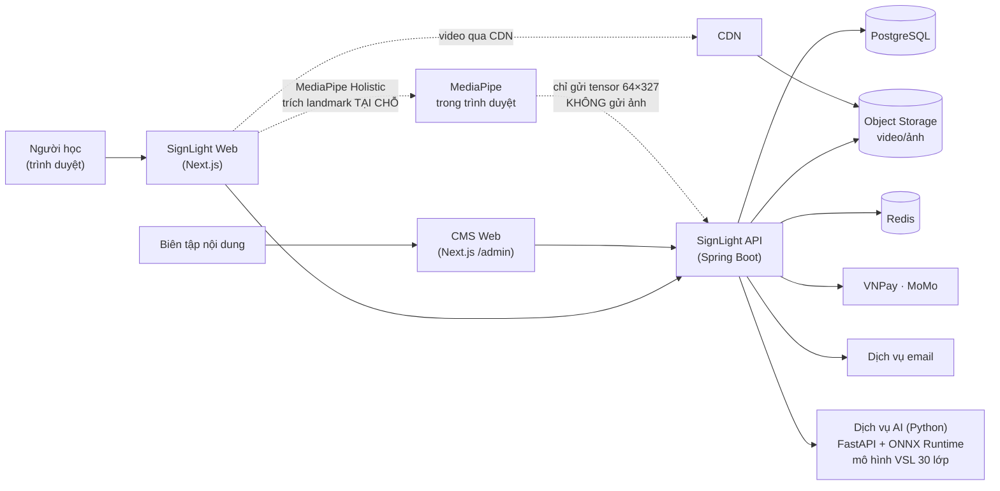

# SRS — SignLight (Nền tảng học Ngôn ngữ Ký hiệu Việt Nam có AI luyện tập)

| Phiên bản | **v0.3** | Ngày | 2026-09-20 | Trạng thái | DRAFT — chờ GATE-2 |
|-----------|------|------|------------|------------|---------------------|

**Thay đổi so với v0.2:** chốt **Q8 = phương án B** (trình duyệt trích landmark, server phân lớp) → viết lại
**NFR-12**, loại bỏ phương án A/C khỏi phạm vi · chốt **Q9 = CÓ** → **FR-46 vào phạm vi GĐ1** (không còn là
tuỳ chọn) · chốt **Q10 = nội dung giả lập trước** → thêm **§3.4 Chính sách nội dung giả lập (seed)** và
**NFR-21**.

**Thay đổi so với v0.1:** ngôn ngữ = **VSL** · thanh toán = **VNPay + MoMo, không tự động gia hạn** ·
thêm **module M10 — AI nhận diện ký hiệu động (FR-41→FR-44)** · thêm FR-45 (báo thiếu ký hiệu), FR-46
(góp dữ liệu tự nguyện) · sửa FR-12, FR-17→19, FR-28→32 theo khảo sát thực tế (BRD §9).

**Tiền đề:** `docs/ba/BRD.md` v0.2 · **Đi kèm:** `docs/ba/function-map.html`
**Đọc tiếp:** `docs/sa/HLD.md`, `docs/sa/LLD.md`, `docs/sa/api-spec.md`, `docs/ba/FSD.md`

---

## 1. Giới thiệu

**Mục đích.** Đặc tả đầy đủ yêu cầu phần mềm của SignLight tới mức **dev code được và tester viết được test
case mà không phải hỏi lại**. Tài liệu này là **nguồn sự thật về YÊU CẦU**; `FSD.md` đặc tả hành vi trên màn
hình và **không được mâu thuẫn** với tài liệu này (mâu thuẫn → SRS thắng).

**Phạm vi.** Đúng theo §3 của `BRD.md`: web responsive cho người học + CMS nội dung + trang marketing.
Ngoài phạm vi GĐ1: app native, cổng B2B, đặt lịch tutor, ngôn ngữ ký hiệu thứ hai.

**Thuật ngữ.**

| Thuật ngữ | Nghĩa trong tài liệu này |
|-----------|---------------------------|
| **VSL** | **Ngôn ngữ Ký hiệu Việt Nam** — ngôn ngữ của khoá học đầu tiên |
| **Sign (Ký hiệu)** | Đơn vị từ vựng nhỏ nhất — một từ/cụm từ kèm một hoặc nhiều video minh hoạ |
| **Lesson (Bài học)** | Đơn vị học nhỏ nhất người học hoàn thành trong một lượt (mục tiêu 3–7 phút) |
| **Lesson Step (Bước bài học)** | Một bước bên trong bài học. 3 loại: `TEACH` (dạy ký hiệu mới) · `EXPLAIN` (thẻ giải thích, không chấm) · `EXERCISE` (bài tập có chấm) |
| **Chapter (Chương)** | Nhóm bài học cùng chủ đề, kết thúc bằng một Quiz |
| **Unit** | Nhóm chương theo cấp độ (Unit 1 = người mới bắt đầu) |
| **Course (Khoá)** | Toàn bộ nội dung của **một ngôn ngữ ký hiệu** |
| **Exercise (Bài tập)** | Một câu hỏi/tương tác bên trong bài học; 7 loại, xem FR-12 |
| **Milestone (Bài mốc)** | Bài kiểm tra tổng hợp cuối Unit, chấm **1–5 sao** |
| **Trainer** | Khu luyện tập lặp lại ngắt quãng, độc lập với lộ trình |
| **Fingerspelling** | Đánh vần bằng bảng chữ cái ngón tay (hình tay **tĩnh**) |
| **Sign Recognition (tĩnh)** | Nhận dạng hình tay tĩnh cho bảng chữ cái |
| **🤖 Dynamic Sign Recognition** | **Nhận dạng ký hiệu ĐỘNG trọn vẹn** — người học thực hiện cả động tác, AI phân lớp thành 1 trong N ký hiệu. Đây là module M10 |
| **Landmark** | Toạ độ điểm mốc bàn tay/thân/mặt do MediaPipe Holistic trích ra. **Là số, không phải ảnh** |
| **Feature tensor** | Chuỗi đặc trưng **64 khung × 327 chiều** — đầu vào của mô hình nhận diện |
| **Attempt (lượt thử)** | Một lần người học thực hiện một ký hiệu trước camera để AI chấm |
| **Segmentation (phân đoạn)** | Xác định điểm bắt đầu/kết thúc động tác. GĐ1 dùng **phân đoạn thủ công** (người học bấm nút) |
| **Recognizable sign (ký hiệu AI nhận được)** | Ký hiệu nằm trong danh sách nhãn của mô hình đang triển khai. GĐ1 = **30 ký hiệu** |
| **Mirror (Gương)** | Chế độ xem video mẫu cạnh hình camera của chính mình, không chấm điểm |
| **Streak** | Số ngày liên tiếp đạt mục tiêu học hằng ngày |
| **Streak Freeze** | Vật phẩm bảo vệ streak khi nghỉ một ngày |
| **Award** | Huy hiệu có cấp bậc, lên cấp theo chỉ số tích luỹ |
| **Curiosity** | Mẩu kiến thức ngắn về văn hoá Điếc, mở khoá được khi học |
| **SRS (thuật toán)** | Spaced Repetition Scheduling — lịch lặp lại ngắt quãng (**không** phải tên tài liệu này) |
| **d/Deaf & HoH** | Người Điếc / khiếm thính (Hard of Hearing) |

## 2. Mô tả tổng quan

### 2.1 Bối cảnh hệ thống

> **Ranh giới quan trọng:** dịch vụ AI là **tiến trình riêng** (Python), backend Java đóng vai **cổng
> trung chuyển**. Mô hình và toàn bộ pipeline huấn luyện tái dùng từ repo
> [`dathihi1/EXE101`](https://github.com/dathihi1/EXE101). Xem `HLD.md` §1 và ADR-08.

### 2.2 Nhóm người dùng & quyền

| Vai trò | Mã | Mô tả | Quyền chính |
|---------|----|-------|-------------|
| Khách | `GUEST` | Chưa đăng nhập | Xem trang marketing, blog, từ điển (giới hạn 10 lượt tra/ngày theo IP) |
| Người học miễn phí | `LEARNER_FREE` | Đã đăng ký, chưa trả phí | Học nội dung miễn phí, Trainer giới hạn, từ điển đầy đủ |
| Người học Premium | `LEARNER_PREMIUM` | Thuê bao còn hiệu lực | Toàn bộ nội dung + Trainer không giới hạn + chứng chỉ |
| Biên tập nội dung | `CONTENT_EDITOR` | Đội nội dung | CRUD ký hiệu/bài học/bài tập; **không** xuất bản |
| Duyệt nội dung | `CONTENT_APPROVER` | Cố vấn người Điếc | Duyệt & **xuất bản** nội dung |
| CSKH | `SUPPORT` | Hỗ trợ khách hàng | Tra cứu người dùng, thuê bao, cấp/thu Premium thủ công; **không** xem mật khẩu, **không** sửa nội dung |
| Quản trị | `ADMIN` | Quản trị hệ thống | Toàn quyền, gồm quản lý vai trò |

> Quy tắc phân quyền: **RBAC**, kiểm ở **cả** frontend (ẩn/disable) **và** backend (chặn thật). Frontend ẩn
> nút **không** được coi là biện pháp bảo vệ (xem NFR-07).

### 2.3 Ràng buộc, giả định & phụ thuộc
- Trình duyệt hỗ trợ: 2 phiên bản gần nhất của Chrome, Edge, Firefox, Safari (desktop + mobile).
  Nhận dạng ký hiệu yêu cầu `getUserMedia` + WebAssembly SIMD — trình duyệt không hỗ trợ thì **hạ cấp mềm**
  sang chế độ Gương (FR-20), không chặn bài học.
- Phụ thuộc ngoài: cổng thanh toán (chờ Q3), dịch vụ email giao dịch, CDN, nhà cung cấp object storage.
- Ngôn ngữ giao diện GĐ1: **Tiếng Việt + Tiếng Anh**; kiến trúc i18n sẵn cho ngôn ngữ thứ ba.

---

## 3. Yêu cầu chức năng (FR)

### 3.1 Danh mục FR

| ID | Module | Tên | Ưu tiên | Truy vết BRD |
|----|--------|-----|---------|--------------|
| FR-01 | M0 Tài khoản | Đăng ký tài khoản bằng email | Cao | BR-01 / BG-01 |
| FR-02 | M0 | Đăng nhập | Cao | BR-01 / BG-01 |
| FR-03 | M0 | Đăng nhập bằng Google | TB | BR-01 / BG-01 |
| FR-04 | M0 | Quên & đặt lại mật khẩu | Cao | BR-01 / BG-05 |
| FR-05 | M0 | Onboarding cá nhân hoá | Cao | BR-02 / BG-01, BG-02 |
| FR-06 | M0 | Quản lý hồ sơ cá nhân | TB | BR-01 / BG-05 |
| FR-07 | M0 | Đặt lại tiến độ học | Thấp | BR-13 / BG-02 |
| FR-08 | M0 | Xoá tài khoản & dữ liệu cá nhân | Cao | BR-16 / BG-05 |
| FR-09 | M1 Nội dung | Duyệt lộ trình học | Cao | BR-03 / BG-01 |
| FR-10 | M1 | Chuyển khoá ngôn ngữ ký hiệu | Thấp | BR-03 / BG-04 |
| FR-11 | M2 Học | Trình phát bài học video | Cao | BR-04 / BG-01 |
| FR-12 | M2 | Làm bài tập trong bài học (7 loại) | Cao | BR-05 / BG-01 |
| FR-13 | M2 | Quiz cuối chương | Cao | BR-05 / BG-01 |
| FR-14 | M2 | Bài mốc (milestone) chấm 1–5 sao | TB | BR-09 / BG-02 |
| FR-15 | M2 | Mở khoá Curiosity | Thấp | BR-09 / BG-02 |
| FR-16 | M2 | Ghi nhận hoàn thành bài & cập nhật tiến độ | Cao | BR-13 / BG-01, BG-02 |
| FR-17 | M3 Luyện tập | Trainer từ vựng (lặp lại ngắt quãng) — **mở khoá sau Chương 1** | Cao | BR-07 / BG-01, BG-02 |
| FR-18 | M3 | Trainer bảng chữ cái ngón tay + nhận dạng tĩnh — **mở khoá sau chương dạy bảng chữ cái** | Cao | BR-06 / BG-01 |
| FR-19 | M3 | Trainer số đếm — **mở khoá khi tới Unit 2** | TB | BR-07 / BG-01 |
| FR-20 | M3 | Chế độ Gương (Mirror) | TB | BR-06 / BG-01 |
| FR-21 | M4 Từ điển | Tìm kiếm ký hiệu | Cao | BR-08 / BG-02 |
| FR-22 | M4 | Xem chi tiết ký hiệu & biến thể | TB | BR-08 / BG-04 |
| FR-23 | M5 Tiến độ | Chuỗi ngày học & Streak Freeze | Cao | BR-09 / BG-02 |
| FR-24 | M5 | Mục tiêu học hằng ngày | Cao | BR-02 / BG-02 |
| FR-25 | M5 | Hệ thống Award (6 loại, có cấp bậc) | TB | BR-09 / BG-02 |
| FR-26 | M5 | Trang tiến độ & thống kê cá nhân | TB | BR-09 / BG-02 |
| FR-27 | M5 | Xuất chứng chỉ PDF | TB | BR-10 / BG-02, BG-03 |
| FR-28 | M6 Thanh toán | Xem & chọn gói Premium (VND, **không tự động gia hạn**) | Cao | BR-11 / BG-03 |
| FR-29 | M6 | Thanh toán qua **VNPay / MoMo** và kích hoạt Premium | Cao | BR-11 / BG-03 |
| FR-30 | M6 | Giới hạn nội dung miễn phí (paywall) | Cao | BR-11 / BG-03 |
| FR-31 | M6 | **Nhắc gia hạn & gia hạn thủ công**; lịch sử giao dịch | Cao | BR-12 / BG-03, BG-05 |
| FR-32 | M6 | Đồng bộ trạng thái thanh toán qua **IPN** của VNPay/MoMo | Cao | BR-11 / BG-03 |
| FR-33 | M7 CMS | Quản lý ký hiệu & video | Cao | BR-14 / BG-04 |
| FR-34 | M7 | Quản lý bài học, bài tập, chương | Cao | BR-14 / BG-04 |
| FR-35 | M7 | Duyệt & xuất bản nội dung | Cao | BR-14 / BG-04, BG-05 |
| FR-36 | M7 | Tra cứu & hỗ trợ người dùng (CSKH) | TB | BR-12 / BG-05 |
| FR-37 | M8 Marketing | Trang landing + blog SEO | TB | BR-15 / BG-03 |
| FR-38 | M8 | Form liên hệ doanh nghiệp | Thấp | BR-17 / BG-03 |
| FR-39 | M9 Hệ thống | Email giao dịch & nhắc học | TB | BR-09 / BG-02 |
| FR-40 | M9 | Nhật ký hệ thống & số liệu phân tích | TB | BR-18 / BG-06 |
| **FR-41** | **M10 AI** | **Luyện ký hiệu động với AI — vòng lặp quay & chấm** | **Rất cao** | BR-06 / **BG-01, BG-07** |
| **FR-42** | **M10** | **Phân đoạn thủ công & kiểm chất lượng khung hình** | **Rất cao** | BR-06 / BG-07 |
| **FR-43** | **M10** | **Phản hồi kết quả & gợi ý sửa cụ thể** | **Rất cao** | BR-06 / BG-07 |
| **FR-44** | **M10** | **Quản lý vốn ký hiệu AI & phiên bản mô hình** | Cao | BR-21 / BG-08 |
| **FR-45** | M4 Từ điển | **Báo thiếu ký hiệu** | Thấp | BR-08 / BG-04 |
| **FR-46** | **M10** | **Góp dữ liệu luyện tập (tự nguyện, rút lại được)** | TB | BR-19 / BG-08 |

---

### 3.2 Đặc tả chi tiết từng FR

---

#### FR-01 — Đăng ký tài khoản bằng email

- **Actor / Tiền điều kiện / Hậu điều kiện:** `GUEST` / đã hoàn tất onboarding FR-05 (bước 1–8) hoặc vào
  thẳng từ trang đăng ký / *Thành công:* tạo `User` trạng thái `PENDING_VERIFICATION`, gửi email xác thực,
  đăng nhập ngay được (không chặn học); *Thất bại:* không tạo bản ghi, không gửi email.

- **Luồng chính:**

  | # | Hành động người dùng | Phản ứng hệ thống | Dữ liệu (C/R/U/D) |
  |---|----------------------|-------------------|-------------------|
  | 1 | Nhập tên hiển thị | Kiểm định dạng phía client (không gọi server) | — |
  | 2 | Nhập email | Kiểm định dạng; **không** báo email đã tồn tại ở bước này (chống dò tài khoản — NFR-08) | — |
  | 3 | Nhập mật khẩu | Hiện thang đo độ mạnh mật khẩu | — |
  | 4 | Tick đồng ý Điều khoản & Chính sách riêng tư | Bật nút "Tạo tài khoản" | — |
  | 5 | Bấm "Tạo tài khoản" | Kiểm toàn bộ phía server; băm mật khẩu bằng **Argon2id**; tạo `User` + `UserProfile` + `UserPreference` (nạp từ dữ liệu onboarding FR-05); ghi `AuditLog`; phát hành cặp access/refresh token; gửi email xác thực | C: `user`, `user_profile`, `user_preference`, `audit_log`, `email_outbox` |
  | 6 | — | Điều hướng vào lộ trình học | R: `course`, `user_progress` |

- **Luồng thay thế / ngoại lệ:**
  - 5a. Email đã tồn tại → **vẫn trả về 200** với thông điệp trung tính "Nếu email này chưa có tài khoản, chúng tôi đã gửi thư xác thực."; hệ thống gửi email "tài khoản đã tồn tại, đây là link đăng nhập/đặt lại mật khẩu" thay vì tạo mới. **Không tạo bản ghi trùng.** *(Chống dò tài khoản — NFR-08)*
  - 5b. Mật khẩu nằm trong danh sách mật khẩu rò rỉ phổ biến → lỗi `01102`, "Mật khẩu này quá phổ biến, vui lòng chọn mật khẩu khác."
  - 5c. Chưa tick Điều khoản → nút vô hiệu; nếu gọi API trực tiếp → lỗi `01103`.
  - 5d. Vượt giới hạn tần suất (> 5 lần đăng ký / IP / giờ) → lỗi `00105`, HTTP 429.
  - 5e. Dịch vụ email lỗi → **vẫn tạo tài khoản thành công**, đưa `email_outbox` vào hàng đợi gửi lại; không chặn người dùng.

- **Validate từng trường:**

  | Trường | Bắt buộc | Kiểu | Định dạng | Độ dài | Miền giá trị / ràng buộc | Thông báo lỗi |
  |--------|:-------:|------|-----------|:------:|--------------------------|---------------|
  | `displayName` | Có | Chuỗi | Chữ, số, khoảng trắng, dấu tiếng Việt; không ký tự điều khiển/HTML | 2–50 | Chuẩn hoá NFC, cắt khoảng trắng thừa | "Tên hiển thị phải từ 2 đến 50 ký tự." |
  | `email` | Có | Chuỗi | RFC 5322, chuyển về chữ thường | ≤ 254 | Duy nhất (kiểm ngầm, xem 5a) | "Email không đúng định dạng." |
  | `password` | Có | Chuỗi | ≥ 1 chữ cái và ≥ 1 chữ số | 10–128 | Không nằm trong danh sách 10.000 mật khẩu rò rỉ phổ biến | "Mật khẩu phải từ 10 đến 128 ký tự, gồm cả chữ và số." |
  | `acceptedTerms` | Có | Boolean | — | — | Phải bằng `true` | "Bạn cần đồng ý Điều khoản sử dụng để tiếp tục." |
  | `onboardingToken` | Không | Chuỗi | UUID v4 | 36 | Còn hiệu lực ≤ 24 giờ | "Phiên onboarding đã hết hạn, vui lòng chọn lại mục tiêu học." |

- **Quy tắc nghiệp vụ:**
  - **BR-A01:** Mật khẩu băm bằng **Argon2id** (m=19 MiB, t=2, p=1), **không bao giờ** lưu/ghi log dạng thô.
  - **BR-A02:** Tài khoản `PENDING_VERIFICATION` **vẫn học được**; chỉ **chặn mua Premium** (FR-29) cho tới khi xác thực email — để không cản trở BG-01 mà vẫn chặn gian lận thanh toán.
  - **BR-A03:** Link xác thực email hiệu lực **24 giờ**, dùng **một lần**.

- **Bảng trạng thái `User`:**

  | Trạng thái nguồn | Sự kiện | Điều kiện | Trạng thái đích |
  |------------------|---------|-----------|------------------|
  | — | Đăng ký thành công | — | `PENDING_VERIFICATION` |
  | `PENDING_VERIFICATION` | Bấm link xác thực | Token còn hạn & chưa dùng | `ACTIVE` |
  | `ACTIVE` | Người dùng yêu cầu xoá (FR-08) | — | `PENDING_DELETION` |
  | `PENDING_DELETION` | Hết 30 ngày ân hạn | Không huỷ yêu cầu | `DELETED` (ẩn danh hoá) |
  | `PENDING_DELETION` | Người dùng đăng nhập lại & huỷ yêu cầu | Trong 30 ngày | `ACTIVE` |
  | `ACTIVE` | ADMIN khoá | Vi phạm điều khoản | `SUSPENDED` |

- **Tiêu chí chấp nhận (Given–When–Then):**
  - **AC-01.1:** Given email chưa từng đăng ký — When gửi form hợp lệ — Then tạo đúng 1 `User` trạng thái `PENDING_VERIFICATION`, trả access token + refresh token, và **không** có bản ghi nào chứa mật khẩu dạng thô.
  - **AC-01.2:** Given email **đã** tồn tại — When gửi form — Then phản hồi **giống hệt** trường hợp thành công (cùng mã, cùng thông điệp, chênh lệch thời gian phản hồi < 100 ms), và **không** tạo `User` thứ hai.
  - **AC-01.3:** Given mật khẩu `123456789a` (nằm trong danh sách rò rỉ) — When gửi form — Then lỗi `01102`, không tạo tài khoản.
  - **AC-01.4:** Given đã gửi 5 yêu cầu đăng ký từ cùng IP trong 1 giờ — When gửi lần thứ 6 — Then HTTP 429, `errorCode = 00105`.
  - **AC-01.5:** Given đăng ký kèm `onboardingToken` hợp lệ — When tạo tài khoản — Then `user_preference` mang đúng mục tiêu phút/ngày và lý do học đã chọn ở FR-05.

---

#### FR-02 — Đăng nhập

- **Actor / Tiền điều kiện / Hậu điều kiện:** `GUEST` có tài khoản / — / *Thành công:* phát hành access token (15 phút) + refresh token (30 ngày, xoay vòng), ghi `login_history`; *Thất bại:* tăng bộ đếm thất bại, không tiết lộ nguyên nhân.
- **Luồng chính:** 1· Nhập email + mật khẩu → 2· Bấm "Đăng nhập" → hệ thống kiểm chứng, phát hành token, điều hướng tới lộ trình học tại đúng bài đang dở. (C: `login_history`, `refresh_token`; R: `user`)
- **Luồng thay thế / ngoại lệ:**
  - 2a. Sai email **hoặc** sai mật khẩu → **cùng một** thông báo "Email hoặc mật khẩu không đúng." (`01201`), thời gian phản hồi được cân bằng.
  - 2b. Sai ≥ 5 lần liên tiếp trong 15 phút → khoá đăng nhập tạm 15 phút (`01202`), gửi email cảnh báo cho chủ tài khoản.
  - 2c. Tài khoản `SUSPENDED` → `01203`, "Tài khoản đang bị tạm khoá. Liên hệ hỗ trợ."
  - 2d. Tài khoản `PENDING_DELETION` → hỏi "Bạn muốn khôi phục tài khoản?" → đồng ý thì về `ACTIVE`.
- **Validate:** `email` — bắt buộc, RFC 5322, ≤ 254 ký tự → "Email không đúng định dạng."; `password` — bắt buộc, 1–128 → "Vui lòng nhập mật khẩu."
- **Quy tắc nghiệp vụ:** **BR-A04** refresh token **xoay vòng**, phát hiện dùng lại token đã thu hồi → thu hồi toàn bộ phiên của người dùng đó và bắt đăng nhập lại.
- **Tiêu chí chấp nhận:**
  - **AC-02.1:** Given mật khẩu đúng — When đăng nhập — Then nhận access + refresh token, `login_history` thêm 1 bản ghi (có IP, user-agent **đã băm**, không lưu IP thô quá 30 ngày).
  - **AC-02.2:** Given email không tồn tại vs Given mật khẩu sai — Then hai phản hồi **không phân biệt được** (cùng errorCode, cùng message).
  - **AC-02.3:** Given 5 lần sai liên tiếp — When thử lần 6 trong 15 phút — Then bị chặn với `01202` kể cả khi mật khẩu đúng.
  - **AC-02.4:** Given refresh token đã dùng rồi — When dùng lại — Then mọi phiên bị thu hồi và trả `01204`.

---

#### FR-03 — Đăng nhập bằng Google
- **Actor:** `GUEST`. **Tiền điều kiện:** — . **Hậu điều kiện (thành công):** tài khoản liên kết `auth_identity(provider='GOOGLE')`, trạng thái `ACTIVE` (email đã được Google xác thực).
- **Luồng chính:** 1· Bấm "Tiếp tục với Google" → chuyển hướng OAuth2 (PKCE) → 2· Người dùng đồng ý → hệ thống nhận `id_token`, kiểm chữ ký + `aud` + `iss` + `exp` → 3· Nếu email đã có tài khoản mật khẩu → **liên kết** vào tài khoản đó; nếu chưa → tạo mới `ACTIVE`.
- **Ngoại lệ:** 2a. `state` không khớp → `01301` (chống CSRF). 2b. Google trả `email_verified=false` → từ chối (`01302`). 2c. Người dùng huỷ ở màn Google → quay lại trang đăng nhập, không báo lỗi.
- **AC-03.1:** Given email Google trùng tài khoản đã có — When đăng nhập Google — Then **không** tạo tài khoản thứ hai, tiến độ học cũ được giữ nguyên.
- **AC-03.2:** Given `state` bị sửa — When callback — Then từ chối với `01301` và không phát hành token.

---

#### FR-04 — Quên & đặt lại mật khẩu
- **Luồng chính:** 1· Nhập email → 2· Hệ thống **luôn** trả "Nếu email tồn tại, chúng tôi đã gửi hướng dẫn." → 3· Người dùng bấm link trong email → 4· Nhập mật khẩu mới → 5· Hệ thống đổi mật khẩu, **thu hồi toàn bộ refresh token**, gửi email thông báo đã đổi.
- **Validate:** `resetToken` — bắt buộc, chuỗi ngẫu nhiên ≥ 256 bit, **lưu dạng băm** trong DB, hiệu lực **60 phút**, dùng **một lần** → "Liên kết đặt lại đã hết hạn hoặc đã được dùng."; `newPassword` — cùng ràng buộc FR-01.
- **Quy tắc:** **BR-A05** token đặt lại lưu dạng băm SHA-256; so sánh bằng hàm chống tấn công thời gian.
- **AC-04.1:** Given email không tồn tại — When yêu cầu đặt lại — Then phản hồi giống hệt trường hợp tồn tại, **không** gửi email.
- **AC-04.2:** Given token đã dùng một lần — When dùng lại — Then từ chối `01401`.
- **AC-04.3:** Given đặt lại mật khẩu thành công — When kiểm các phiên cũ — Then mọi refresh token cũ đều vô hiệu.

---

#### FR-05 — Onboarding cá nhân hoá

- **Actor / Tiền điều kiện / Hậu điều kiện:** `GUEST` hoặc `LEARNER_*` lần đầu / — / *Thành công:* lưu `onboarding_answer` gắn `onboardingToken` (khách) hoặc `userId`; sinh `user_preference` (mục tiêu phút/ngày, lý do học, khoá ngôn ngữ).

- **Luồng chính (11 bước, thanh tiến trình hiện `n/11`):**

  | # | Bước | Hành động người dùng | Phản ứng hệ thống | Dữ liệu |
  |---|------|----------------------|-------------------|---------|
  | 1 | Chào mừng | Bấm "Chọn ngôn ngữ" | Hiện linh vật + câu dẫn | — |
  | 2 | Chọn ngôn ngữ ký hiệu | Chọn 1 khoá | Lưu tạm; GĐ1 chỉ 1 khoá hoạt động, các khoá khác hiện "Sắp có" (disable) | R: `course` |
  | 3 | Giá trị sản phẩm | Bấm "Tiếp" | Hiện 2–3 điểm mạnh | — |
  | 4 | Lý do học | Chọn 1 trong 7 lý do | Bật nút "Tiếp" | C: `onboarding_answer` |
  | 5 | Thông điệp sứ mệnh | Bấm "Tiếp" | Hiện số liệu cộng đồng | — |
  | 6 | Mục tiêu phút/ngày | Chọn 5 / 10 / 15 / 20 phút | Bật nút "Cam kết mục tiêu" | C: `onboarding_answer` |
  | 7 | Dự báo tiến bộ | Bấm "Tiếp" | Hiện mốc NGAY / 1 TUẦN / 3 THÁNG theo mục tiêu đã chọn | — |
  | 8 | Dựng lộ trình | — (tự động) | Màn chờ ≤ 3 giây; nếu > 3 giây vẫn phải đi tiếp được | R: `chapter`, `lesson` |
  | 9 | Tên hiển thị | Nhập tên | Validate theo FR-01 | — |
  | 10 | Email | Nhập email | Validate theo FR-01 | — |
  | 11 | Mật khẩu & Điều khoản | Nhập mật khẩu, tick Điều khoản | Gọi FR-01 tạo tài khoản | C: `user` … |

- **Luồng thay thế / ngoại lệ:**
  - Mọi bước: bấm **←** quay lại bước trước, **giữ nguyên** lựa chọn đã chọn.
  - 4a / 6a. Chưa chọn gì → nút "Tiếp" vô hiệu (không hiện lỗi đỏ).
  - 11a. Bỏ dở giữa chừng → `onboardingToken` sống 24 giờ; quay lại trong 24 giờ thì tiếp tục đúng bước đang dở.
  - 8a. Dựng lộ trình lỗi → dùng lộ trình mặc định của khoá, ghi cảnh báo, **không** chặn người dùng.

- **Validate:** `learningGoalMinutes` — bắt buộc, số nguyên, ∈ {5, 10, 15, 20} → "Vui lòng chọn mục tiêu học mỗi ngày."; `learningReason` — bắt buộc, enum 7 giá trị (`CURIOSITY`, `INCLUSIVITY`, `WORK`, `FAMILY`, `SCHOOL`, `DHH_SELF`, `OTHER`) → "Vui lòng chọn lý do học."; `courseId` — bắt buộc, UUID, khoá phải `PUBLISHED` → "Khoá học này chưa mở."

- **Quy tắc nghiệp vụ:** **BR-A06** `learningGoalMinutes` là **cơ sở tính streak** ở FR-23 — đạt mục tiêu ngày = học đủ số phút đã cam kết. **BR-A07** đổi mục tiêu về sau (FR-24) **không** tính lại streak quá khứ.

- **Tiêu chí chấp nhận:**
  - **AC-05.1:** Given khách chọn 10 phút/ngày và lý do `FAMILY` — When hoàn tất đăng ký — Then `user_preference.daily_goal_minutes = 10` và `learning_reason = 'FAMILY'`.
  - **AC-05.2:** Given đang ở bước 6 — When bấm ← ba lần rồi tiến lại — Then các lựa chọn ở bước 2, 4 vẫn giữ nguyên.
  - **AC-05.3:** Given bỏ dở ở bước 7, quay lại sau 2 giờ cùng trình duyệt — When mở lại — Then vào đúng bước 7 với lựa chọn cũ.
  - **AC-05.4:** Given bỏ dở ở bước 7, quay lại sau 25 giờ — When mở lại — Then bắt đầu lại từ bước 1.

---

#### FR-06 — Quản lý hồ sơ cá nhân
- **Chức năng:** đổi tên hiển thị, đổi ảnh đại diện, đổi ngôn ngữ giao diện, đổi email, đổi mật khẩu, xem gói hiện tại.
- **Luồng đổi email:** 1· Nhập email mới + **mật khẩu hiện tại** → 2· Gửi link xác nhận tới **email mới** → 3· Bấm link → đổi. Đồng thời gửi thông báo tới **email cũ** (chống chiếm tài khoản).
- **Luồng đổi mật khẩu:** yêu cầu **mật khẩu hiện tại**; đổi xong thu hồi mọi phiên khác, giữ phiên hiện tại.
- **Validate:** `avatar` — không bắt buộc, JPEG/PNG/WebP, ≤ 2 MB, ≤ 1024×1024 px, **kiểm magic bytes chứ không tin đuôi file**, xoá EXIF → "Ảnh phải là JPG/PNG/WebP, tối đa 2 MB."
- **AC-06.1:** Given nhập sai mật khẩu hiện tại — When đổi email — Then từ chối `01601`, email không đổi.
- **AC-06.2:** Given đổi mật khẩu thành công — When kiểm phiên trên thiết bị khác — Then phiên đó đã bị đăng xuất, phiên hiện tại vẫn dùng được.
- **AC-06.3:** Given tải lên tệp `.jpg` nhưng nội dung thật là HTML — When lưu — Then từ chối `01602`.

---

#### FR-07 — Đặt lại tiến độ học
- **Luồng:** 1· Vào Hồ sơ → "Đặt lại tiến độ" → 2· Hệ thống cảnh báo **không hoàn tác được**, liệt kê thứ sẽ mất (bài đã hoàn thành, sao, chuỗi ngày, lịch ôn tập) và thứ **giữ lại** (Award đã đạt, Curiosity đã mở, thuê bao) → 3· Người dùng **gõ đúng từ `RESET`** để xác nhận → 4· Hệ thống xoá tiến độ của **khoá đang chọn**, ghi `AuditLog`.
- **Quy tắc:** **BR-A08** chỉ đặt lại tiến độ của **một khoá**, không ảnh hưởng khoá khác. **BR-A09** Award và Curiosity đã đạt **được giữ** (tôn trọng công sức đã bỏ ra).
- **AC-07.1:** Given có 40 bài đã hoàn thành và 3 Award — When đặt lại tiến độ — Then 0 bài hoàn thành, **vẫn còn đủ 3 Award**.
- **AC-07.2:** Given gõ `reset` (chữ thường) — When bấm xác nhận — Then nút vẫn vô hiệu.

---

#### FR-08 — Xoá tài khoản & dữ liệu cá nhân
- **Luồng:** 1· Hồ sơ → "Xoá tài khoản" → 2· Yêu cầu nhập mật khẩu → 3· Cảnh báo: thuê bao đang chạy sẽ **không tự hoàn tiền**, hướng dẫn huỷ trước → 4· Xác nhận → đặt `PENDING_DELETION`, đăng xuất mọi phiên, gửi email xác nhận → 5· Sau **30 ngày** ân hạn, tiến trình nền **ẩn danh hoá**: xoá email/tên/ảnh/lịch sử đăng nhập, giữ lại bản ghi tài chính ở dạng ẩn danh theo nghĩa vụ kế toán.
- **Quy tắc:** **BR-A10** trong 30 ngày, đăng nhập lại → hỏi "Khôi phục tài khoản?" → đồng ý thì về `ACTIVE`. **BR-A11** dữ liệu tài chính (hoá đơn) giữ **theo thời hạn luật định**, ở dạng **không còn định danh người dùng**.
- **AC-08.1:** Given yêu cầu xoá — When kiểm ngay sau đó — Then trạng thái `PENDING_DELETION` và mọi refresh token đã bị thu hồi.
- **AC-08.2:** Given quá 30 ngày — When chạy tiến trình xoá — Then không còn tìm được email/tên trong bất kỳ bảng nào (kể cả log), nhưng `payment_transaction` vẫn còn ở dạng ẩn danh.

---

#### FR-09 — Duyệt lộ trình học
- **Mô tả:** Hiển thị lộ trình dạng dọc Unit → Chapter → Lesson, đánh dấu bài **đã xong / đang mở / đang khoá**, có nút nổi bật "Tiếp tục học" trỏ đúng bài kế tiếp.
- **Quy tắc:** **BR-A12** bài học mở khoá **tuần tự**: bài `n` chỉ mở khi bài `n-1` đã `COMPLETED`. **BR-A13** bài mốc (milestone) chỉ mở khi **toàn bộ** bài trong Unit đã xong. **BR-A14** bài thuộc nội dung Premium hiển thị **có ổ khoá** với người dùng miễn phí — vẫn nhìn thấy tên bài (tạo động lực nâng cấp), bấm vào ra màn giới thiệu Premium (FR-30).
- **AC-09.1:** Given bài 3 chưa hoàn thành — When mở bài 4 bằng URL trực tiếp — Then bị chặn **ở backend** với `00403` và điều hướng về lộ trình.
- **AC-09.2:** Given người dùng miễn phí — When xem lộ trình — Then bài Premium vẫn hiện tên + biểu tượng khoá.
- **AC-09.3:** Given vừa hoàn thành bài 5 — When tải lại trang — Then nút "Tiếp tục học" trỏ tới bài 6.

---

#### FR-10 — Chuyển khoá ngôn ngữ ký hiệu
- **Luồng:** Hồ sơ → "Đổi ngôn ngữ ký hiệu" → chọn khoá khác → hệ thống đổi `user_preference.active_course_id`. **Tiến độ mỗi khoá lưu riêng, không trộn lẫn.**
- **Quy tắc:** **BR-A15** đổi khoá **không mất** tiến độ khoá cũ; quay lại là thấy nguyên vẹn. *(Đây chính là nguyên nhân số 1 khiến người dùng tưởng "mất tiến độ" — xem FR-26 và `user-guide.md`.)*
- **AC-10.1:** Given đang học khoá A tới bài 12 — When đổi sang khoá B rồi quay lại A — Then vẫn ở bài 12.

---

#### FR-11 — Trình phát bài học video
- **Chức năng:** phát video ký hiệu; **nút "rùa" giảm tốc độ** còn 0.5×; lặp lại đoạn; tua; hiện phụ đề/chú giải chữ; chọn góc quay khác (nếu ký hiệu có nhiều biến thể).
- **Validate/Ràng buộc:** tốc độ phát ∈ {0.5×, 0.75×, 1×}; mặc định **1×**; lựa chọn tốc độ **được nhớ** theo người dùng.
- **Quy tắc:** **BR-A16** video **không có thông tin chỉ truyền bằng âm thanh** (ràng buộc khả năng tiếp cận — BRD §6). **BR-A17** video phát qua **HLS đa bitrate**, tự chọn mức theo băng thông; URL video là **link ký có hạn 15 phút**, không đoán được.
- **AC-11.1:** Given bấm nút "rùa" — When video phát — Then tốc độ còn 0.5× mà **không** đổi cao độ/biến dạng hình.
- **AC-11.2:** Given đã chọn 0.5× ở bài trước — When mở bài mới — Then vẫn là 0.5×.
- **AC-11.3:** Given sao chép URL video — When mở sau 16 phút — Then bị từ chối (403).
- **AC-11.4:** Given băng thông tụt xuống 1 Mbps — When đang xem — Then trình phát tự hạ độ phân giải, **không dừng** quá 2 giây.

---

#### FR-12 — Làm bài tập trong bài học (7 loại)

- **Actor / Tiền điều kiện / Hậu điều kiện:** `LEARNER_*` / bài học đã mở khoá (BR-A12) / *Thành công:* ghi `exercise_attempt`, cập nhật `user_sign_knowledge` phục vụ FR-17; *Thất bại (thoát giữa chừng):* lưu tiến độ dở dang, lần sau vào lại đúng câu đang làm.

- **Cấu trúc bài học — bài học là CHUỖI BƯỚC, không phải danh sách bài tập thuần** *(sửa ở v0.2 theo BRD §9-2)*:

  | Loại bước | Mã | Nội dung | Có chấm? | Tính vào điểm bài? |
  |-----------|----|----------|:--------:|:------------------:|
  | Dạy ký hiệu mới | `TEACH` | Video ký hiệu + nhãn từ (ví dụ `CÁI BÀN`) + nút "Tiếp" | ❌ | ❌ |
  | Thẻ giải thích | `EXPLAIN` | Kiến thức ngắn kèm **một hoặc nhiều video** (ví dụ "Tay trái hay tay phải? — bạn ký hiệu bằng tay nào cũng được, chỉ cần nhất quán một bên") | ❌ | ❌ |
  | Bài tập | `EXERCISE` | 1 trong 7 loại ở bảng dưới | ✅ | ✅ |

  **BR-A19b:** điểm bài học chỉ tính trên các bước `EXERCISE`. Thanh tiến trình `i/n` đếm **mọi bước**.

- **7 loại bài tập** *(loại thứ 7 `SIGN_PERFORMANCE` thêm ở v0.2)*:

  | Mã | Loại | Đề bài | Cách trả lời | Chấm đúng/sai |
  |----|------|--------|--------------|----------------|
  | `SIGN_TO_MEANING` | Xem ký hiệu → chọn nghĩa | Video ký hiệu | Chọn 1 trong **2–4** đáp án chữ/ảnh | So `selectedOptionId` với đáp án |
  | `MEANING_TO_SIGN` | Xem nghĩa → chọn ký hiệu | Từ/ảnh | Chọn 1 trong **2–4** video | So `selectedOptionId` |
  | `TYPE_WHAT_YOU_SEE` | Gõ lại điều bạn thấy | Video ký hiệu | Gõ văn bản | So chuỗi đã chuẩn hoá (bỏ hoa/thường, bỏ dấu câu, chấp nhận danh sách từ đồng nghĩa) |
  | `SENTENCE_ORDER` | Sắp xếp câu đúng trật tự ngữ pháp ký hiệu | Video câu + các thẻ từ xáo trộn | Kéo-thả thẻ | So đúng **toàn bộ** thứ tự |
  | `DIALOGUE_COMPREHENSION` | Xem hội thoại đời thực → trả lời | Video hội thoại 2 người | Chọn đáp án | So `selectedOptionId` |
  | `FINGERSPELL_RECOGNITION` | Tự đánh vần trước camera | Chữ/từ cần đánh vần | Ký hiệu hình tay tĩnh | Nhận dạng tĩnh (FR-18) |
  | `SIGN_PERFORMANCE` 🤖 | **Tự thực hiện trọn ký hiệu trước camera** | Ký hiệu cần thực hiện | Làm cả động tác | **AI nhận diện động (FR-41)** — chỉ dùng được với ký hiệu nằm trong vốn AI |

- **Luồng chính:**

  | # | Hành động người dùng | Phản ứng hệ thống | Dữ liệu |
  |---|----------------------|-------------------|---------|
  | 1 | Mở bài học | Tải danh sách bài tập theo thứ tự; hiện thanh tiến trình `i/n` | R: `lesson`, `exercise` |
  | 2 | Trả lời một bài tập | Chấm **ngay**; hiện phản hồi đúng/sai + video đáp án đúng; ghi lượt trả lời | C: `exercise_attempt`; U: `user_sign_knowledge` |
  | 3 | Bấm "Tiếp" | Sang bài tập kế | — |
  | 4 | Trả lời hết | Hiện màn tổng kết: số câu đúng/tổng, ký hiệu mới học, gọi FR-16 | U: `user_progress`, `user_lesson_state` |

- **Luồng thay thế / ngoại lệ:**
  - 2a. Trả lời **sai** → ký hiệu đó được **đưa lại cuối hàng đợi** trong cùng bài học (tối đa 2 lần lặp/bài).
  - 2b. Loại `FINGERSPELL_RECOGNITION` mà **không có camera / bị từ chối quyền** → tự chuyển sang chế độ tự đánh giá ("Tôi làm được / Cho tôi xem lại"), **không** chặn bài học (BR-A18).
  - 3a. Mất mạng giữa chừng → lưu tạm cục bộ, đồng bộ lại khi có mạng; **không** mất lượt trả lời đã làm.
  - 4a. Thoát trước khi xong → lưu `user_lesson_state = IN_PROGRESS` + chỉ số câu đang làm.

- **Validate:**

  | Trường | Bắt buộc | Kiểu | Ràng buộc | Thông báo lỗi |
  |--------|:-------:|------|-----------|---------------|
  | `exerciseId` | Có | UUID | Phải thuộc bài học đang mở khoá của chính người dùng | "Bài tập không hợp lệ." |
  | `answerType` | Có | Enum | ∈ 7 loại ở bảng trên, **khớp loại của `exerciseId`** | "Loại câu trả lời không khớp bài tập." |
  | `selectedOptionId` | Có nếu là loại chọn | UUID | Phải nằm trong tập lựa chọn của bài tập đó | "Lựa chọn không hợp lệ." |
  | `typedAnswer` | Có nếu `TYPE_WHAT_YOU_SEE` | Chuỗi | 1–200 ký tự, loại bỏ HTML | "Vui lòng nhập câu trả lời (tối đa 200 ký tự)." |
  | `orderedTokenIds` | Có nếu `SENTENCE_ORDER` | Mảng UUID | Đúng số phần tử, không trùng lặp | "Thứ tự câu chưa hợp lệ." |
  | `recognitionScore` | Có nếu `FINGERSPELL_RECOGNITION` | Số thực | 0.0–1.0 | "Kết quả nhận dạng không hợp lệ." |
  | `clientElapsedMs` | Có | Số nguyên | 0–600000; **chỉ dùng để thống kê, không dùng để chấm điểm** | — |

- **Quy tắc nghiệp vụ:**
  - **BR-A19 (chống gian lận — bắt buộc):** **Việc chấm đúng/sai luôn do BACKEND quyết định.** Client gửi lựa chọn, **không** gửi kết quả đúng/sai. API trả về danh sách lựa chọn **không kèm cờ đáp án đúng**.
  - **BR-A20:** Điểm hoàn thành bài học = `số câu đúng lần đầu / tổng số câu`. Trả lời lại sau khi sai **không** tính vào điểm này.
  - **BR-A21:** Bài học đạt **100% đúng ngay lần đầu** → cộng 1 **Streak Freeze** (FR-23), tối đa tồn kho 3 cái.
  - **BR-A22:** Riêng `FINGERSPELL_RECOGNITION`, đúng khi `recognitionScore ≥ 0.80`; backend lưu điểm **và** chấp nhận kết quả từ client vì suy luận chạy tại chỗ — bù lại **không** cho phép loại này ảnh hưởng điểm mốc (FR-14) để hạn chế lợi dụng.

- **Tiêu chí chấp nhận:**
  - **AC-12.1:** Given bài học 10 câu, trả lời đúng 8 câu ngay lần đầu — When hoàn thành — Then điểm bài học = 80%, và **không** cộng Streak Freeze.
  - **AC-12.2:** Given đúng cả 10/10 lần đầu — When hoàn thành — Then cộng đúng **1** Streak Freeze (nếu tồn kho < 3).
  - **AC-12.3:** Given gọi API chấm bài với `isCorrect: true` tự chế — When backend xử lý — Then trường đó **bị bỏ qua**, kết quả tính theo đáp án lưu ở server.
  - **AC-12.4:** Given đọc phản hồi API lấy lựa chọn — When kiểm nội dung JSON — Then **không** có trường nào chỉ ra đáp án đúng.
  - **AC-12.5:** Given trả lời sai câu 3 — When tiếp tục — Then câu 3 xuất hiện lại trước khi kết thúc bài, tối đa 2 lần.
  - **AC-12.6:** Given từ chối quyền camera ở câu `FINGERSPELL_RECOGNITION` — When tiếp tục — Then bài học vẫn hoàn thành được qua chế độ tự đánh giá.
  - **AC-12.7:** Given `typedAnswer = "  Xin CHÀO! "` và đáp án `"xin chào"` — When chấm — Then **đúng**.

---

#### FR-13 — Quiz cuối chương
- **Mô tả:** 10–15 câu rút từ **toàn bộ** ký hiệu của chương, trộn ngẫu nhiên đủ 5 loại bài tập (trừ `FINGERSPELL_RECOGNITION`).
- **Quy tắc:** **BR-A23** đạt khi ≥ **80%** đúng. **BR-A24** không đạt → được làm lại **không giới hạn**, mỗi lần bốc lại đề; chương chỉ tính `COMPLETED` khi quiz đạt. **BR-A25** quiz **không** có gợi ý và **không** hiện đáp án đúng cho tới khi nộp xong toàn bài.
- **AC-13.1:** Given đúng 7/10 — When nộp — Then quiz **không đạt**, chương chưa `COMPLETED`, hiện danh sách ký hiệu cần ôn.
- **AC-13.2:** Given làm lại lần 2 — When xem đề — Then thứ tự câu và bộ câu **khác** lần 1.

---

#### FR-14 — Bài mốc (milestone) chấm 1–5 sao
- **Mô tả:** Bài tổng hợp cuối mỗi Unit. Chấm sao theo tỉ lệ đúng: `<60%` → 1 sao · `60–69%` → 2 · `70–79%` → 3 · `80–89%` → 4 · `≥90%` → 5 sao.
- **Quy tắc:** **BR-A26** chỉ **giữ số sao cao nhất** từng đạt; làm lại kém hơn không bị hạ sao. **BR-A27** tổng số sao là đầu vào của Award "Ngôi sao đang lên" (FR-25).
- **AC-14.1:** Given lần 1 đạt 4 sao, lần 2 đạt 2 sao — When xem Unit — Then vẫn hiển thị **4 sao**.
- **AC-14.2:** Given đúng 90% — When nộp — Then nhận đúng 5 sao.

---

#### FR-15 — Mở khoá Curiosity
- **Mô tả:** Một số bài học có gắn **Curiosity** — mẩu kiến thức ngắn về văn hoá Điếc/lịch sử ngôn ngữ ký hiệu, hiện ra khi hoàn thành bài đó, và được lưu vào bộ sưu tập.
- **Quy tắc:** **BR-A28** mỗi Curiosity chỉ mở **một lần**, không mở lại kể cả khi học lại bài. **BR-A29** danh sách Curiosity chưa mở **không** được lộ tên/nội dung qua API (giữ yếu tố bất ngờ) — chỉ trả về số lượng còn ẩn.
- **AC-15.1:** Given hoàn thành bài có Curiosity — When xem bộ sưu tập — Then Curiosity đó đã mở.
- **AC-15.2:** Given gọi API bộ sưu tập — When đọc JSON — Then Curiosity chưa mở **không** có `title`/`content`.

---

#### FR-16 — Ghi nhận hoàn thành bài & cập nhật tiến độ
- **Mô tả:** Khi hoàn tất bài học, hệ thống **trong một giao dịch** cập nhật: trạng thái bài, thời lượng học trong ngày, streak (FR-23), tiến độ Award (FR-25), lịch ôn tập (FR-17), mở khoá bài kế (BR-A12), Curiosity (FR-15).
- **Quy tắc:** **BR-A30** toàn bộ cập nhật là **một transaction** — không được có trạng thái nửa vời. **BR-A31** API hoàn thành bài **idempotent** theo `attemptId`: gọi lại cùng `attemptId` **không** cộng dồn thời lượng/streak.
- **AC-16.1:** Given gọi API hoàn thành bài 3 lần với cùng `attemptId` — When kiểm — Then thời lượng học chỉ cộng **một** lần.
- **AC-16.2:** Given cập nhật Award lỗi giữa chừng — When giao dịch kết thúc — Then **không** bản ghi nào được ghi (rollback toàn bộ).

---

#### FR-17 — Trainer từ vựng (lặp lại ngắt quãng)
- **Mô tả:** Khu luyện tập độc lập, tự chọn ra các ký hiệu **sắp quên** để hỏi lại.
- **Thuật toán:** SM-2 rút gọn. Mỗi `user_sign_knowledge` giữ `ease_factor` (mặc định 2.5, min 1.3), `interval_days`, `repetition_count`, `due_at`.
  Trả lời đúng → `repetition_count++`, `interval = 1 → 6 → interval × ease_factor`; trả lời sai → `repetition_count = 0`, `interval = 1 ngày`, `ease_factor -= 0.20`.
- **Quy tắc:** **BR-A32** mỗi phiên Trainer tối đa **20 ký hiệu**, ưu tiên `due_at` sớm nhất. **BR-A34** thời gian luyện trong Trainer **có tính** vào mục tiêu phút/ngày và streak.

- **BR-A33 (sửa ở v0.2 — quy tắc mở khoá Trainer):** Trainer **mở khoá theo TIẾN ĐỘ HỌC**, không phải theo
  gói thuê bao. Lý do sư phạm: không thể luyện lại thứ chưa học.

  | Khu luyện tập | Điều kiện mở khoá | Thông điệp khi còn khoá |
  |---------------|-------------------|--------------------------|
  | Từ vựng (FR-17) | Hoàn thành **Chương 1** | "Hoàn thành Chương 1 để mở phần luyện từ vựng." |
  | Đánh vần (FR-18) | Hoàn thành **chương dạy bảng chữ cái** (cấu hình ở `chapter.unlocks_trainer`) | "Hoàn thành chương Bảng chữ cái để mở phần luyện đánh vần." |
  | Số đếm (FR-19) | Đạt tới **Unit 2** | "Học tới Unit 2 để mở phần luyện số." |
  | **AI ký hiệu động (FR-41)** | Đã học **ít nhất 1 ký hiệu nằm trong vốn AI** | "Học một ký hiệu có hỗ trợ AI để mở phần luyện này." |

  Điều kiện mở khoá là **dữ liệu cấu hình** (`trainer_unlock_rule`), không hard-code, để đổi giáo trình
  không phải sửa code.

- **BR-A33b (giới hạn theo gói):** người dùng **miễn phí** giới hạn **1 phiên Trainer/ngày** *sau khi đã mở
  khoá*; Premium không giới hạn. Hai cơ chế này **độc lập**: mở khoá theo tiến độ, hạn mức theo gói.
- **AC-17.1:** Given ký hiệu X trả lời đúng lần đầu — When xem lịch — Then `due_at` = hôm nay + 1 ngày.
- **AC-17.2:** Given X đúng 3 lần liên tiếp (interval 1 → 6 → 15) — When kiểm — Then `interval_days = 15` (6 × 2.5).
- **AC-17.3:** Given X trả lời sai — When kiểm — Then `interval_days = 1` và `ease_factor` giảm đúng 0.20 (không dưới 1.3).
- **AC-17.4:** Given người dùng miễn phí **đã mở khoá** Trainer và đã luyện 1 phiên hôm nay — When mở phiên 2 — Then hiện màn giới thiệu Premium (FR-30), lỗi `06201`.
- **AC-17.5:** Given người dùng **Premium** nhưng **chưa hoàn thành Chương 1** — When mở Trainer từ vựng — Then vẫn bị khoá với lỗi `03203` và thông điệp "Hoàn thành Chương 1…" *(trả tiền không mở được thứ chưa học)*.
- **AC-17.6:** Given vừa hoàn thành Chương 1 — When mở lại màn Luyện — Then khu Từ vựng đã mở khoá ngay, không cần tải lại ứng dụng.

---

#### FR-18 — Trainer bảng chữ cái ngón tay + nhận dạng camera

- **Actor / Tiền điều kiện / Hậu điều kiện:** `LEARNER_*` / trình duyệt hỗ trợ `getUserMedia` + WebAssembly / *Thành công:* ghi `fingerspell_attempt` (chỉ **kết quả dạng số**); *Thất bại:* hạ cấp sang chế độ tự đánh giá.

- **Luồng chính:**

  | # | Hành động người dùng | Phản ứng hệ thống | Dữ liệu |
  |---|----------------------|-------------------|---------|
  | 1 | Mở Trainer đánh vần | Hiện màn giải thích quyền camera **trước khi** hỏi quyền, nêu rõ "hình ảnh không rời khỏi thiết bị" | — |
  | 2 | Cấp quyền camera | Tải mô hình nhận dạng (≤ 5 MB, cache lại); hiện khung xem trước | — |
  | 3 | Hệ thống hiện chữ cái cần ký hiệu | Đếm ngược 3 giây rồi bắt đầu chấm | R: `sign` |
  | 4 | Người học tạo hình tay | **Suy luận trên trình duyệt** ở ≥ 15 khung hình/giây; hiện chỉ báo tin cậy theo thời gian thực | — |
  | 5 | Giữ đúng hình ≥ 1 giây | Báo đúng, chuyển chữ tiếp theo | C: `fingerspell_attempt` |
  | 6 | Hết bộ chữ | Tổng kết: số chữ đúng, chữ cần luyện thêm | U: `user_sign_knowledge` |

- **Luồng thay thế / ngoại lệ:**
  - 2a. **Từ chối quyền camera** → hiện hướng dẫn bật lại + nút "Dùng chế độ tự đánh giá"; **không** lặp lại lời nhắc quyền quá 1 lần/phiên.
  - 2b. Không có camera trên thiết bị → thẳng sang chế độ tự đánh giá, **không** hiện lời nhắc quyền.
  - 2c. Trình duyệt không hỗ trợ WebAssembly SIMD → chế độ tự đánh giá + gợi ý đổi trình duyệt.
  - 4a. Ánh sáng quá tối / không thấy bàn tay > 5 giây → gợi ý "Đưa tay vào khung hình, tăng ánh sáng".
  - 4b. Không đạt sau 20 giây → nút "Xem lại cách ký hiệu" + "Bỏ qua chữ này".
  - 5a. Nhận dạng dao động (đúng-sai liên tục) → chỉ chốt khi **ổn định ≥ 1 giây** (chống nhấp nháy).

- **Validate:**

  | Trường | Bắt buộc | Kiểu | Ràng buộc | Thông báo lỗi |
  |--------|:-------:|------|-----------|---------------|
  | `letter` | Có | Chuỗi | 1 ký tự, thuộc bảng chữ cái của khoá | "Ký tự không thuộc bảng chữ cái của khoá học." |
  | `recognitionScore` | Có | Số thực | 0.0–1.0, làm tròn 2 chữ số | "Điểm nhận dạng không hợp lệ." |
  | `durationMs` | Có | Số nguyên | 0–60000 | — |
  | `modelVersion` | Có | Chuỗi | Khớp danh sách phiên bản mô hình đang hỗ trợ | "Phiên bản mô hình không được hỗ trợ, vui lòng tải lại trang." |
  | *(ảnh/khung hình)* | **KHÔNG BAO GIỜ GỬI** | — | API **từ chối** mọi request chứa dữ liệu ảnh/video | "Yêu cầu không hợp lệ." |

- **Quy tắc nghiệp vụ:**
  - **BR-A35 (bất biến về quyền riêng tư):** khung hình camera **không được** gửi ra khỏi trình duyệt, **không** ghi vào đĩa, **không** đưa vào log. Chỉ `recognitionScore`, `letter`, `durationMs` rời thiết bị. *Đây là ràng buộc kiểm ở GATE-5 bằng cách theo dõi lưu lượng mạng thật.*
  - **BR-A36:** Đúng khi `recognitionScore ≥ 0.80` **và** giữ ổn định ≥ 1 giây.
  - **BR-A37:** Camera **tự tắt** (giải phóng `MediaStream`) khi rời màn hình hoặc tab ẩn quá 30 giây.
  - **BR-A38:** Nếu chưa từng dùng, phải hiện **màn giải thích trước** khi trình duyệt hỏi quyền (tăng tỉ lệ đồng ý — GĐ-01 trong BRD).

- **Tiêu chí chấp nhận:**
  - **AC-18.1:** Given đang luyện đánh vần — When theo dõi toàn bộ lưu lượng mạng của tab — Then **không** có request nào chứa dữ liệu ảnh/video/blob nhị phân từ camera.
  - **AC-18.2:** Given hình tay đúng, điểm 0.85, giữ 1,2 giây — When chấm — Then báo đúng và ghi 1 `fingerspell_attempt`.
  - **AC-18.3:** Given điểm dao động 0.9 → 0.4 → 0.9 trong 0,5 giây — When chấm — Then **chưa** báo đúng.
  - **AC-18.4:** Given từ chối quyền camera — When tiếp tục — Then vào chế độ tự đánh giá và **không** bị hỏi quyền lần hai trong phiên đó.
  - **AC-18.5:** Given rời sang tab khác 31 giây — When quay lại — Then đèn camera đã tắt, có nút "Bật lại camera".
  - **AC-18.6:** Given gửi request kèm trường ảnh base64 — When backend nhận — Then từ chối với `00101`.

---

#### FR-19 — Trainer số đếm
- **Mô tả:** Luyện nhận biết và tạo ký hiệu số 0–100 (và số lớn nếu khoá có), dùng cùng cơ chế lặp lại ngắt quãng của FR-17 và cùng cơ chế nhận dạng của FR-18 với các số có hình tay tĩnh.
- **Quy tắc:** **BR-A39** số có hình tay **chuyển động** (ví dụ số lớn) chỉ dùng bài tập nhận biết, **không** chấm qua camera.
- **AC-19.1:** Given số thuộc nhóm chuyển động — When mở bài — Then **không** hiện chế độ chấm bằng camera.

---

#### FR-21 — Tìm kiếm ký hiệu (Từ điển)
- **Mô tả:** Ô tìm kiếm theo từ khoá + duyệt theo chủ đề + lọc theo cấp độ. Hỗ trợ **tìm không dấu** và gợi ý khi gõ sai chính tả.
- **Validate:** `q` — bắt buộc, 1–100 ký tự, chuẩn hoá NFC, loại bỏ ký tự điều khiển → "Từ khoá tìm kiếm tối đa 100 ký tự."; `page` từ 0; `size` mặc định 20, tối đa 50.
- **Quy tắc:** **BR-A40** `GUEST` tra được **tối đa 10 lượt/ngày theo IP**, sau đó mời đăng ký (phục vụ SEO nhưng không cho cào dữ liệu). **BR-A41** `LEARNER_*` tra không giới hạn. **BR-A42** chỉ trả ký hiệu trạng thái `PUBLISHED`.
- **AC-21.1:** Given gõ `"chao"` (không dấu) — When tìm — Then vẫn ra ký hiệu `"chào"`.
- **AC-21.2:** Given khách đã tra 10 lượt trong ngày — When tra lần 11 — Then trả `04201` kèm lời mời đăng ký.
- **AC-21.3:** Given ký hiệu ở trạng thái `DRAFT` — When tìm — Then **không** xuất hiện trong kết quả.
- **AC-21.4:** Given `size = 500` — When gọi API — Then bị ép về 50 (không lỗi).

---

#### FR-22 — Xem chi tiết ký hiệu & biến thể
- **Mô tả:** Trang chi tiết gồm: video chính, các **biến thể** (vùng miền / người ký hiệu khác nhau), loại từ (danh từ / động từ / động từ có hướng), mô tả cách thực hiện, ký hiệu liên quan, bài học có chứa ký hiệu này.
- **Quy tắc:** **BR-A43** hiển thị đủ **mọi biến thể đã xuất bản**, kèm nhãn nguồn/vùng — không được ngầm chọn một biến thể là "đúng duy nhất".
- **AC-22.1:** Given ký hiệu có 3 biến thể đã xuất bản — When mở chi tiết — Then thấy đủ 3, mỗi cái có nhãn vùng/người ký hiệu.

---

#### FR-23 — Chuỗi ngày học (Streak) & Streak Freeze

- **Actor / Tiền điều kiện / Hậu điều kiện:** `LEARNER_*` / đã đặt mục tiêu phút/ngày (FR-05/FR-24) / *Thành công:* `streak_current` tăng hoặc giữ nguyên; *Thất bại (bỏ ngày):* tiêu 1 Streak Freeze nếu có, nếu không thì reset về 0.

- **Quy tắc nghiệp vụ (phần dễ sai nhất — đặc tả kỹ):**
  - **BR-A44 — Định nghĩa "ngày":** tính theo **múi giờ của người dùng** lưu ở `user_preference.timezone` (mặc định lấy từ trình duyệt lúc onboarding). Ngày chạy từ 00:00 đến 23:59:59 theo múi giờ đó.
  - **BR-A45 — Đạt mục tiêu ngày:** tổng thời lượng học **thực tế** (bài học + Trainer) trong ngày ≥ `daily_goal_minutes`.
  - **BR-A46 — Tính thời lượng thực tế:** chỉ tính lúc có tương tác; **tạm dừng đếm sau 60 giây không thao tác**; mỗi bài học tính tối đa 15 phút (chống để tab mở suốt ngày).
  - **BR-A47 — Tăng streak:** đạt mục tiêu ngày `D` mà ngày `D-1` cũng đạt → `streak_current++`. Nếu `D-1` không đạt nhưng được Freeze bảo vệ → vẫn `streak_current++`.
  - **BR-A48 — Dùng Streak Freeze:** tiến trình nền chạy **mỗi giờ**, xét những người dùng vừa qua nửa đêm theo múi giờ của họ. Ngày vừa qua không đạt mục tiêu mà `streak_freeze_count > 0` → trừ 1 Freeze, **giữ nguyên** streak, ghi `streak_event(type='FREEZE_USED')`, gửi thông báo.
  - **BR-A49 — Mất streak:** không đạt và hết Freeze → `streak_longest = max(streak_longest, streak_current)`, rồi `streak_current = 0`.
  - **BR-A50 — Kiếm Freeze:** mỗi bài học đúng **100% ngay lần đầu** cho 1 Freeze (BR-A21); **tồn kho tối đa 3**; đạt trần thì không cộng thêm (không dồn).
  - **BR-A51:** Streak **không** mua được bằng tiền và **không** do CSKH chỉnh tay (trừ khi có sự cố hệ thống, ghi `audit_log` bắt buộc).

- **Luồng thay thế / ngoại lệ:**
  - Người dùng **đổi múi giờ** (đi du lịch) → dùng múi giờ mới từ ngày hôm sau; ngày chuyển tiếp **luôn được tính có lợi cho người dùng** (không làm mất streak).
  - Hệ thống ngừng hoạt động cả ngày (sự cố) → vận hành chạy công việc bù: cấp Freeze bù cho mọi người dùng bị ảnh hưởng, ghi `audit_log`.

- **Tiêu chí chấp nhận:**
  - **AC-23.1:** Given mục tiêu 10 phút, hôm nay học 11 phút, hôm qua đã đạt, streak = 4 — When kết thúc ngày — Then streak = 5.
  - **AC-23.2:** Given hôm qua không học, còn 2 Freeze, streak = 7 — When tiến trình nửa đêm chạy — Then streak vẫn = 7, Freeze còn 1, có `streak_event` loại `FREEZE_USED`.
  - **AC-23.3:** Given hôm qua không học, 0 Freeze, streak = 7, `streak_longest` = 9 — When tiến trình chạy — Then streak = 0, `streak_longest` vẫn = 9.
  - **AC-23.4:** Given hôm qua không học, 0 Freeze, streak = 12, `streak_longest` = 9 — When tiến trình chạy — Then streak = 0, `streak_longest` = 12.
  - **AC-23.5:** Given mở tab bài học rồi bỏ đó 3 giờ không thao tác — When tính thời lượng — Then cộng tối đa **1 phút** (60 giây trước khi tạm dừng đếm).
  - **AC-23.6:** Given đang có 3 Freeze — When hoàn thành thêm 1 bài 100% đúng — Then vẫn là 3 Freeze.
  - **AC-23.7:** Given người dùng múi giờ UTC+7 học lúc 23:50 ngày 20/09 — When tính — Then tính cho ngày 20/09 chứ không phải 21/09.

---

#### FR-24 — Mục tiêu học hằng ngày
- **Mô tả:** Người học xem và đổi mục tiêu (5/10/15/20 phút) bất cứ lúc nào trong Hồ sơ; giao diện hiện vòng tiến trình phút học hôm nay.
- **Quy tắc:** **BR-A52** đổi mục tiêu có hiệu lực **từ ngày hôm sau** (tránh việc hạ mục tiêu lúc 23:50 để cứu streak).
- **AC-24.1:** Given đang đặt 20 phút, hôm nay học 6 phút — When hạ xuống 5 phút lúc 23:00 — Then hôm nay **vẫn** tính theo mục tiêu 20 phút (chưa đạt).

---

#### FR-25 — Hệ thống Award (6 loại, có cấp bậc)

| Mã | Tên | Chỉ số theo dõi | Các mốc cấp bậc |
|----|-----|------------------|------------------|
| `STREAK_GUARDIAN` | Người giữ lửa | `streak_longest` | 3 · 7 · 14 · 30 · 60 · 100 · 180 · 365 ngày |
| `SIGNING_ENTHUSIAST` | Người mê ký hiệu | Số **bài học khác nhau** đã hoàn thành | 5 · 15 · 30 · 60 · 120 · 200 · 300 bài |
| `ZERO_MISS_WIZ` | Phù thuỷ không sai | Số bài đạt **100% lần đầu** (**không** tính trùng bài) | 1 · 5 · 15 · 30 · 60 · 100 bài |
| `SIGNS_COLLECTOR` | Nhà sưu tầm ký hiệu | Số **ký hiệu khác nhau** đã học | 10 · 50 · 150 · 350 · 700 · 1200 ký hiệu |
| `RISING_STAR` | Ngôi sao đang lên | Tổng **sao mốc** đã thu (FR-14) | 5 · 15 · 30 · 60 · 100 sao |
| `PATH_CONQUEROR` | Người chinh phục lộ trình | Số **chương** đã hoàn thành | 1 · 3 · 6 · 12 · 24 · 40 chương |

- **Quy tắc:** **BR-A53** Award **chỉ lên, không xuống** — kể cả khi đặt lại tiến độ (BR-A09) hay mất streak. **BR-A54** `ZERO_MISS_WIZ` và `SIGNING_ENTHUSIAST` đếm theo **bài khác nhau**; học lại cùng một bài không cộng thêm. **BR-A55** khi lên cấp phải hiện màn chúc mừng **một lần**, và chịu được việc tải lại trang (không hiện lại).
- **AC-25.1:** Given hoàn thành bài A 100% ba lần — When kiểm `ZERO_MISS_WIZ` — Then chỉ đếm **1**.
- **AC-25.2:** Given `streak_longest = 30` rồi mất streak về 0 — When xem Award — Then `STREAK_GUARDIAN` vẫn ở mốc 30.
- **AC-25.3:** Given vừa lên cấp — When tải lại trang — Then **không** hiện lại màn chúc mừng.

---

#### FR-26 — Trang tiến độ & thống kê cá nhân
- **Mô tả:** Hiển thị: streak hiện tại & dài nhất, số Freeze, phút học 7/30 ngày gần nhất (biểu đồ cột), số ký hiệu đã học, số bài/chương hoàn thành, sao mốc, bộ sưu tập Award & Curiosity, **và nhãn khoá ngôn ngữ đang học** (giúp người dùng nhận ra mình đang ở khoá nào — xem BR-A15).
- **Quy tắc:** **BR-A56** trang này hiển thị rõ ràng khoá đang chọn ở vị trí nổi bật, vì nhầm khoá là nguyên nhân hàng đầu của khiếu nại "mất tiến độ".
- **AC-26.1:** Given đang học khoá B — When mở trang tiến độ — Then tên khoá B hiển thị ở đầu trang.
- **AC-26.2:** Given học 5 ngày trong 7 ngày qua — When xem biểu đồ — Then đúng 5 cột có giá trị, 2 cột bằng 0.

---

#### FR-27 — Xuất chứng chỉ PDF
- **Mô tả:** Người học tải chứng chỉ PDF cho các **chương/Unit đã hoàn thành**, gồm tên người học, tên khoá, danh sách phần đã hoàn thành, ngày cấp, **mã xác minh** và liên kết xác minh công khai.
- **Quy tắc:** **BR-A57** chỉ `LEARNER_PREMIUM` tải được (FR-30). **BR-A58** chứng chỉ **không** tuyên bố trình độ được công nhận chính thức; phải ghi rõ "chứng nhận hoàn thành khoá học, không phải chứng chỉ thông dịch". **BR-A59** mã xác minh tra được ở trang công khai, trang đó **chỉ** hiện tên khoá + phần hoàn thành + ngày, **không** lộ email hay dữ liệu cá nhân khác.
- **Validate:** `chapterIds` — bắt buộc, mảng UUID, mọi phần tử phải đã `COMPLETED` bởi chính người dùng → "Bạn chưa hoàn thành phần này."
- **AC-27.1:** Given người dùng miễn phí — When bấm tải chứng chỉ — Then hiện màn Premium, lỗi `06202`.
- **AC-27.2:** Given yêu cầu chứng chỉ cho chương chưa hoàn thành — When gọi API — Then từ chối `05201`.
- **AC-27.3:** Given mở trang xác minh bằng mã hợp lệ — When xem nội dung — Then **không** thấy email người học.

---

#### FR-28 — Xem & chọn gói Premium

- **Mô tả:** Trang giá hiển thị 3 kỳ hạn **1 tháng · 3 tháng · 12 tháng**, giá bằng **VND**, mức tiết kiệm so
  với gói tháng, bảng so sánh Miễn phí ↔ Premium, và **lựa chọn phương thức: VNPay hoặc MoMo**.
- **Quy tắc nghiệp vụ:**
  - **BR-A60:** giá lấy từ bảng `plan_price` phía **server**; **không bao giờ** nhận giá do client gửi lên.
  - **BR-A61 (viết lại ở v0.2):** phải hiển thị rõ **"Thanh toán một lần cho kỳ đã chọn. Hệ thống KHÔNG tự
    động trừ tiền lần sau."** — đây là điểm khác biệt có lợi so với mô hình tự động gia hạn, phải nói rõ để
    tạo lòng tin, không giấu.
  - **BR-A61b:** hiển thị **ngày hết hạn dự kiến** ngay tại trang giá (hôm nay + số ngày của gói).
  - **BR-A104:** GĐ1 chỉ hỗ trợ **VND**; không đa tiền tệ (BRD §3.3).
- **Validate:** `planCode` bắt buộc ∈ {`PREMIUM_1M`,`PREMIUM_3M`,`PREMIUM_12M`}, gói phải `is_active` →
  "Gói đăng ký không tồn tại hoặc đã ngừng."; `provider` bắt buộc ∈ {`VNPAY`,`MOMO`} → "Vui lòng chọn phương thức thanh toán."
- **Tiêu chí chấp nhận:**
  - **AC-28.1:** Given người dùng mở trang giá — When xem — Then giá hiển thị bằng **VND** đúng bảng `plan_price`, kèm ngày hết hạn dự kiến.
  - **AC-28.2:** Given gọi API tạo thanh toán kèm `amount` tự chế — When backend xử lý — Then dùng giá từ server, bỏ qua giá client (`06101`).
  - **AC-28.3:** Given trang giá — When đọc nội dung — Then có câu nêu rõ **không tự động gia hạn**.
  - **AC-28.4:** Given chọn gói 12M — When xem — Then hiện mức tiết kiệm % so với mua 12 lần gói 1M.

---

#### FR-29 — Thanh toán qua VNPay / MoMo và kích hoạt Premium

- **Actor / Tiền điều kiện / Hậu điều kiện:** `LEARNER_FREE` **đã xác thực email** (BR-A02) / — /
  *Thành công:* `subscription` trạng thái `ACTIVE` với `expires_at` xác định, vai trò lên `LEARNER_PREMIUM`,
  gửi email biên nhận; *Thất bại:* **không** đổi vai trò, **không** trừ tiền, người dùng thấy lý do rõ ràng.

- **Luồng chính:**

  | # | Hành động người dùng | Phản ứng hệ thống | Dữ liệu (C/R/U/D) |
  |---|----------------------|-------------------|-------------------|
  | 1 | Chọn kỳ hạn + chọn VNPay hoặc MoMo, bấm "Thanh toán" | Tra `plan_price`, tạo `payment_transaction` trạng thái `PENDING`, sinh `order_ref` duy nhất | C: `payment_transaction` |
  | 2 | — | Dựng URL thanh toán **có chữ ký** (VNPay: HMAC-SHA512 trên chuỗi tham số đã sắp xếp; MoMo: HMAC-SHA256 trên chuỗi `accessKey&amount&...`) rồi chuyển hướng | — |
  | 3 | Thanh toán trên ứng dụng/trang của VNPay hoặc MoMo | **SignLight không chạm vào thông tin thẻ/ví** (BR-A62) | — |
  | 4 | Hoàn tất | Người dùng được chuyển về `returnUrl` — **chỉ để hiển thị**, không dùng để cấp quyền | — |
  | 5 | — | **IPN** từ cổng (FR-32) là **nguồn sự thật duy nhất** → xác thực chữ ký → kích hoạt `subscription`, nâng vai trò, gửi biên nhận | C: `subscription`; U: `user_role`; C: `email_outbox` |
  | 6 | — | Trang kết quả tự cập nhật sang "Đã kích hoạt Premium" | R: `subscription` |

- **Luồng thay thế / ngoại lệ:**
  - 1a. Chưa xác thực email → `06103`.
  - 1b. Đang có thuê bao `ACTIVE` → **không chặn**; chuyển sang luồng **gia hạn** (FR-31): kỳ mới **cộng dồn** vào `expires_at` hiện tại (BR-A66b).
  - 4a. Người dùng huỷ trên trang cổng → `payment_transaction` = `CANCELLED`.
  - 4b. Giao dịch bị từ chối → `FAILED` + thông điệp thân thiện; **không** hiện mã lỗi thô của cổng.
  - 5a. **Người dùng quay về trước khi IPN tới** → trang kết quả hiện "Đang xác nhận…", hỏi lại mỗi 3 giây tối đa 60 giây; quá 60 giây → "Sẽ kích hoạt trong ít phút, đã gửi email."
  - 5b. **IPN gửi lại nhiều lần** → xử lý **idempotent** theo `(provider, transaction_no)` (BR-A63).
  - 5c. IPN báo thành công nhưng **không có** `payment_transaction` khớp `order_ref` → ghi `payment_anomaly` + cảnh báo vận hành, **không** cấp Premium.
  - 5d. **Số tiền trong IPN khác số tiền đã tạo** → từ chối, ghi `payment_anomaly`, **không** cấp Premium (BR-A105).
  - 5e. IPN không bao giờ tới (sự cố cổng) → job đối soát chạy **mỗi 15 phút** gọi API truy vấn giao dịch của cổng để đồng bộ (BR-A106).

- **Validate:**

  | Trường | Bắt buộc | Kiểu | Ràng buộc | Thông báo lỗi |
  |--------|:-------:|------|-----------|---------------|
  | `planCode` | Có | Chuỗi | ∈ 3 gói, đang mở bán | "Gói đăng ký không tồn tại hoặc đã ngừng." |
  | `provider` | Có | Enum | `VNPAY` \| `MOMO` | "Vui lòng chọn phương thức thanh toán." |
  | `idempotencyKey` | Có | UUID v4 | Duy nhất trong 24 giờ theo người dùng | "Yêu cầu trùng lặp." |
  | `returnUrl` | Có | Chuỗi | Thuộc **danh sách trắng** của hệ thống | "Đường dẫn trả về không hợp lệ." |
  | `amount`, `currency` | — | — | **Client KHÔNG được gửi**; nếu gửi thì bỏ qua | — |

- **Quy tắc nghiệp vụ:**
  - **BR-A62 (bắt buộc):** hệ thống **không lưu, không truyền, không ghi log** thông tin thẻ/ví. Toàn bộ
    nhập liệu diễn ra trên giao diện của VNPay/MoMo. Phạm vi PCI-DSS giữ ở mức **SAQ-A**.
  - **BR-A63:** xử lý IPN **idempotent** theo `(provider, transaction_no)`; lưu mọi IPN thô để đối soát.
  - **BR-A64:** nguồn sự thật về quyền Premium là **`subscription` trong CSDL SignLight**, không phải
    `returnUrl` hay phản hồi trình duyệt. **`returnUrl` tuyệt đối không được dùng để cấp quyền** — người
    dùng có thể tự gọi URL đó.
  - **BR-A65:** kỳ hạn: 1M = 30 ngày · 3M = 90 ngày · 12M = 365 ngày, tính từ **thời điểm IPN xác nhận thành công**.
  - **BR-A66 (viết lại ở v0.2):** **KHÔNG có tự động gia hạn.** Thay vào đó gửi email + thông báo trong
    ứng dụng nhắc gia hạn vào **7 ngày · 3 ngày · 1 ngày** trước khi hết hạn, và **1 ngày sau** khi hết hạn.
  - **BR-A66b:** gia hạn khi thuê bao **còn hiệu lực** → `expires_at` mới = `expires_at` cũ + số ngày gói
    (cộng dồn, người dùng không mất ngày nào). Gia hạn khi **đã hết hạn** → tính từ thời điểm thanh toán.
  - **BR-A105:** đối chiếu **số tiền** và **`order_ref`** trong IPN với bản ghi đã tạo; lệch → từ chối.
  - **BR-A106:** job đối soát mỗi 15 phút cho các `payment_transaction` ở `PENDING` quá 5 phút.

- **Tiêu chí chấp nhận:**
  - **AC-29.1:** Given thanh toán `PREMIUM_3M` qua VNPay thành công — When IPN xử lý xong — Then có đúng 1 `subscription` `ACTIVE` hết hạn sau **90 ngày**, vai trò `LEARNER_PREMIUM`, có email biên nhận.
  - **AC-29.2:** Given cùng một IPN gửi lại 3 lần — When xử lý — Then vẫn chỉ 1 `subscription`, hạn **không** cộng dồn.
  - **AC-29.3:** Given chưa xác thực email — When tạo thanh toán — Then `06103`, không tạo giao dịch.
  - **AC-29.4:** Given rà log ứng dụng sau một giao dịch thật — When tìm chuỗi 13–19 chữ số liền nhau — Then **không** có dữ liệu thẻ.
  - **AC-29.5:** Given giao dịch bị từ chối — When xem giao diện — Then thông báo thân thiện + nút thử lại, **không** lộ mã lỗi nội bộ của cổng.
  - **AC-29.6:** Given IPN chưa tới sau 60 giây — When người dùng chờ ở trang kết quả — Then hiện hướng dẫn rõ ràng, **không** kẹt vòng quay vô hạn.
  - **AC-29.7 🔒:** Given người dùng **tự gọi `returnUrl`** với tham số thành công **giả mạo** (không có IPN hợp lệ) — When hệ thống xử lý — Then **KHÔNG** cấp Premium; trang chỉ hiển thị trạng thái đọc từ CSDL.
  - **AC-29.8:** Given IPN có `amount` **khác** số tiền của `order_ref` — When xử lý — Then từ chối, ghi `payment_anomaly`, không cấp Premium.
  - **AC-29.9:** Given đang có Premium còn 40 ngày — When mua thêm gói 1M — Then `expires_at` mới = cũ + 30 ngày (tổng 70 ngày).
  - **AC-29.10:** Given giao dịch `PENDING` quá 5 phút — When job đối soát chạy — Then truy vấn cổng và cập nhật đúng trạng thái.

---

#### FR-30 — Giới hạn nội dung miễn phí (paywall)

- **Mô tả:** Ranh giới miễn phí ↔ Premium và cách hệ thống chặn.

| Chức năng | `LEARNER_FREE` | `LEARNER_PREMIUM` |
|-----------|----------------|--------------------|
| Bài học | **Unit 1 (khoảng 10% tổng số bài)** | Toàn bộ |
| Quiz cuối chương | Chỉ các chương miễn phí | Toàn bộ |
| Bài mốc | Chỉ mốc của Unit 1 | Toàn bộ |
| Trainer từ vựng/số *(sau khi đã mở khoá theo tiến độ)* | **1 phiên/ngày** | Không giới hạn |
| Trainer đánh vần + nhận dạng tĩnh | **Không giới hạn** *(chủ đích: tính năng gây hứng thú, mở để tăng chuyển đổi)* | Không giới hạn |
| **🤖 AI luyện ký hiệu động** | **5 lượt thử/ngày** | **Không giới hạn** |
| Từ điển | Không giới hạn (đã đăng nhập) | Không giới hạn |
| Chứng chỉ PDF | ❌ | ✅ |
| Award & Curiosity | ✅ | ✅ |

- **Quy tắc nghiệp vụ:**
  - **BR-A67 (bắt buộc):** chặn paywall thực hiện ở **backend**. Ẩn/khoá ở giao diện chỉ là trải nghiệm.
    Mọi endpoint nội dung kiểm quyền trước khi trả dữ liệu, **kể cả URL video đã ký**.
  - **BR-A68:** khi bị chặn, trả `errorCode` nhóm `062xx` để frontend hiện màn giới thiệu Premium thay vì màn lỗi chung.
  - **BR-A107 (mới ở v0.2):** **phân biệt rõ hai loại khoá** — khoá vì **chưa học tới** (`032xx`, không bán
    được bằng tiền) và khoá vì **cần Premium** (`062xx`). Hiển thị nhầm loại sẽ khiến người dùng bực bội
    hoặc mua nhầm kỳ vọng.
  - **BR-A108:** hạn mức AI của người dùng miễn phí tính theo **ngày địa phương** của người dùng, reset lúc 00:00.

- **Tiêu chí chấp nhận:**
  - **AC-30.1:** Given người dùng miễn phí — When gọi trực tiếp API lấy bài học thuộc Unit 3 — Then `06203` và **không** có URL video nào trong phản hồi.
  - **AC-30.2:** Given lấy được URL video Premium từ người khác — When mở URL — Then bị từ chối (link ký gắn người dùng, có hạn).
  - **AC-30.3:** Given thuê bao vừa hết hạn — When mở bài Premium đang học dở — Then bị chặn ngay lần gọi API kế tiếp, không cần đăng nhập lại.
  - **AC-30.4:** Given người dùng miễn phí đã dùng 5 lượt AI hôm nay — When thử lượt thứ 6 — Then `06204` + màn Premium; **sang ngày hôm sau lại được 5 lượt**.
  - **AC-30.5:** Given người dùng **Premium** chưa học tới Chương 3 — When mở Trainer đánh vần — Then nhận `03203` (**chưa học tới**), **không** phải `062xx`.

---

#### FR-31 — Nhắc gia hạn & gia hạn thủ công; lịch sử giao dịch

- **Mô tả:** Vì **không có tự động gia hạn** (BRD §3.3), việc giữ doanh thu phụ thuộc hoàn toàn vào **nhắc
  đúng lúc** và **gia hạn dễ**. Đây là FR có ảnh hưởng trực tiếp tới BG-03 và rủi ro R-10.

- **Luồng chính:**

  | # | Thời điểm | Hệ thống làm gì | Kênh |
  |---|-----------|------------------|------|
  | 1 | Còn **7 ngày** | Gửi nhắc "Premium của bạn còn 7 ngày" + nút "Gia hạn ngay" | Email + thông báo trong ứng dụng |
  | 2 | Còn **3 ngày** | Nhắc lần 2, nêu rõ ngày hết hạn | Email + trong ứng dụng |
  | 3 | Còn **1 ngày** | Nhắc lần cuối + banner cố định trong ứng dụng | Email + banner |
  | 4 | **Hết hạn** | Hạ vai trò về `LEARNER_FREE`; **giữ nguyên toàn bộ tiến độ học** | Thông báo |
  | 5 | **Sau hết hạn 1 ngày** | Gửi 1 email "Quay lại học nhé" kèm tóm tắt tiến độ đang dở | Email |

- **Luồng thay thế / ngoại lệ:**
  - 1a. Người dùng đã tắt email tiếp thị → **vẫn nhận** nhắc gia hạn (đây là email giao dịch, không phải tiếp thị) nhưng **tối đa 3 lần** cho một kỳ.
  - 4a. Hạ vai trò **không được** xoá hay khoá vĩnh viễn dữ liệu học: người dùng quay lại mua là dùng tiếp ngay.
  - 5a. Sau bước 5 **không gửi thêm** email nhắc gia hạn nào nữa cho kỳ đó (chống làm phiền).

- **Chức năng trên trang Quản lý gói:** gói hiện tại · ngày hết hạn · **số ngày còn lại** · nút
  **"Gia hạn ngay"** · lịch sử giao dịch (mã giao dịch, gói, số tiền, phương thức, thời gian, trạng thái) ·
  tải biên nhận.

- **Quy tắc nghiệp vụ:**
  - **BR-A69 (viết lại ở v0.2):** **không còn khái niệm "huỷ gia hạn"** — không có gì để huỷ. Nếu người
    dùng không muốn dùng nữa thì đơn giản là không gia hạn. Giao diện **không được** hiển thị nút "Huỷ"
    gây hiểu nhầm là đang bị trừ tiền định kỳ.
  - **BR-A70 (viết lại):** **gia hạn phải làm được trong ≤ 3 thao tác** kể từ bất kỳ màn nào có banner nhắc.
  - **BR-A71:** sau mỗi giao dịch thành công, gửi email biên nhận ghi rõ **ngày hết hạn mới**.
  - **BR-A109:** hoàn tiền xử lý **thủ công qua CSKH** theo chính sách công bố (VNPay/MoMo không có hoàn
    tiền tự động qua API cho merchant thường); CSKH thao tác qua FR-36 và **bắt buộc ghi lý do**.

- **Tiêu chí chấp nhận:**
  - **AC-31.1:** Given thuê bao còn đúng 7 ngày — When job nhắc chạy — Then có đúng **1** email nhắc, không trùng lặp.
  - **AC-31.2:** Given thuê bao hết hạn — When job chạy — Then vai trò về `LEARNER_FREE` và **tiến độ học còn nguyên vẹn**.
  - **AC-31.3:** Given đang ở màn hình bất kỳ có banner nhắc — When đếm số thao tác tới khi mở được trang thanh toán — Then **≤ 3 thao tác**.
  - **AC-31.4:** Given người dùng đã tắt email tiếp thị — When tới mốc nhắc gia hạn — Then **vẫn nhận** email nhắc.
  - **AC-31.5:** Given một kỳ thuê bao — When đếm tổng số email nhắc gia hạn đã gửi — Then **≤ 4** (7 ngày, 3 ngày, 1 ngày, sau hết hạn 1 ngày).
  - **AC-31.6:** Given giao diện trang Quản lý gói — When rà nội dung — Then **không có** chữ "huỷ tự động gia hạn" hay bất kỳ diễn đạt nào hàm ý đang bị trừ tiền định kỳ.

---

#### FR-32 — Đồng bộ trạng thái thanh toán qua IPN của VNPay/MoMo

- **Mô tả:** Nhận và xử lý **IPN (Instant Payment Notification)** — bản tin server-to-server từ cổng, là
  **nguồn sự thật duy nhất** về kết quả thanh toán.

- **Khác biệt giữa hai cổng (phải hiện thực riêng sau cùng một interface `PaymentProvider`):**

  | Hạng mục | VNPay | MoMo |
  |----------|-------|------|
  | Thuật toán chữ ký | **HMAC-SHA512** | **HMAC-SHA256** |
  | Cách dựng chuỗi ký | Sắp xếp tham số theo **thứ tự bảng chữ cái**, nối `key=value&…`, **loại bỏ** `vnp_SecureHash` | Chuỗi cố định theo tài liệu MoMo (`accessKey=…&amount=…&extraData=…&…`) |
  | Mã thành công | `vnp_ResponseCode = "00"` **và** `vnp_TransactionStatus = "00"` | `resultCode = 0` |
  | Phản hồi cho cổng | JSON `{"RspCode":"00","Message":"Confirm Success"}` | HTTP 204 / JSON theo tài liệu |
  | Định danh giao dịch | `vnp_TxnRef` (của ta) + `vnp_TransactionNo` (của cổng) | `orderId` (của ta) + `transId` (của cổng) |

- **Luồng xử lý (áp dụng cho cả hai):**
  1. Nhận IPN → **đọc body thô**, chưa parse nghiệp vụ.
  2. **Xác thực chữ ký.** Sai → trả lỗi theo định dạng cổng, ghi **cảnh báo bảo mật**, **không thay đổi dữ liệu gì**.
  3. Lưu **nguyên văn** vào `payment_event`.
  4. Kiểm **idempotent** theo `(provider, transaction_no)`; đã xử lý → trả thành công để cổng ngừng gửi lại.
  5. Đối chiếu `order_ref` **và số tiền** với `payment_transaction` (BR-A105). Lệch → `payment_anomaly`.
  6. Theo mã kết quả: thành công → kích hoạt/cộng dồn `subscription`; thất bại → `FAILED`.
  7. Trả phản hồi đúng định dạng cổng yêu cầu.

- **Validate:** `signature` bắt buộc, so sánh **chống tấn công thời gian** → sai thì từ chối + cảnh báo;
  `order_ref` bắt buộc, phải tồn tại; `amount` bắt buộc, phải **khớp chính xác**; `transaction_no` bắt buộc,
  dùng làm khoá idempotent.

- **Quy tắc nghiệp vụ:**
  - **BR-A72:** IPN chưa xác thực chữ ký thì **tuyệt đối không** được thay đổi dữ liệu.
  - **BR-A73:** mọi IPN lưu thô vào `payment_event` trước khi xử lý (phục vụ đối soát và tranh chấp).
  - **BR-A74 (viết lại ở v0.2):** **không có gia hạn tự động nên không có "gia hạn thất bại"**. Thay vào đó
    là job **hết hạn** chạy hằng giờ: `expires_at < now()` → hạ vai trò về `LEARNER_FREE`.
  - **BR-A110:** `returnUrl` (người dùng quay về trình duyệt) **chỉ để hiển thị**; mọi quyết định cấp quyền
    dựa trên IPN đã xác thực (AC-29.7).

- **Tiêu chí chấp nhận:**
  - **AC-32.1:** Given IPN có chữ ký sai — When nhận — Then từ chối, **không** đổi bản ghi nào, có cảnh báo bảo mật trong log.
  - **AC-32.2:** Given IPN VNPay hợp lệ với `vnp_ResponseCode = "00"` — When xử lý — Then `subscription` `ACTIVE` và phản hồi cho VNPay đúng định dạng `{"RspCode":"00",...}`.
  - **AC-32.3:** Given IPN MoMo hợp lệ với `resultCode = 0` — When xử lý — Then kết quả tương đương AC-32.2 theo định dạng MoMo.
  - **AC-32.4:** Given IPN báo `order_ref` không tồn tại — When xử lý — Then ghi `payment_anomaly` + cảnh báo, **không** cấp Premium.
  - **AC-32.5:** Given thuê bao có `expires_at` đã qua — When job hết hạn hằng giờ chạy — Then vai trò về `LEARNER_FREE`, tiến độ học giữ nguyên.
  - **AC-32.6:** Given IPN thành công gửi lại lần 2 với cùng `transaction_no` — When xử lý — Then không cộng thêm ngày, trả phản hồi thành công.

---

#### FR-33 — Quản lý ký hiệu & video (CMS)
- **Actor:** `CONTENT_EDITOR`, `CONTENT_APPROVER`, `ADMIN`.
- **Chức năng:** CRUD ký hiệu (từ khoá, nghĩa, loại từ, chủ đề, cấp độ, mô tả cách thực hiện); tải lên **nhiều video biến thể** cho một ký hiệu, gắn nhãn vùng/người ký hiệu; xem trước; gắn thẻ.
- **Validate:** `video` — bắt buộc khi tạo biến thể, MP4/WebM, ≤ 100 MB, ≤ 60 giây, **kiểm magic bytes**, quét mã độc trước khi nhận → "Video phải là MP4/WebM, tối đa 100 MB và 60 giây."; `word` — bắt buộc, 1–100 ký tự, **duy nhất theo (khoá, từ, nghĩa)** → "Ký hiệu này đã tồn tại trong khoá học."
- **Quy tắc:** **BR-A75** video tải lên được đưa vào hàng đợi **chuyển mã sang HLS đa bitrate**; trạng thái `UPLOADED → TRANSCODING → READY → FAILED`. Chỉ ký hiệu có ít nhất 1 video `READY` mới xuất bản được. **BR-A76** không xoá cứng ký hiệu đã dùng trong bài học đã xuất bản — chỉ `ARCHIVED`.
- **AC-33.1:** Given tải lên tệp 120 MB — When gửi — Then từ chối `07101`, không lưu tệp.
- **AC-33.2:** Given ký hiệu đang dùng trong bài học đã xuất bản — When bấm xoá — Then chặn `07201` kèm danh sách bài học đang dùng.
- **AC-33.3:** Given video vừa tải lên — When chưa chuyển mã xong — Then **không** xuất bản được ký hiệu đó.

---

#### FR-34 — Quản lý bài học, bài tập, chương (CMS)
- **Chức năng:** CRUD Unit/Chapter/Lesson; kéo-thả sắp xếp thứ tự; thêm bước vào bài học (TEACH/EXPLAIN/EXERCISE), bài tập chọn 1 trong 7 loại, gắn ký hiệu và lựa chọn đáp án; đánh dấu bài miễn phí/Premium; gắn Curiosity.
- **Validate:** `title` bắt buộc 1–150 ký tự; `orderIndex` số nguyên ≥ 0, **duy nhất trong cùng cha**; bài tập loại chọn phải có **đúng 4** lựa chọn và **đúng 1** đáp án đúng → "Bài tập trắc nghiệm cần đúng 4 lựa chọn và 1 đáp án đúng."
- **Quy tắc:** **BR-A77** không xuất bản được bài học có bài tập thiếu đáp án đúng hoặc tham chiếu ký hiệu chưa `READY`. **BR-A78** đổi thứ tự bài học **không** làm mất tiến độ người học (tiến độ gắn theo `lessonId`, không theo thứ tự).
- **AC-34.1:** Given bài tập trắc nghiệm chỉ có 3 lựa chọn — When xuất bản bài học — Then chặn `07202` kèm chỉ rõ bài tập lỗi.
- **AC-34.2:** Given người học đã xong bài ở vị trí 5, biên tập đổi bài đó xuống vị trí 8 — When người học xem lộ trình — Then bài đó vẫn `COMPLETED`.

---

#### FR-35 — Duyệt & xuất bản nội dung (CMS)
- **Luồng:** `CONTENT_EDITOR` soạn → chuyển trạng thái `IN_REVIEW` → `CONTENT_APPROVER` (cố vấn người Điếc) xem, để lại nhận xét → **Duyệt** (`PUBLISHED`) hoặc **Trả lại** (`CHANGES_REQUESTED`).
- **Quy tắc:** **BR-A79 (ràng buộc chất lượng từ BRD §6):** **`CONTENT_EDITOR` không được tự xuất bản.** Phải có `CONTENT_APPROVER` duyệt. **BR-A80** mọi lần đổi trạng thái ghi `content_audit_log` (ai, khi nào, ghi chú). **BR-A81** gỡ xuất bản nội dung đang có người học dở → người học **vẫn hoàn thành được** bài đang làm, nhưng bài không còn hiện với người mới.
- **AC-35.1:** Given tài khoản `CONTENT_EDITOR` — When gọi API xuất bản — Then `00403`, kể cả khi giao diện có lộ nút.
- **AC-35.2:** Given nội dung bị gỡ xuất bản lúc người học đang làm dở — When người học nộp bài — Then vẫn ghi nhận hoàn thành bình thường.

---

#### FR-36 — Tra cứu & hỗ trợ người dùng (CSKH)
- **Chức năng:** `SUPPORT` tìm người dùng theo email (**khớp chính xác**, không cho liệt kê toàn bộ), xem trạng thái tài khoản/thuê bao/tiến độ tóm tắt, cấp Premium bù thủ công có thời hạn, kích hoạt lại email xác thực.
- **Quy tắc:** **BR-A82** `SUPPORT` **không** xem được mật khẩu (không tồn tại dạng đọc được), **không** sửa nội dung, **không** chỉnh streak (BR-A51). **BR-A83** mọi thao tác CSKH ghi `audit_log` kèm lý do **bắt buộc nhập**. **BR-A84** dữ liệu cá nhân hiển thị **che một phần** (ví dụ `ng***@example.com`) trừ khi bấm "Hiện đầy đủ" — hành động này cũng bị ghi log.
- **AC-36.1:** Given `SUPPORT` gọi API danh sách người dùng không kèm email chính xác — Then `00403`.
- **AC-36.2:** Given cấp Premium bù mà bỏ trống lý do — When gửi — Then `07103`, không thực hiện.
- **AC-36.3:** Given bấm "Hiện đầy đủ" email — When kiểm log — Then có bản ghi `audit_log` tương ứng.

---

#### FR-37 — Trang landing + blog SEO
- **Chức năng:** Trang chủ, giới thiệu, trang doanh nghiệp, trang pháp lý (điều khoản, riêng tư, cookie), blog với các bài dạng "Ký hiệu của từ X" — mỗi bài nhúng **một video ký hiệu miễn phí** + lời kêu gọi đăng ký.
- **Quy tắc:** **BR-A85** trang blog & landing **kết xuất phía server (SSR/SSG)** để lấy chỉ mục tìm kiếm; phải có thẻ meta, Open Graph, dữ liệu có cấu trúc `VideoObject`, sitemap tự sinh. **BR-A86** banner đồng ý cookie mặc định **từ chối cookie không thiết yếu**; chỉ nạp mã phân tích sau khi có đồng ý.
- **AC-37.1:** Given tắt JavaScript — When mở một bài blog — Then vẫn đọc được toàn bộ nội dung chữ.
- **AC-37.2:** Given chưa bấm đồng ý cookie — When kiểm request mạng — Then **không** có request nào tới dịch vụ phân tích/quảng cáo.

---

#### FR-38 — Form liên hệ doanh nghiệp
- **Validate:** `organizationName` bắt buộc 2–150; `contactEmail` bắt buộc RFC 5322; `seatCount` bắt buộc số nguyên 1–100000 → "Số lượng tài khoản phải từ 1 đến 100.000."; `message` ≤ 2000 ký tự; **có bảo vệ chống bot** (token chống spam ẩn + giới hạn tần suất 3 lần/IP/giờ).
- **AC-38.1:** Given gửi 4 form từ cùng IP trong 1 giờ — When gửi lần 4 — Then HTTP 429.
- **AC-38.2:** Given `message` chứa thẻ HTML — When lưu và hiển thị ở trang quản trị — Then hiển thị dạng văn bản thuần, **không** thực thi script.

---

#### FR-39 — Email giao dịch & nhắc học
- **Loại email:** xác thực email · đặt lại mật khẩu · cảnh báo đăng nhập bất thường · hoá đơn · nhắc gia hạn (BR-A66) · **nhắc học hằng ngày** · cảnh báo sắp mất streak · chúc mừng lên cấp Award.
- **Quy tắc:** **BR-A87** email tiếp thị/nhắc học phải có **tuỳ chọn ngừng nhận** trong 1 lần bấm; email giao dịch (bảo mật, hoá đơn) **không** tắt được. **BR-A88** nhắc học gửi theo **múi giờ người dùng**, tối đa **1 email/ngày**, và **không** gửi nếu hôm đó đã đạt mục tiêu. **BR-A89** gửi qua `email_outbox` + thử lại, không gửi đồng bộ trong luồng request.
- **AC-39.1:** Given đã đạt mục tiêu lúc 10:00 — When tới giờ nhắc 20:00 — Then **không** gửi email nhắc.
- **AC-39.2:** Given bấm ngừng nhận — When kiểm — Then không còn email nhắc học, **vẫn** nhận email hoá đơn.

---

#### FR-40 — Nhật ký hệ thống & số liệu phân tích
- **Chức năng:** log có cấu trúc (JSON) kèm `traceId`; số liệu kỹ thuật (thời gian phản hồi, tỉ lệ lỗi, độ trễ truy vấn) và số liệu sản phẩm (đăng ký, hoàn thành bài, chuyển đổi trả phí, retention D1/D7/D30).
- **Quy tắc:** **BR-A90** log **không chứa PII**: email/tên **băm hoặc che**, **không** log mật khẩu/token/số thẻ. **BR-A91** số liệu sản phẩm gắn với `userId` giả danh, không dùng email. **BR-A92** lưu log 30 ngày, số liệu tổng hợp 13 tháng.
- **AC-40.1:** Given tìm chuỗi `@` trong log ứng dụng 24 giờ — When kiểm — Then không có địa chỉ email dạng thô.
- **AC-40.2:** Given một request lỗi — When tra `traceId` — Then dựng lại được toàn bộ chuỗi xử lý.

---

#### FR-20 — Chế độ Gương (Mirror)
- **Mô tả:** Hiển thị **video mẫu** và **hình camera của chính người học** cạnh nhau (hoặc lồng nhau) để tự đối chiếu. **Không chấm điểm, không ghi hình, không tải lên.**
- **Quy tắc:** **BR-A93** có nút **lật gương** (mặc định lật, giống soi gương thật). **BR-A94** không có bất kỳ chức năng ghi/tải xuống/tải lên nào trong chế độ này. **BR-A95** camera tắt khi rời màn hình (BR-A37).
- **AC-20.1:** Given đang ở chế độ Gương — When theo dõi lưu lượng mạng — Then không có dữ liệu ảnh/video đi ra.
- **AC-20.2:** Given bấm nút lật — When quan sát — Then hình camera đảo chiều ngang, video mẫu **không** đổi.

---

---

### 3.3 Module M10 — AI nhận diện ký hiệu động *(mới ở v0.2)*

> **Nền tảng kỹ thuật đã có:** mô hình `vsl_mvp30_v2_lite_transformer` từ repo
> [`dathihi1/EXE101`](https://github.com/dathihi1/EXE101) — 30 lớp ký hiệu VSL, top1 = 0.901, top3 = 1.000,
> đặc trưng **64 khung × 327 chiều** (schema `v2_holistic_subset`), ONNX INT8 ~0,40 MB, độ trễ phân lớp
> ~0,52 ms/mẫu. Mọi đặc tả dưới đây **bám sát schema này** để tái dùng được mô hình.

#### FR-41 — Luyện ký hiệu động với AI

- **Actor / Tiền điều kiện / Hậu điều kiện:** `LEARNER_*` / (a) trình duyệt hỗ trợ `getUserMedia` +
  WebAssembly, (b) ký hiệu mục tiêu **nằm trong vốn ký hiệu AI**, (c) còn hạn mức lượt thử (FR-30) /
  *Thành công:* ghi `sign_attempt` (**chỉ số liệu**), cập nhật `user_sign_knowledge`, trả kết quả + gợi ý;
  *Thất bại:* hạ cấp mềm sang chế độ Gương (FR-20), **không chặn việc học**.

- **Luồng chính:**

  | # | Hành động người dùng | Phản ứng hệ thống | Dữ liệu (C/R/U/D) |
  |---|----------------------|-------------------|-------------------|
  | 1 | Mở bài luyện ký hiệu | Hiện **video mẫu** + tên ký hiệu + màn giải thích quyền camera (lần đầu) | R: `sign`, `sign_video` |
  | 2 | Bấm "Bật camera", cấp quyền | Tải MediaPipe Holistic + mô hình (cache lại lần sau); hiện khung xem trước | — |
  | 3 | Bấm **"Bắt đầu quay"** | Đếm ngược 3 giây rồi bắt đầu thu chuỗi khung hình | — |
  | 4 | Thực hiện trọn ký hiệu | Trích **landmark** theo thời gian thực; hiện chỉ báo "đang ghi" + thời lượng | — |
  | 5 | Bấm **"Kết thúc"** (hoặc tự dừng ở 5 giây) | Chuẩn hoá chuỗi về **64 khung × 327 chiều**, chạy suy luận | — |
  | 6 | — | Hiện kết quả: **đúng / chưa đúng** + độ tin cậy + **top-3** + gợi ý sửa (FR-43) | C: `sign_attempt`; U: `user_sign_knowledge` |
  | 7 | Bấm "Thử lại" hoặc "Ký hiệu tiếp theo" | Quay lại bước 3 hoặc chuyển ký hiệu | — |

- **Luồng thay thế / ngoại lệ:**
  - 1a. Ký hiệu **không nằm trong vốn AI** → **không hiển thị nút luyện AI**; thay bằng chế độ Gương và chú
    thích "Ký hiệu này chưa có chấm tự động" *(BR-A111 — không để người dùng thử rồi nhận kết quả sai)*.
  - 2a. **Từ chối quyền camera** → hướng dẫn bật lại + nút "Dùng chế độ Gương"; không hỏi quyền lần hai trong phiên.
  - 2b. Không có camera / trình duyệt không hỗ trợ → thẳng sang chế độ Gương, **không** hiện lời nhắc quyền.
  - 4a. **Không thấy bàn tay** trong > 50% số khung → dừng, không gửi suy luận, hiện gợi ý chất lượng (FR-42).
  - 5a. **Quá ngắn** (< 8 khung hữu ích hoặc < 0,8 giây) → trạng thái `too_short`, không tính vào hạn mức.
  - 5b. **Quá dài** (> 5 giây) → tự dừng và xử lý phần đã thu.
  - 6a. **Độ tin cậy dưới ngưỡng** → trạng thái `low_confidence`, coi là **chưa đúng**, kèm gợi ý.
  - 6b. **Nhận đúng nhưng là ký hiệu khác** với mục tiêu → trạng thái `wrong_target`, nêu rõ "Hệ thống thấy
    bạn đang ký hiệu *{X}*" — phản hồi này có giá trị dạy học cao hơn chỉ nói "sai".
  - 6c. Dịch vụ AI không phản hồi / lỗi → thông báo thân thiện + nút thử lại; **không tính** vào hạn mức;
    không đánh dấu ký hiệu là sai.

- **Validate:**

  | Trường | Bắt buộc | Kiểu | Ràng buộc | Thông báo lỗi |
  |--------|:-------:|------|-----------|---------------|
  | `targetSignId` | Có | Chuỗi | Phải thuộc **vốn ký hiệu của mô hình đang triển khai** | "Ký hiệu này chưa được hỗ trợ chấm tự động." |
  | `features` | Có *(phương án B)* | Mảng số | **Đúng 64 × 327** phần tử, mọi giá trị hữu hạn, \|giá trị\| ≤ 50 | "Dữ liệu chuyển động không hợp lệ." |
  | `frameCount` | Có | Số nguyên | **8 ≤ n ≤ 32** khung hữu ích *(khớp ràng buộc của dịch vụ AI)* | "Hãy thực hiện trọn động tác trong khoảng hai giây." |
  | `modelVersion` | Có | Chuỗi | Thuộc danh sách phiên bản đang hỗ trợ | "Đã có phiên bản mới, vui lòng tải lại trang." |
  | `durationMs` | Có | Số nguyên | 300–6000 | — |
  | `clientQuality` | Có | Đối tượng | `handFrameRatio`, `bothHandsRatio`, `poseDetected` ∈ [0,1] | — |
  | *(ảnh/video/khung hình thô)* | **CẤM** *(phương án A và B)* | — | API **từ chối** payload chứa dữ liệu ảnh | "Yêu cầu không hợp lệ." |

- **Quy tắc nghiệp vụ:**
  - **BR-A111:** chỉ hiện chức năng chấm AI cho ký hiệu **có trong vốn AI**. Vốn này lấy từ
    `GET /ai/labels` của dịch vụ AI, **cache và làm mới khi đổi phiên bản mô hình** (FR-44).
  - **BR-A112 — ngưỡng chấp nhận:** đúng khi `confidence ≥ ngưỡng cấu hình` **và** nhãn dự đoán khớp
    `targetSignId`. Ngưỡng **để trong cấu hình, không hard-code** — repo dùng `confidence_threshold = 0.55`
    trong config nhưng khuyến nghị **0.25 kèm biên 0.03** khi chạy demo thực tế. **Phải hiệu chỉnh lại
    trên webcam thật trước GATE-4** (rủi ro R-02 của BRD).
  - **BR-A113 — biên tin cậy:** nếu `confidence(top1) − confidence(top2) < biên cấu hình` → coi là
    `uncertain_intent`, **không** tính là đúng, vì mô hình đang phân vân giữa hai ký hiệu.
  - **BR-A114:** kết quả AI **không bao giờ** làm người học **mất** tiến độ đã có. Thử sai chỉ khiến lịch ôn
    tập đưa ký hiệu đó lại sớm hơn (FR-17), không trừ điểm, không hạ sao.
  - **BR-A115:** `SIGN_PERFORMANCE` trong bài học **không ảnh hưởng điểm bài mốc** (cùng lý do BR-A22): vì
    kết quả phụ thuộc thiết bị và ánh sáng, không công bằng khi dùng để chấm điểm chính thức.
  - **BR-A116 — tuyên bố bắt buộc:** màn AI phải hiển thị **"Đây là công cụ hỗ trợ luyện tập, không phải
    thông dịch viên"** và **ghi nguồn bộ dữ liệu VSL400 (CC BY 4.0)** (ràng buộc BRD §6, SC-12, SC-13).

- **Tiêu chí chấp nhận:**
  - **AC-41.1:** Given ký hiệu "Cái bàn" (có trong vốn AI) và người học thực hiện đúng — When chấm — Then `verified = true`, ghi 1 `sign_attempt`, `confidence` được lưu.
  - **AC-41.2:** Given ký hiệu **không** nằm trong vốn AI — When mở bài luyện — Then **không có** nút chấm AI, chỉ có chế độ Gương.
  - **AC-41.3:** Given người học thực hiện ký hiệu **khác** với mục tiêu — When chấm — Then trạng thái `wrong_target` và thông điệp nêu **tên ký hiệu hệ thống nhận được**.
  - **AC-41.4:** Given độ tin cậy top1 = 0.30 và top2 = 0.29 (biên 0.01 < 0.03) — When chấm — Then `uncertain_intent`, **không** tính đúng.
  - **AC-41.5:** Given động tác chỉ dài 0,5 giây — When kết thúc — Then `too_short`, **không** trừ hạn mức lượt thử.
  - **AC-41.6:** Given dịch vụ AI trả lỗi 500 — When người học thử — Then thông báo thân thiện, **không** trừ hạn mức, **không** đánh dấu ký hiệu là sai.
  - **AC-41.7:** Given thử sai 5 lần liên tiếp một ký hiệu — When xem tiến độ — Then **không** mất sao, **không** mất streak; ký hiệu đó được xếp ôn lại sớm hơn.
  - **AC-41.8:** Given mở màn AI — When đọc giao diện — Then thấy tuyên bố "không phải thông dịch viên" **và** dòng ghi nguồn VSL400.

---

#### FR-42 — Phân đoạn thủ công & kiểm chất lượng khung hình

- **Mô tả:** Người học **tự bấm bắt đầu và kết thúc** động tác. Hệ thống kiểm chất lượng dữ liệu thu được
  **trước khi** gửi suy luận, để không lãng phí lượt thử và để đưa gợi ý hữu ích.

- **Quy tắc:**
  - **BR-A117:** GĐ1 **chỉ dùng phân đoạn thủ công**. Tự động phân đoạn thuộc GĐ2 (BRD §3.2) — repo cũng
    khuyến nghị "Add auto segmentation only after manual start/stop demo is stable".
  - **BR-A118 — cổng chất lượng trước suy luận:** chuỗi bị **từ chối tại chỗ** (không gửi lên, không trừ
    hạn mức) nếu: số khung hữu ích < 8 · tỉ lệ khung thấy bàn tay < 0,55 · không phát hiện được thân trên.
  - **BR-A119:** tự dừng ghi ở **5 giây** để tránh chuỗi quá dài.
  - **BR-A120:** hiện **đồng hồ đếm thời lượng đang ghi** để người học biết nhịp độ mong đợi (~2 giây).

- **Bảng trạng thái kết quả** *(đồng bộ với dịch vụ AI)*:

  | Trạng thái | Nghĩa | Tính là đúng? | Trừ hạn mức? |
  |------------|-------|:-------------:|:------------:|
  | `ok` | Nhận diện thành công, khớp mục tiêu | ✅ | ✅ |
  | `wrong_target` | Nhận ra ký hiệu khác | ❌ | ✅ |
  | `low_confidence` | Dưới ngưỡng tin cậy | ❌ | ✅ |
  | `uncertain_intent` | Biên giữa top1/top2 quá hẹp | ❌ | ✅ |
  | `no_hand` / `low_hand_visibility` | Không thấy tay | ❌ | ❌ |
  | `too_short` / `not_enough_frames` | Động tác quá ngắn | ❌ | ❌ |
  | `service_error` | Lỗi hệ thống | ❌ | ❌ |

- **Tiêu chí chấp nhận:**
  - **AC-42.1:** Given tay để ngoài khung suốt quá trình ghi — When bấm kết thúc — Then `no_hand`, **không** gửi request suy luận, **không** trừ hạn mức.
  - **AC-42.2:** Given ghi liên tục 6 giây — When quan sát — Then tự dừng ở **5 giây** và xử lý phần đã thu.
  - **AC-42.3:** Given đang ghi — When quan sát giao diện — Then có đồng hồ đếm thời lượng.
  - **AC-42.4:** Given chỉ thu được 6 khung hữu ích — When kết thúc — Then `not_enough_frames` kèm gợi ý "Thực hiện trọn động tác trong khoảng hai giây."

---

#### FR-43 — Phản hồi kết quả & gợi ý sửa cụ thể

- **Mô tả:** Phản hồi phải **dạy được**, không chỉ nói đúng/sai. Đây là điểm tạo ra giá trị của BG-07.

- **Nội dung phản hồi:**

  | Thành phần | Luôn hiện? | Nội dung |
  |------------|:----------:|----------|
  | Kết luận | ✅ | "Chính xác!" / "Chưa đúng" — **kèm biểu tượng và chữ**, không chỉ màu |
  | Độ tin cậy | ✅ | Thanh + số phần trăm |
  | **Gợi ý sửa** | Khi chưa đúng | Sinh theo trạng thái — xem bảng dưới |
  | **Top-3** | Khi `wrong_target` hoặc `uncertain_intent` | "Hệ thống thấy: *Cái bàn* 62% · *Cái cửa* 21% · *Cửa sổ* 9%" |
  | Video mẫu | ✅ | Nút "Xem lại mẫu", có chế độ chậm 0.5× |
  | So sánh | Khi chưa đúng | Nút "Xem mẫu cạnh video của tôi" *(chỉ khi người dùng đã bật ghi tạm cục bộ — xem FR-46)* |

- **Bảng gợi ý theo trạng thái** *(đối chiếu với `quality_hints()` của dịch vụ AI để hai bên nói cùng một giọng)*:

  | Trạng thái / điều kiện | Gợi ý hiển thị |
  |------------------------|-----------------|
  | `no_hand`, `low_hand_visibility`, hoặc `handFrameRatio < 0.55` | "Đưa bàn tay vào giữa khung hình và đứng cách camera khoảng một sải tay." |
  | `bothHandsRatio < 0.35` với ký hiệu hai tay | "Giữ cả hai bàn tay trong khung nếu ký hiệu sử dụng hai tay." |
  | `too_short`, `not_enough_frames` | "Thực hiện trọn động tác trong khoảng hai giây." |
  | `low_confidence`, `uncertain_intent` | "Thử lại chậm hơn và bắt đầu đúng tư thế như trong video mẫu." |
  | `wrong_target` | "Ký hiệu nhận được chưa khớp từ đang luyện. Hãy xem lại video mẫu." |
  | Không rơi vào các trường hợp trên nhưng vẫn chưa đúng | "Đảm bảo đủ sáng, nền đơn giản và camera nhìn rõ phần thân trên." |

- **Quy tắc:**
  - **BR-A121:** gợi ý **tối đa 2 câu** một lần — nhiều hơn sẽ không ai đọc.
  - **BR-A122:** sau **3 lần thử không thành công liên tiếp**, chủ động đề nghị: "Xem lại video mẫu" ·
    "Chuyển sang chế độ Gương" · "Bỏ qua ký hiệu này" — **không để người học mắc kẹt**.
  - **BR-A123:** giọng phản hồi **khuyến khích, không phán xét**. Cấm dùng từ mang tính chê trách.

- **Tiêu chí chấp nhận:**
  - **AC-43.1:** Given `wrong_target` — When xem phản hồi — Then thấy **tên ký hiệu hệ thống nhận được** và danh sách top-3.
  - **AC-43.2:** Given `handFrameRatio = 0.40` — When xem gợi ý — Then đúng câu "Đưa bàn tay vào giữa khung hình…".
  - **AC-43.3:** Given thử không thành công 3 lần liên tiếp — When xem giao diện — Then có đủ 3 lựa chọn thoát (xem mẫu / Gương / bỏ qua).
  - **AC-43.4:** Given bất kỳ phản hồi nào — When rà nội dung chữ — Then **không** có từ ngữ chê trách; kết luận luôn có **biểu tượng + chữ**, không chỉ màu.

---

#### FR-44 — Quản lý vốn ký hiệu AI & phiên bản mô hình

- **Mô tả:** Hệ thống phải mở rộng được vốn ký hiệu AI (30 → 50 → 100, mục tiêu BG-08) **mà không phải sửa
  code ứng dụng**.

- **Chức năng:**
  - Dịch vụ AI công bố `GET /ai/labels` → danh sách nhãn + `modelVersion` + ngưỡng khuyến nghị.
  - Backend **đồng bộ** danh sách này vào bảng `ai_sign_label`, **ánh xạ** nhãn của mô hình sang `sign.id`
    trong từ điển bằng khoá chuẩn hoá (bỏ dấu, chữ thường, thay khoảng trắng bằng `-`).
  - CMS hiển thị: ký hiệu nào **đã có** chấm AI, ký hiệu nào **chưa**, nhãn nào **không ánh xạ được**.

- **Quy tắc:**
  - **BR-A124 — ánh xạ nhãn:** dùng đúng thuật toán `stable_sign_id` của dịch vụ AI (chuẩn hoá NFKD, `đ→d`,
    bỏ dấu, chữ thường, ký tự không phải chữ/số → `-`). Hai bên **phải dùng cùng một quy tắc**, nếu lệch thì
    ánh xạ sai và người học nhận kết quả vô nghĩa.
  - **BR-A125 — nhãn mồ côi:** nhãn của mô hình **không ánh xạ được** sang ký hiệu nào trong từ điển →
    **không kích hoạt** cho người dùng, ghi cảnh báo, hiện trong CMS để biên tập xử lý.
  - **BR-A126 — đổi phiên bản mô hình:** khi `modelVersion` đổi, backend làm mới cache nhãn; client đang
    dùng phiên bản cũ nhận lỗi `10101` kèm yêu cầu tải lại trang.
  - **BR-A127:** giữ được **nhiều phiên bản mô hình song song** để so sánh (ví dụ MVP-30 và MVP-50), chọn
    phiên bản kích hoạt bằng cấu hình, **không cần triển khai lại backend**.

- **Tiêu chí chấp nhận:**
  - **AC-44.1:** Given dịch vụ AI công bố 30 nhãn — When đồng bộ — Then `ai_sign_label` có 30 dòng, mỗi dòng ánh xạ tới một `sign.id` hoặc bị đánh dấu **mồ côi**.
  - **AC-44.2:** Given nhãn "Cái bàn" — When chuẩn hoá — Then ra `cai-ban`, khớp với `stable_sign_id` của dịch vụ AI.
  - **AC-44.3:** Given đổi sang mô hình MVP-50 bằng cấu hình — When khởi động lại dịch vụ AI — Then vốn ký hiệu tăng lên 50 mà **không** phải sửa hay triển khai lại backend.
  - **AC-44.4:** Given client gửi `modelVersion` cũ — When backend xử lý — Then `10101` kèm yêu cầu tải lại.
  - **AC-44.5:** Given một nhãn không ánh xạ được — When xem CMS — Then nhãn đó hiện trong danh sách cần xử lý và **không** được bật cho người dùng.

---

#### FR-45 — Báo thiếu ký hiệu *(Từ điển)*

- **Mô tả:** Người dùng tra không thấy ký hiệu → gửi yêu cầu bổ sung. Đây là **nguồn đầu vào rẻ nhất** để
  biết nên quay thêm ký hiệu nào (phục vụ BG-04).
- **Luồng:** 1· Tìm không có kết quả **hoặc** bấm "Thiếu ký hiệu?" → 2· Nhập từ cần tìm + ngữ cảnh (không
  bắt buộc) → 3· Gửi → 4· Hệ thống gộp các yêu cầu **trùng nhau sau chuẩn hoá** và đếm số lượt.
- **Validate:** `word` bắt buộc 1–100 ký tự, khử HTML → "Vui lòng nhập từ bạn muốn tìm (tối đa 100 ký tự).";
  `note` ≤ 500; giới hạn **10 yêu cầu/người dùng/ngày** → `00105`.
- **Quy tắc:** **BR-A128** gộp theo khoá chuẩn hoá không dấu; CMS xem được bảng xếp hạng từ được yêu cầu
  nhiều nhất. **BR-A129** khi ký hiệu được bổ sung và xuất bản, gửi thông báo cho những người đã yêu cầu.
- **AC-45.1:** Given 3 người yêu cầu "cảm ơn", "Cảm ơn", "cam on" — When xem CMS — Then gộp thành **1 mục với số lượt = 3**.
- **AC-45.2:** Given đã gửi 10 yêu cầu hôm nay — When gửi yêu cầu thứ 11 — Then `00105`.
- **AC-45.3:** Given ký hiệu được yêu cầu nay đã xuất bản — When job thông báo chạy — Then người yêu cầu nhận thông báo.

---

#### FR-46 — Góp dữ liệu luyện tập *(tự nguyện, rút lại được)*

> ✅ **Q9 đã chốt: BẬT** (anh Bryan, 2026-09-20). FR-46 **nằm trong phạm vi GĐ1**, không còn là tuỳ chọn.
> Kéo theo: tạo bucket `signlight-donation` (deploy), bảng `data_donation_consent` + `donated_clip` (LLD),
> màn **SCR-33** (FSD/design), và mục DR-07 trong pentest.
>
> ⚠️ **Đây là chức năng nhạy cảm nhất về quyền riêng tư của toàn hệ thống.** Nó cho phép lưu **video/landmark
> của người học** để cải thiện mô hình — điều mà mặc định hệ thống **không bao giờ** làm.
> **Vì Q9 = CÓ nên mọi quy tắc BR-A130→BR-A137 dưới đây trở thành ràng buộc bắt buộc của GATE-5**, không
> phải khuyến nghị.

- **Mô tả:** Giải quyết rủi ro R-09 (chỉ có 701 mẫu huấn luyện) bằng cách xin người học **tự nguyện** cho
  phép lưu lại lượt thử của họ làm dữ liệu huấn luyện.

- **Quy tắc nghiệp vụ *(mọi quy tắc dưới đây là bắt buộc, không được nới)*:**
  - **BR-A130 — mặc định TẮT.** Không có đồng ý thì **không lưu gì** ngoài số liệu ẩn danh.
  - **BR-A131 — đồng ý riêng biệt.** Phải là một hành động riêng, **không** gộp vào Điều khoản sử dụng,
    **không** tick sẵn, **không** đánh đổi bằng tính năng (không được "bật mới cho dùng AI").
  - **BR-A132 — nói rõ trước khi đồng ý:** lưu **cái gì** (clip ngắn 2 giây và/hoặc chuỗi landmark), lưu
    **bao lâu**, dùng **làm gì**, **ai xem được**, và **cách rút lại**.
  - **BR-A133 — rút lại được bất cứ lúc nào**, và rút lại thì **xoá toàn bộ dữ liệu đã góp trong 30 ngày**.
  - **BR-A134 — tách kho lưu trữ:** dữ liệu góp nằm ở **bucket riêng**, quyền truy cập riêng, **không** trộn
    với dữ liệu vận hành.
  - **BR-A135 — gắn nhãn ẩn danh:** bản ghi góp dữ liệu gắn với **định danh giả (pseudonymous id)**, không
    gắn email/tên.
  - **BR-A136 — hiển thị khi đang ghi:** có chỉ báo rõ ràng **mọi lúc** trong lúc lượt thử được lưu lại.
  - **BR-A137 — tuổi:** ✅ **tuổi tối thiểu = 16** (anh Bryan chốt 2026-09-20). Tài khoản **dưới 16 tuổi**: màn SCR-33 **không hiển thị lời mời**, công tắc **bị vô hiệu**, và API `PUT /me/data-donation` **từ chối** (403). Người dưới 16 vẫn dùng **đầy đủ** chức năng AI. Năm sinh thu ở onboarding. ⚠️ Đây là tự khai, **không xác minh được** — biện pháp giảm nhẹ, không phải bảo đảm pháp lý.

- **Tiêu chí chấp nhận:**
  - **AC-46.1:** Given người dùng **chưa** đồng ý — When thực hiện lượt luyện AI và theo dõi lưu lượng mạng — Then **không** có dữ liệu ảnh/video/landmark nào được gửi để lưu trữ.
  - **AC-46.2:** Given màn hình xin đồng ý — When kiểm — Then công tắc **mặc định tắt**, và có đủ 5 thông tin của BR-A132.
  - **AC-46.3:** Given đã góp 12 lượt rồi rút lại đồng ý — When kiểm sau 30 ngày — Then **không còn** bản ghi nào của người đó trong kho dữ liệu góp.
  - **AC-46.4:** Given đang ghi để góp dữ liệu — When xem giao diện — Then có chỉ báo rõ ràng đang lưu.
  - **AC-46.5:** Given tài khoản **không** bật góp dữ liệu — When dùng chức năng AI — Then **đầy đủ tính năng**, không bị hạn chế gì.
  - **AC-46.6:** Given kho dữ liệu góp — When kiểm nội dung bản ghi — Then **không** chứa email/tên, chỉ có định danh giả.

### 3.4 Chính sách nội dung giả lập *(mới ở v0.3 — Q10 đã chốt)*

> ✅ **Q10 đã chốt (anh Bryan, 2026-09-20): làm giả lập trước, chưa cần quan tâm nội dung. Nội dung thật
> sẽ bổ sung sau.**

**Điều này KHÔNG có nghĩa là bỏ qua nội dung — mà là tách nội dung ra khỏi đường găng.** Ràng buộc:

| # | Quy tắc | Lý do |
|---|---------|-------|
| **SEED-1** | Mọi FR liên quan nội dung (FR-09→FR-16, FR-41) được **hiện thực và nghiệm thu bằng dữ liệu giả lập**. Tiêu chí chấp nhận **không đổi** | Không được lấy "nội dung chưa có" làm cớ để hoãn chức năng |
| **SEED-2** | Nội dung là **dữ liệu, không phải code**: nạp qua script seed + bảng CSDL, **cấm** hard-code tên ký hiệu/bài học trong mã nguồn | Đổi nội dung thật sau này không được sửa code |
| **SEED-3** | Bộ seed bám **30 nhãn của MVP-30** để phần AI chấm được **thật sự chạy** *(danh sách ở BRD §3.1)*; các bước học khác dùng video placeholder | AI là tính năng cốt lõi — không thể giả lập phần chấm |
| **SEED-4** | Ký hiệu seed **ngoài** vốn AI phải test được nhánh "chưa có chấm tự động" (AC-41.2) → bộ seed **bắt buộc** có ≥ 3 ký hiệu ngoài 30 nhãn | Không có thì nhánh này không bao giờ được test |
| **SEED-5** | Mỗi bản ghi seed có cờ `is_seed = true`; **GATE-6 chặn phát hành prod** nếu còn bản ghi `is_seed = true` | Chống rò nội dung giả lập ra người dùng thật |
| **SEED-6** | Video/ảnh placeholder **không** dùng tư liệu có bản quyền của bên thứ ba; dùng clip tự dựng hoặc VSL400 (CC BY 4.0, có ghi nguồn) | Tránh nợ pháp lý ngay từ seed |

**Hệ quả lên các cổng:** GATE-4 nghiệm thu **trên dữ liệu seed** — hợp lệ. GATE-6 (phát hành) **vẫn cần
nội dung thật** cho ít nhất 1 Unit; đây là **rủi ro R-01 chưa được gỡ**, chỉ được **dời lại**.

## 4. Yêu cầu phi chức năng (NFR)

| ID | Loại | Yêu cầu đo được |
|----|------|-----------------|
| **NFR-01** | Hiệu năng — API | P95 < **300 ms**, P99 < **800 ms** cho mọi API đọc, ở mức **300 request/giây**, đo tại tầng ứng dụng (không tính mạng người dùng) |
| **NFR-02** | Hiệu năng — Web | **LCP < 2,5 giây**, **INP < 200 ms**, **CLS < 0,1** trên 4G mô phỏng, thiết bị tầm trung, đo ở trang lộ trình học và trang bài học |
| **NFR-03** | Hiệu năng — Video | Video bài học bắt đầu phát trong **< 2 giây** ở băng thông ≥ 5 Mbps; tỉ lệ khựng (rebuffer) < **1%** thời lượng xem |
| **NFR-04** | Hiệu năng — Nhận dạng | Trích landmark (MediaPipe Holistic) ≥ **15 khung hình/giây** trên thiết bị tầm trung 4 năm tuổi; tổng dữ liệu mô hình tải về ≤ **8 MB**, được cache. **Thời gian từ lúc bấm "Kết thúc" tới lúc hiện kết quả ≤ 1,5 giây (P95)** |
| **NFR-05** | Khả dụng | **99,5%** thời gian hoạt động/tháng (≈ 3,6 giờ gián đoạn); có trang trạng thái |
| **NFR-06** | Quy mô | Chịu **50.000 người dùng đăng ký**, **5.000 người hoạt động ngày**, **500 phiên học đồng thời** mà không đổi kiến trúc |
| **NFR-07** | Bảo mật — Xác thực & phân quyền | Mọi API (trừ `GET /health` và các endpoint công khai đã liệt kê) yêu cầu Bearer JWT; **kiểm quyền ở backend** cho mọi endpoint; tuân **ST.TIM.ITC.16** |
| **NFR-08** | Bảo mật — Chống dò tài khoản | Đăng ký/đăng nhập/quên mật khẩu trả phản hồi **không phân biệt được** giữa email tồn tại và không tồn tại; chênh lệch thời gian < **100 ms** |
| **NFR-09** | Bảo mật — Mật khẩu & phiên | Argon2id; access token 15 phút; refresh token 30 ngày, **xoay vòng**, phát hiện tái sử dụng thì thu hồi toàn bộ |
| **NFR-10** | Bảo mật — Giới hạn tần suất | Đăng nhập 10/phút/IP · đăng ký 5/giờ/IP · quên mật khẩu 3/giờ/email · tìm kiếm 60/phút/người dùng · webhook không giới hạn nhưng bắt buộc xác thực chữ ký |
| **NFR-11** | Bảo mật — Thanh toán | Phạm vi **PCI-DSS SAQ-A**: không lưu/truyền/ghi log dữ liệu thẻ/ví (BR-A62). Chữ ký IPN xác thực bằng **HMAC-SHA512 (VNPay)** / **HMAC-SHA256 (MoMo)**, so sánh chống tấn công thời gian |
| **NFR-12** | **Quyền riêng tư — Camera** *(viết lại ở v0.3 — Q8 đã chốt)* | ✅ **Phương án B đã chốt (anh Bryan, 2026-09-20): trình duyệt trích landmark, server phân lớp.** • **Không một pixel nào** từ camera rời khỏi thiết bị trong luồng chấm AI. Thứ duy nhất được gửi lên là **tensor số `64×327`** (float) + vài chỉ số chất lượng. • **Không hình ảnh hay video nào được LƯU TRỮ** ở bất kỳ đâu trong luồng chấm AI. • **API bắt buộc từ chối** (HTTP 400, `errorCode = 10103`) mọi payload chứa trường ảnh/video/base64 — kể cả khi client gửi nhầm. • Ngoại lệ **duy nhất**: người dùng **chủ động bật** góp dữ liệu theo **FR-46** (Q9 = CÓ) — khi đó clip được lưu vào **bucket riêng** `signlight-donation`, gắn định danh giả, xoá khi rút đồng ý. Kiểm chứng bằng theo dõi lưu lượng mạng thật ở B5 (TC-FR41-01/02/03, TC-FR46-01) |
| **NFR-13** | Tuân thủ dữ liệu | Tuân **Nghị định 13/2023/NĐ-CP**: có cơ sở pháp lý xử lý dữ liệu, cho phép xuất & xoá dữ liệu (FR-08), không PII trong log (BR-A90) |
| **NFR-14** | Khả năng tiếp cận | **WCAG 2.1 AA** trên toàn luồng học: tương phản ≥ 4,5:1, thao tác đủ bằng bàn phím, có nhãn cho mọi điều khiển, vùng chạm ≥ 44×44 px, **không thông tin chỉ bằng âm thanh** |
| **NFR-15** | Tương thích | 2 phiên bản gần nhất của Chrome/Edge/Firefox/Safari, desktop & mobile; **hạ cấp mềm** khi thiếu camera/WebAssembly |
| **NFR-16** | Khả năng bảo trì | Độ phủ unit test ≥ **70%** ở tầng service backend; lint + kiểm kiểu **không có lỗi**; mọi API công khai có tài liệu sinh tự động (springdoc) |
| **NFR-17** | Quan sát & vận hành | Log JSON có `traceId`; cảnh báo khi tỉ lệ lỗi 5xx > 1% trong 5 phút; sao lưu CSDL **hằng ngày**, kiểm thử phục hồi **hằng quý**; **RPO ≤ 24 giờ, RTO ≤ 4 giờ** |
| **NFR-18** | Chi phí | Chi phí hạ tầng ≤ **0,15 USD/MAU** (BG-06); bắt buộc dùng CDN cho video; có cảnh báo khi chi phí tháng vượt 120% dự toán |
| **NFR-19** | **Chất lượng mô hình AI** | Mô hình triển khai đạt **top1 ≥ 0,85** và **top3 ≥ 0,95** trên tập kiểm định chia theo **người ký hiệu** (`group_shuffle_by_signer`). **Bắt buộc kiểm lại trên webcam thật với ≥ 5 người, ≥ 3 điều kiện ánh sáng trước GATE-4**; nếu tụt dưới 0,80 thì hạ cấp chức năng về chế độ Gương (rủi ro R-02) |
| **NFR-20** | **Khả dụng & cô lập của dịch vụ AI** | Dịch vụ AI lỗi hoặc quá tải **không được làm hỏng luồng học**: backend đặt **timeout 5 giây**, có **circuit breaker**, và hạ cấp mềm sang chế độ Gương. Lỗi dịch vụ AI **không** tính vào hạn mức lượt thử và **không** đánh dấu ký hiệu là sai |
| **NFR-21** | **Nội dung giả lập (seed)** *(mới ở v0.3 — Q10 đã chốt)* | Hệ thống phải chạy **đầy đủ chức năng** với bộ nội dung giả lập: **≥ 30 ký hiệu, ≥ 3 Unit, ≥ 9 bài học, ≥ 5 loại bước học**, nạp bằng **một lệnh seed duy nhất** và **lặp lại được** (idempotent). Nội dung thật thay thế seed **không được đòi hỏi đổi schema hay đổi code** — chỉ đổi dữ liệu. Video/ảnh seed dùng **placeholder** và **bắt buộc** hiển thị nhãn `NỘI DUNG GIẢ LẬP` ở mọi môi trường **trừ prod**; **cấm** deploy prod khi CSDL còn bản ghi seed *(kiểm tự động ở GATE-6)* |

## 5. Ràng buộc dữ liệu

### 5.1 Thực thể chính & phân loại nhạy cảm

| Thực thể | Mô tả | Phân loại | Ghi chú bảo vệ |
|----------|-------|-----------|----------------|
| `User` | Tài khoản | **PII** | Email mã hoá khi lưu nghỉ; mật khẩu băm Argon2id |
| `UserProfile` | Tên hiển thị, ảnh đại diện, múi giờ | **PII** | Ảnh xoá EXIF |
| `UserPreference` | Mục tiêu/ngày, lý do học, khoá đang chọn, ngôn ngữ giao diện | Nội bộ | |
| `LoginHistory` | Lịch sử đăng nhập | **PII** | IP giữ tối đa 30 ngày rồi ẩn danh |
| `Course` / `Unit` / `Chapter` / `Lesson` | Cấu trúc nội dung | Công khai (khi `PUBLISHED`) | |
| `Sign` / `SignVideo` | Ký hiệu & video biến thể | Công khai (khi `PUBLISHED`) | URL video ký có hạn |
| `Exercise` / `ExerciseOption` | Bài tập & lựa chọn | **Nội bộ** | **Đáp án đúng không bao giờ gửi ra client trước khi chấm** |
| `UserProgress` / `UserLessonState` | Tiến độ học | Nội bộ (gắn người dùng) | |
| `UserSignKnowledge` | Lịch lặp lại ngắt quãng | Nội bộ | |
| `FingerspellAttempt` | Kết quả nhận dạng tĩnh (**chỉ số liệu**) | Nội bộ | **Tuyệt đối không chứa ảnh** |
| `SignAttempt` | Kết quả nhận dạng **động** (nhãn dự đoán, độ tin cậy, top-3, chất lượng) | Nội bộ | **Tuyệt đối không chứa ảnh/landmark thô** |
| `AiSignLabel` / `AiModelVersion` | Vốn ký hiệu AI & phiên bản mô hình | Nội bộ | Ánh xạ nhãn ↔ `sign.id` |
| `DataDonationConsent` / `DonatedClip` | Đồng ý góp dữ liệu & clip đã góp | **RẤT NHẠY CẢM — sinh trắc học** | **Bucket riêng**, định danh giả, xoá khi rút đồng ý (FR-46) |
| `MissingSignRequest` | Yêu cầu bổ sung ký hiệu | Nội bộ | Gộp theo khoá chuẩn hoá |
| `Streak` / `StreakEvent` / `UserAward` / `UserCuriosity` | Gamification | Nội bộ | |
| `Subscription` / `PaymentTransaction` / `PaymentEvent` | Thuê bao & thanh toán | **Nhạy cảm — tài chính** | Không chứa dữ liệu thẻ; giữ theo luật kế toán |
| `Certificate` | Chứng chỉ đã cấp | Nội bộ | Trang xác minh công khai chỉ lộ tối thiểu |
| `AuditLog` / `ContentAuditLog` | Nhật ký thao tác | Nội bộ | Chỉ `ADMIN` xem |
| `BusinessInquiry` | Yêu cầu từ doanh nghiệp | **PII** | |

### 5.2 Vòng đời trạng thái

**`Subscription`:**

| Trạng thái nguồn | Sự kiện | Điều kiện | Trạng thái đích |
|------------------|---------|-----------|------------------|
| — | Thanh toán thành công | webhook hợp lệ | `ACTIVE` |
| `ACTIVE` | **Người dùng chủ động gia hạn** | IPN xác nhận thành công | `ACTIVE` — `expires_at` **cộng dồn** (BR-A66b) |
| `ACTIVE` | Tới `expires_at` | job hết hạn chạy hằng giờ | `EXPIRED` |
| `EXPIRED` | **Người dùng mua lại** | IPN xác nhận thành công | `ACTIVE` — tính từ thời điểm thanh toán |
| `ACTIVE` / `EXPIRED` | Hoàn tiền *(CSKH xử lý thủ công — BR-A109)* | — | `REFUNDED` |

> **Viết lại ở v0.2:** vì VNPay/MoMo **không hỗ trợ tự động gia hạn**, các trạng thái
> `CANCELLED_AT_PERIOD_END` và sự kiện "gia hạn thất bại" **không còn tồn tại**. Tập trạng thái rút gọn
> còn **3 giá trị**: `ACTIVE` · `EXPIRED` · `REFUNDED` (xem BRD §3.3).

**`ContentItem` (Sign / Lesson / Chapter):**

| Trạng thái nguồn | Sự kiện | Điều kiện | Trạng thái đích |
|------------------|---------|-----------|------------------|
| — | Tạo mới | — | `DRAFT` |
| `DRAFT` | Gửi duyệt | Đạt kiểm tra tính đầy đủ (BR-A77) | `IN_REVIEW` |
| `IN_REVIEW` | Người duyệt trả lại | — | `CHANGES_REQUESTED` |
| `CHANGES_REQUESTED` | Gửi duyệt lại | — | `IN_REVIEW` |
| `IN_REVIEW` | Duyệt | `CONTENT_APPROVER` (BR-A79) | `PUBLISHED` |
| `PUBLISHED` | Gỡ xuất bản | — | `UNPUBLISHED` |
| `PUBLISHED` / `UNPUBLISHED` | Lưu trữ | Không xoá cứng (BR-A76) | `ARCHIVED` |

**`SignVideo`:** `UPLOADED → TRANSCODING → READY` (hoặc `→ FAILED` → tải lại).

### 5.3 Lưu trú & vòng đời dữ liệu
- Dữ liệu cá nhân lưu tại vùng phục vụ người dùng chính; sao lưu cùng vùng.
- `LoginHistory` ẩn danh sau **30 ngày** · log ứng dụng **30 ngày** · số liệu tổng hợp **13 tháng** ·
  dữ liệu tài chính giữ **theo luật kế toán** ở dạng ẩn danh sau khi tài khoản bị xoá (BR-A11).

## 6. Giao diện ngoài

| Hệ thống | Mục đích | Giao thức | Xác thực | Xử lý khi lỗi |
|----------|----------|-----------|----------|----------------|
| Cổng thanh toán *(chờ Q3)* | Thu tiền, thuê bao định kỳ | REST + Webhook | API key (ra) / HMAC (vào) | Hàng đợi thử lại; không tự cấp Premium khi chưa xác nhận |
| Dịch vụ email giao dịch | Gửi email | REST | API key | `email_outbox` + thử lại luỹ thừa |
| Object storage + CDN | Lưu & phát video/ảnh | S3 API / HTTPS | Khoá truy cập / URL ký | Lỗi thì trình phát thử lại, có thông báo thân thiện |
| Dịch vụ chuyển mã video | Sinh HLS đa bitrate | REST/Webhook | API key | Trạng thái `FAILED`, biên tập tải lại |
| Google OAuth2 | Đăng nhập | OIDC | Client ID/Secret + PKCE | Lỗi thì quay về đăng nhập bằng mật khẩu |
| Công cụ phân tích | Số liệu sản phẩm | JS SDK | — | **Chỉ nạp sau khi có đồng ý cookie** (BR-A86) |

## 7. Truy vết

### 7.1 FR → mục tiêu BRD

| BG | FR phục vụ |
|----|------------|
| **BG-01** Người học tới giao tiếp VSL cơ bản | FR-01, 02, 03, 05, 09, 11, 12, 13, 17, 18, 19, 20, **41, 42, 43** |
| **BG-02** Giữ chân | FR-05, 10, 15, 16, 17, 21, 23, 24, 25, 26, 27, 39 |
| **BG-03** Chuyển đổi trả phí | FR-01, 27, 28, 29, 30, **31**, 32, 37, 38 |
| **BG-04** Kho nội dung | FR-21, 22, 33, 34, 35, **45** |
| **BG-05** Chất lượng & uy tín | FR-04, 06, 08, 11, 31, 35, 36 |
| **BG-06** Chi phí hạ tầng | FR-40 |
| **BG-07** **AI thực sự giúp người học** | **FR-41, 42, 43** (+ FR-40 để đo) |
| **BG-08** **Mở rộng vốn ký hiệu AI** | **FR-44, 45, 46** |

### 7.2 NFR → mục tiêu BRD
NFR-01→06 → BG-01, BG-02, BG-06 · NFR-07→13 → BG-05, SC-06, SC-08, SC-10 ·
NFR-14 → BG-01, BG-05, SC-07 · NFR-15 → BG-01 · NFR-16→17 → BG-05, SC-06 · NFR-18 → BG-06 ·
**NFR-19 → BG-07, BG-08, SC-11** · **NFR-20 → BG-01, BG-07, SC-06**.

**Kiểm tra mồ côi:** mọi FR-01→FR-46 đều xuất hiện ở §7.1; mọi `BR-01→BR-21` của BRD đều có ≥ 1 FR hiện thực (đối chiếu cột "Truy vết BRD" ở §3.1).

### 7.3 Truy vết BR mới của v0.2

| BR (BRD) | FR hiện thực |
|----------|---------------|
| BR-06 (AI phản hồi khi ký hiệu) | FR-41, FR-42, FR-43 |
| BR-12 (nhắc & gia hạn dễ) | FR-31, FR-39 |
| BR-19 (bảo vệ hình ảnh camera; góp dữ liệu tự nguyện) | FR-41 (BR-A130…), FR-46, NFR-12 |
| BR-20 (đo AI có giúp người học không) | FR-40, FR-41 (`sign_attempt`), BG-07 |
| BR-21 (mở rộng vốn ký hiệu không viết lại hệ thống) | FR-44 |

---

## ✅ Checklist đặc tả
- [x] Mọi FR có ID, actor, tiền/hậu điều kiện (cả thành công & thất bại) cho các FR trọng yếu.
- [x] Luồng chính đánh số, có cột C/R/U/D ở các FR phức tạp.
- [x] Mọi nhánh lỗi/ngoại lệ có luồng thay thế đánh số gắn bước.
- [x] Có bảng validate field-level với thông báo lỗi cụ thể cho mọi trường nhập.
- [x] Công thức/quy tắc nghiệp vụ (BR-A01→BR-A95) và bảng trạng thái đã viết.
- [x] Có tiêu chí chấp nhận Given–When–Then kiểm chứng được cho mọi FR.
- [x] NFR đo được; mọi FR/NFR truy vết ngược về BRD; không PII thật (PDPL).
- [x] Không còn từ mơ hồ; đã xoá hết khối 💡 Hướng dẫn / 📝 Ví dụ.
- [ ] ⚠️ **Phụ thuộc Q3 (cổng thanh toán)** — FR-29/31/32 có thể phải chỉnh chi tiết khi chốt nhà cung cấp.
