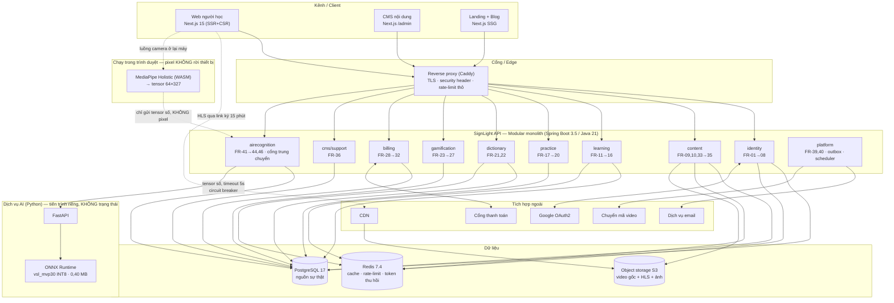
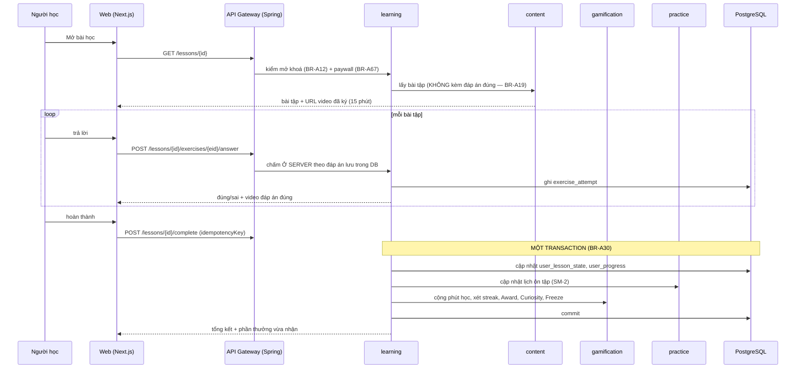
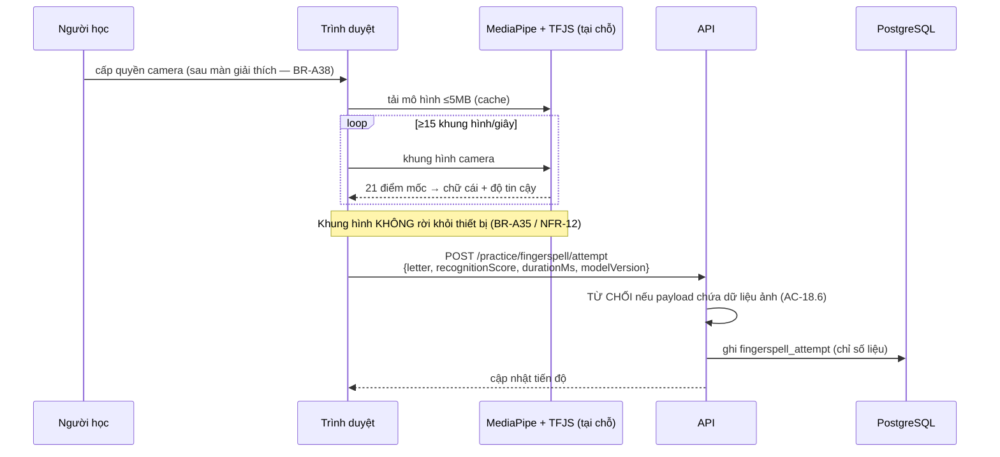
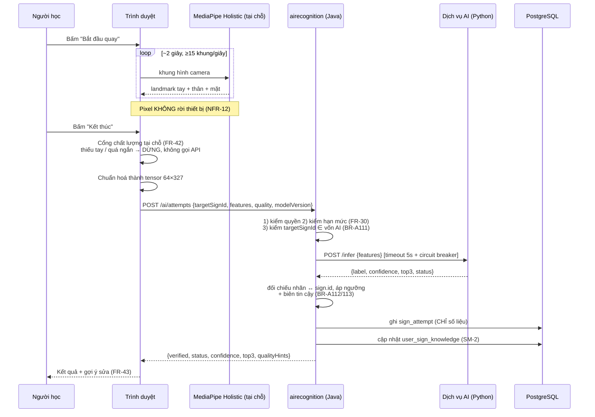
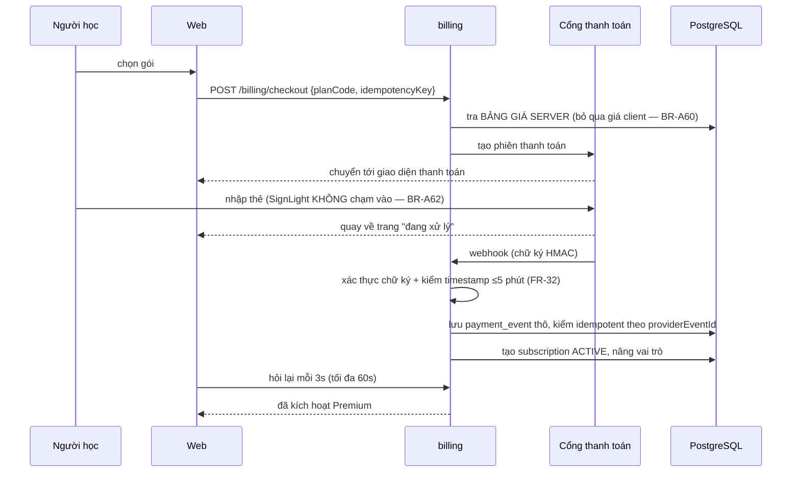

# HLD — SignLight

| Phiên bản | **v0.3** | Ngày | 2026-09-20 | Trạng thái | DRAFT — chờ GATE-2 |

**Tiền đề:** `docs/ba/BRD.md` v0.3, `docs/ba/SRS.md` v0.3 · **Đi kèm:** `docs/sa/architecture.html` (sơ đồ khối dễ nhìn — không thay tài liệu này) · **Khớp:** `docs/sa/techstack.md`

---

## 1. Quyết định kiểu kiến trúc

| Câu hỏi quyết định | Trả lời (trích BRD/SRS) | Nghiêng Monolith / Modular | Nghiêng Microservices |
|--------------------|-------------------------|----------------------------|-----------------------|
| Quy mô người dùng (tổng, đồng thời/peak, tăng trưởng) | NFR-06: 50.000 đăng ký · 5.000 hoạt động/ngày · **500 phiên học đồng thời** · NFR-01: 300 req/s | ✅ Nhỏ–vừa, tải có thể dự đoán (học tập có đỉnh buổi tối nhưng biên độ hẹp) | ❌ |
| Số miền nghiệp vụ & mức độc lập | 10 miền (identity, content, learning, practice, dictionary, gamification, billing, cms, platform, airecognition) — nhưng **gắn kết rất chặt**: hoàn thành 1 bài học chạm tới learning + gamification + practice **trong cùng một transaction** (BR-A30) | ✅ Nhiều miền nhưng **chia sẻ transaction**; tách service sẽ đẻ ra giao dịch phân tán không cần thiết | ❌ |
| Nhu cầu triển khai/mở rộng độc lập | Không có phần nào cần scale riêng ở GĐ1. Phần tốn tài nguyên nhất **nằm ngoài backend Java**: video ở CDN, trích đặc trưng ở trình duyệt, phân lớp ở **dịch vụ AI tách riêng** (ADR-08) | ✅ Trọn gói + 1 dịch vụ tính toán tách riêng | ❌ |
| Số đội song song & tần suất release | **1 đội 1–2 người** (BRD §6) | ✅ | ❌ |
| Năng lực vận hành (CI/CD, giám sát, hạ tầng phân tán) | Hạn chế; ngân sách NFR-18 ≤ 0,15 USD/MAU | ✅ | ❌ Microservices sẽ nhân chi phí hạ tầng & vận hành lên nhiều lần |

**Kết luận:** Kiểu kiến trúc = **Modular monolith + MỘT dịch vụ vệ tinh** — một tiến trình backend Java
(tách module theo miền, dùng chung một CSDL PostgreSQL), **cộng một dịch vụ AI Python tách riêng**.

**Vì sao dịch vụ AI là ngoại lệ duy nhất được tách ra** *(mới ở v0.2)* — ba lý do độc lập, mỗi lý do đủ mạnh:
1. **Khác ngôn ngữ.** Mô hình, pipeline trích đặc trưng và pipeline huấn luyện đều viết bằng Python
   (ONNX Runtime, MediaPipe, PyTorch). Nhét vào tiến trình Java là không làm được một cách sạch sẽ.
2. **Khác vòng đời.** Mô hình được huấn luyện lại và thay mới theo nhịp riêng (30 → 50 → 100 ký hiệu,
   mục tiêu BG-08), hoàn toàn độc lập với nhịp phát hành sản phẩm.
3. **Khác đặc tính lỗi.** Suy luận là tác vụ nặng CPU, có thể chậm hoặc chết; **phải cô lập** để không kéo
   sập luồng học (NFR-20). Backend gọi nó với timeout + circuit breaker, lỗi thì hạ cấp mềm.

Ranh giới này **không mâu thuẫn** với quyết định chọn monolith: dịch vụ AI **không có CSDL riêng**, **không
giữ trạng thái**, **không tham gia transaction nghiệp vụ** — nó là một **hàm thuần** nhận tensor trả nhãn.
Đây là *một dịch vụ tính toán*, không phải *một microservice nghiệp vụ*.

**Điều kiện tách service về sau (ghi sẵn để không phải tranh luận lại):** tách một module thành service
riêng khi **đồng thời** thoả (a) module đó chiếm > 40% tài nguyên backend, **và** (b) cần nhịp phát hành
khác phần còn lại, **hoặc** (c) có đội thứ hai sở hữu riêng module đó. Ứng viên tách tiếp theo: **`billing`**
(ranh giới rõ, ít phụ thuộc) và **`cms`** (tải khác hẳn người học).

## 2. Tổng quan kiến trúc



**Nguyên tắc ranh giới module (bắt buộc tuân ở LLD & code):**
- Mỗi module là **một package gốc** `mm.com.mytel.signlight.<module>`, có **một lớp cửa ngõ** (`<Module>Facade`).
- Module **chỉ gọi nhau qua Facade**, **không** gọi thẳng repository của module khác.
- Module **sở hữu bảng của mình**; module khác muốn đọc thì gọi Facade. Ngoại lệ được phép duy nhất:
  truy vấn đọc chỉ-đọc xuyên module cho màn hình tổng hợp, và phải khai báo rõ ở LLD §2.
- Vi phạm ranh giới bị chặn bằng **kiểm tra kiến trúc tự động** (ArchUnit) trong CI.

## 3. Thành phần chính

| Component/Module | Trách nhiệm | Công nghệ | Dữ liệu sở hữu | Phụ thuộc |
|-------------------|-------------|-----------|----------------|-----------|
| **Web người học** | Lộ trình, bài học, bài tập, Trainer, từ điển, tiến độ, thanh toán | Next.js 15, React 19, TS | Trạng thái phiên học cục bộ | API, CDN, MediaPipe |
| **CMS nội dung** | Soạn/duyệt/xuất bản nội dung | Next.js (khu `/admin`) | — | API |
| **Landing + Blog** | SEO, thu hút người dùng (FR-37) | Next.js SSG/ISR | Nội dung blog (MDX) | API (nhúng video ký hiệu) |
| **`identity`** | Đăng ký, đăng nhập, OAuth, token, hồ sơ, xoá tài khoản | Spring Security, JWT | `user`, `auth_identity`, `user_profile`, `user_preference`, `login_history`, `refresh_token` | Redis, Google, email |
| **`content`** | Cây nội dung, ký hiệu, video, xuất bản | Spring Boot | `course`, `unit`, `chapter`, `lesson`, `exercise`, `exercise_option`, `sign`, `sign_video`, `curiosity` | S3, chuyển mã, Redis |
| **`learning`** | Trình phát, chấm bài tập, quiz, mốc, tiến độ | Spring Boot | `user_progress`, `user_lesson_state`, `exercise_attempt`, `quiz_attempt`, `milestone_result` | `content`, `gamification`, `practice` |
| **`practice`** | Trainer SRS, đánh vần, số, Gương | Spring Boot | `user_sign_knowledge`, `fingerspell_attempt`, `practice_session` | `content`, `gamification` |
| **`dictionary`** | Tìm kiếm & chi tiết ký hiệu | PostgreSQL FTS | *(đọc từ `content`)* + `dictionary_search_log` | `content`, Redis |
| **`gamification`** | Streak, Freeze, Award, Curiosity, chứng chỉ | Spring Boot, PDFBox | `streak`, `streak_event`, `user_award`, `user_curiosity`, `certificate` | `learning`, `practice` |
| **`billing`** | Gói, thanh toán, thuê bao, webhook, paywall | Spring Boot | `plan`, `plan_price`, `subscription`, `payment_transaction`, `payment_event` | Cổng thanh toán, `identity` |
| **`cms`/`support`** | Quyền biên tập, duyệt, tra cứu CSKH | Spring Boot | `content_audit_log`, `audit_log` | mọi module (chỉ đọc qua Facade) |
| **`airecognition`** 🤖 | Cổng trung chuyển tới dịch vụ AI: kiểm quyền & hạn mức, đối chiếu nhãn ↔ ký hiệu, ghi lượt thử, đồng bộ vốn ký hiệu | Spring Boot, Resilience4j | `sign_attempt`, `ai_sign_label`, `ai_model_version`, `data_donation_consent` | Dịch vụ AI, `content`, `billing`, `practice` |
| **Dịch vụ AI** 🤖 | Suy luận thuần: tensor → nhãn + độ tin cậy + top-3 + chất lượng | Python 3.11, FastAPI, ONNX Runtime | **Không sở hữu bảng nào** | — *(không gọi ngược vào backend)* |
| **`platform`** | Outbox, scheduler, email, log, số liệu, health | Spring Boot, Micrometer | `email_outbox`, `job_lock`, `business_inquiry` | email, Prometheus |
| **Nhận dạng trong trình duyệt** | Điểm mốc bàn tay → chữ cái | MediaPipe WASM + TFJS | **Không lưu gì** | — |

## 4. Luồng dữ liệu chính

### 4.1 Hoàn thành một bài học (FR-12 + FR-16) — luồng quan trọng nhất



**Điểm thiết kế then chốt:** ba việc *chấm bài*, *cập nhật tiến độ*, *cập nhật gamification* nằm **trong
cùng một transaction cục bộ**. Đây chính là lý do chọn monolith — nếu tách microservices, luồng này phải
dùng saga và sẽ sinh ra trạng thái nửa vời (người học thấy bài đã xong nhưng streak chưa tăng), làm hỏng
đúng thứ tạo động lực học (BG-02).

### 4.2 Luyện đánh vần có nhận dạng (FR-18)



### 4.2b 🤖 Luyện ký hiệu động với AI (FR-41 → FR-43) — luồng đặc trưng của sản phẩm



**Bốn quyết định thiết kế nằm trong luồng này:**
1. **Cổng chất lượng chạy TRƯỚC khi gọi API** → không lãng phí lượt thử và không tốn tài nguyên suy luận
   cho chuỗi vô dụng.
2. **Backend Java quyết định "đúng/sai"**, không phải dịch vụ AI. Dịch vụ AI chỉ trả *nhãn + độ tin cậy*;
   việc áp ngưỡng, biên tin cậy và đối chiếu với mục tiêu là **luật nghiệp vụ**, thuộc về backend.
3. **Dịch vụ AI không chạm CSDL** → cô lập hoàn toàn, thay mô hình không ảnh hưởng dữ liệu.
4. **Lỗi dịch vụ AI không phải lỗi của người học** → không trừ hạn mức, không đánh dấu sai (NFR-20).

### 4.3 Thanh toán và kích hoạt Premium (FR-29 + FR-32)



### 4.4 Xuất bản nội dung (FR-33→35)
`CONTENT_EDITOR` tạo ký hiệu → tải video lên S3 → `platform` đẩy việc chuyển mã → webhook chuyển mã trả về
→ `sign_video.status = READY` → biên tập gửi duyệt → `CONTENT_APPROVER` duyệt → `PUBLISHED` → **xoá cache
danh mục ở Redis** → nội dung xuất hiện với người học.

## 5. Tích hợp ngoài

| Hệ thống | Giao thức | Xác thực | Chiều | Xử lý lỗi & thử lại |
|----------|-----------|----------|-------|----------------------|
| Cổng thanh toán | REST (ra) + Webhook (vào) | API key / **HMAC** | Hai chiều | Ra: timeout 10s, thử lại 3 lần luỹ thừa. Vào: lưu thô trước, xử lý idempotent (BR-A63) |
| Dịch vụ email | REST | API key | Ra | Qua `email_outbox`, thử lại tới 5 lần, sau đó cảnh báo |
| Object storage (S3) | S3 API / HTTPS | Khoá truy cập, **URL ký 15 phút** | Ra | Trình phát thử lại; lỗi kéo dài → thông báo thân thiện |
| CDN | HTTPS | Token/URL ký | Ra | Dự phòng về origin |
| Chuyển mã video | REST + Webhook | API key | Hai chiều | `FAILED` → biên tập tải lại |
| Google OAuth2 | OIDC + PKCE | Client ID/Secret | Ra | Lỗi → quay về đăng nhập mật khẩu |
| Prometheus | HTTP scrape | Mạng nội bộ | Vào | — |

## 6. Hạ tầng & Môi trường

| Môi trường | Mục đích | Cấu hình | Dữ liệu |
|------------|----------|----------|---------|
| **dev** | Máy lập trình viên | Docker Compose: api + web + postgres + redis; storage giả lập S3 | Dữ liệu mẫu ẩn danh |
| **uat** | Nghiệm thu (B6) | Docker Compose theo `deploy/docker-compose.yml`; dải port **`18080–18090`** (api `18080` · web `18081` · storage `18082/18083`; `ai` **không mở**) | Dữ liệu ẩn danh, **không PII thật** |
| **prod** (định hướng) | Người dùng thật | 1 máy chủ + Caddy + api + postgres + redis; object storage & CDN là dịch vụ quản lý; sao lưu hằng ngày | Dữ liệu thật, mã hoá khi lưu nghỉ |

```
Internet ──► CDN ──► Object storage (video, ảnh)
    │
    └──► Caddy (TLS, security header)
             ├──► Next.js (SSR)
             └──► Spring Boot API ──► PostgreSQL (sao lưu hằng ngày)
                                  └──► Redis
```

**Đường nâng cấp khi vượt NFR-06:** (1) tách Next.js và API sang hai máy; (2) thêm bản sao API sau cân bằng
tải (backend **không giữ trạng thái**, phiên nằm ở JWT + Redis nên nhân bản được ngay); (3) thêm replica đọc
PostgreSQL. **Không** cần đổi kiến trúc trong cả ba bước.

## 7. Xuyên suốt (cross-cutting)

| Mặt | Quyết định |
|-----|------------|
| **Xác thực** | JWT: access 15 phút (trong bộ nhớ, **không** localStorage), refresh 30 ngày trong **cookie HttpOnly + Secure + SameSite=Strict**, xoay vòng và phát hiện tái sử dụng (NFR-09) |
| **Phân quyền** | RBAC kiểm ở backend cho **mọi** endpoint (NFR-07, BR-A67); `@PreAuthorize` + kiểm quyền sở hữu tài nguyên ở tầng service; frontend chỉ ẩn/disable cho đẹp |
| **Giới hạn tần suất** | Bộ đếm cửa sổ trượt trong Redis theo NFR-10, áp ở filter trước controller |
| **Ghi log** | JSON có cấu trúc + `traceId` (MDC); **cấm PII** (BR-A90) — có bộ lọc che dữ liệu ở lớp append log |
| **Truy vết** | `traceId`/`spanId` theo Micrometer Tracing, truyền từ frontend qua header `X-Request-Id` (chính là `requestId` của envelope) |
| **Cấu hình** | Biến môi trường; **secret không nằm trong mã nguồn hay compose**; `.env` không commit |
| **Xử lý lỗi** | `@RestControllerAdvice` duy nhất → `TransactionResponse` với `errorCode` 5 ký tự; HTTP status thật theo loại lỗi (`error-code-convention.md` §3) |
| **Bảo vệ dữ liệu (PDPL)** | Email mã hoá khi lưu nghỉ; ảnh xoá EXIF; IP ẩn danh sau 30 ngày; xoá tài khoản có ân hạn 30 ngày; **khung hình camera không bao giờ rời thiết bị** |
| **Header bảo mật** | CSP nghiêm ngặt (không `unsafe-inline`), HSTS, `X-Content-Type-Options`, `Referrer-Policy`, `Permissions-Policy: camera=(self)` |
| **Bộ nhớ đệm** | Danh mục nội dung cache ở Redis TTL 10 phút, **xoá chủ động khi xuất bản**; kết quả tìm kiếm từ điển cache 5 phút; **tuyệt đối không cache dữ liệu gắn người dùng ở tầng chia sẻ** |
| **Việc nền** | Bảng outbox + `@Scheduled` + khoá phân tán qua bảng `job_lock` (an toàn khi chạy nhiều bản sao) |
| **Khả năng tiếp cận** | Radix UI làm nền; kiểm tự động bằng axe trong Playwright ở CI (NFR-14) |

## 8. Quyết định kiến trúc (ADR ngắn)

- **ADR-01 — Modular monolith thay vì microservices.**
  *Bối cảnh:* 5.000 DAU, 9 miền gắn kết chặt, đội 1–2 người, ngân sách 0,15 USD/MAU.
  *Quyết định:* một tiến trình backend, tách module theo miền, một CSDL, ranh giới cưỡng chế bằng ArchUnit.
  *Hệ quả:* triển khai và gỡ lỗi đơn giản, transaction cục bộ cho luồng hoàn thành bài học; đổi lại phải
  **kỷ luật giữ ranh giới module** để sau này tách được. Điều kiện tách đã ghi ở §1.

- **ADR-02 — Bảng outbox trong PostgreSQL thay vì message broker.**
  *Bối cảnh:* chỉ có 3 loại việc bất đồng bộ; Kafka/RabbitMQ thêm một hệ phải vận hành.
  *Quyết định:* outbox + scheduler + `job_lock`.
  *Hệ quả:* đúng-một-lần cùng transaction nghiệp vụ, chi phí bằng 0; đổi lại thông lượng giới hạn (~vài
  nghìn việc/phút). Xem lại khi vượt 5.000 việc nền/phút.

- **ADR-03 — Suy luận nhận dạng ký hiệu chạy trong trình duyệt.**
  *Bối cảnh:* NFR-12 cấm khung hình camera rời thiết bị; suy luận phía server cần GPU, đắt, độ trễ cao.
  *Quyết định:* MediaPipe Hands (WASM) + mô hình phân lớp TFJS ≤ 5 MB tải về và cache.
  *Hệ quả:* quyền riêng tư đạt **theo thiết kế**, chi phí server bằng 0, hoạt động cả khi mạng chập chờn;
  đổi lại **phải tin điểm số do client gửi** → bù bằng BR-A22 (không cho loại bài này ảnh hưởng điểm mốc)
  và giới hạn tần suất. Đây là đánh đổi có chủ đích: quyền riêng tư quan trọng hơn khả năng chống gian lận
  tuyệt đối ở một bài luyện tập.

- **ADR-04 — Chấm bài tập luôn ở backend, không gửi đáp án đúng ra client.**
  *Bối cảnh:* client-side scoring khiến mọi chỉ số học tập (BG-01, BG-02) trở nên vô nghĩa và mở đường gian
  lận chứng chỉ.
  *Quyết định:* API trả lựa chọn **không cờ đáp án**; chấm ở server (BR-A19).
  *Hệ quả:* thêm một round-trip mỗi câu trả lời (chấp nhận được với P95 < 300 ms); dữ liệu học đáng tin.

- **ADR-05 — PostgreSQL FTS thay vì máy tìm kiếm riêng.**
  *Bối cảnh:* kho từ điển mục tiêu 1.500–5.000 ký hiệu.
  *Quyết định:* `tsvector` + `unaccent` + `pg_trgm`.
  *Hệ quả:* bớt một dịch vụ (~40 USD/tháng và công vận hành); đổi lại thiếu các tính năng xếp hạng nâng
  cao. Ngưỡng xem lại: > 50.000 ký hiệu hoặc P95 tìm kiếm > 300 ms.

- **ADR-06 — Refresh token trong cookie HttpOnly, access token chỉ trong bộ nhớ.**
  *Bối cảnh:* lưu token ở `localStorage` biến mọi lỗ hổng XSS thành chiếm tài khoản.
  *Quyết định:* refresh trong cookie HttpOnly/Secure/SameSite=Strict; access token giữ trong bộ nhớ JS.
  *Hệ quả:* phải có bảo vệ CSRF cho endpoint làm mới token (token chống CSRF gửi kèm); đổi lại giảm mạnh
  hậu quả của XSS.

- **ADR-07 — Trừu tượng hoá nhà cung cấp thanh toán sau interface `PaymentProvider`.** *(cập nhật v0.2)*
  *Bối cảnh:* đã chốt **hai** cổng — VNPay và MoMo — với **thuật toán chữ ký khác nhau** (HMAC-SHA512 vs
  HMAC-SHA256), chuỗi ký khác nhau, mã kết quả khác nhau, định dạng phản hồi IPN khác nhau.
  *Quyết định:* `billing` chỉ làm việc với interface `PaymentProvider`; `VnpayProvider` và `MomoProvider`
  là hai lớp hiện thực; luật nghiệp vụ (cộng dồn hạn, idempotency, đối chiếu số tiền) nằm **ngoài** provider.
  *Hệ quả:* thêm ZaloPay sau này chỉ là thêm một lớp; đổi lại phải kỷ luật **không để chi tiết của cổng rò
  rỉ ra ngoài interface**.

- **ADR-08 — 🤖 Vị trí suy luận AI: trích đặc trưng ở client, phân lớp ở server.** *(mới ở v0.2 — ✅ **ĐÃ CHỐT: phương án B**, anh Bryan 2026-09-20)*
  *Bối cảnh:* mô hình nhận **tensor 64×327**, không nhận pixel. Có ba phương án khả thi.

  | | A — toàn bộ trong trình duyệt | **B — landmark lên server** *(khuyến nghị)* | C — gửi ảnh lên server |
  |---|---|---|---|
  | Pixel rời thiết bị? | ❌ Không | ❌ **Không** | ✅ Có |
  | Payload mỗi lượt | 0 | **~84 KB** (fp32) / ~42 KB (fp16) | ~2 MB (8–32 ảnh JPEG) |
  | Đổi mô hình | Phải phát hành lại client | **Chỉ đổi server** | Chỉ đổi server |
  | Tái dùng repo EXE101 | Phải port MediaPipe + ONNX sang web | **Sửa nhỏ: thêm endpoint nhận tensor** | **Dùng nguyên trạng** |
  | Chi phí server | 0 | Thấp (0,5 ms/lượt) | Cao (MediaPipe chạy ở server) |
  | Hoạt động khi mạng yếu | ✅ | ⚠️ | ❌ |
  | Bảo vệ mô hình khỏi sao chép | ❌ Mô hình tải về máy người dùng | ✅ | ✅ |

  *Quyết định (đã chốt):* **phương án B** — anh Bryan chốt ngày **2026-09-20**. Nó giữ trọn cam kết quyền
  riêng tư (không pixel nào rời thiết bị), chỉ cần **một endpoint mới** ở dịch vụ AI nhận tensor thay vì
  ảnh, và vẫn cho phép nâng cấp mô hình mà không đụng tới client. Phương án A là **đường nâng cấp tự nhiên**
  khi đã đo được hiệu năng MediaPipe trên máy thật; giữ nguyên interface thì đổi sang A sau này không phá
  kiến trúc. Phương án C **bị loại** khỏi phạm vi.
  *Hệ quả bắt buộc thực hiện:*
  1. Dịch vụ AI **phải bổ sung** `POST /api/infer/features` nhận tensor `64×327` (api-spec §4.3);
     endpoint `POST /api/infer/frames` (nhận ảnh) của repo EXE101 **không được bật** trong sản phẩm.
  2. Frontend **bắt buộc** chạy MediaPipe Holistic tại chỗ — không có đường nào khác để lấy landmark.
  3. Backend **từ chối 400 (`10103`)** mọi payload chứa trường ảnh/video (INV-1, TC-FR41-02).
  4. Chấp nhận ~84 KB mỗi lượt thử và phụ thuộc mạng; nếu MediaPipe không đạt ≥ 15 fps trên máy tầm trung
     (GĐ-06) thì **leo thang lên anh Bryan**, không tự ý rơi về phương án C.

- **ADR-09 — 🤖 Backend Java quyết định đúng/sai, dịch vụ AI chỉ trả nhãn.** *(mới ở v0.2)*
  *Bối cảnh:* "đúng hay sai" phụ thuộc ngưỡng tin cậy, biên giữa top1/top2, và ký hiệu mục tiêu — đều là
  **luật nghiệp vụ** có thể phải điều chỉnh mà không huấn luyện lại mô hình.
  *Quyết định:* dịch vụ AI trả `{label, confidence, top3, status}`; backend áp `BR-A112`/`BR-A113` và quyết
  định `verified`.
  *Hệ quả:* hiệu chỉnh ngưỡng chỉ cần đổi cấu hình backend (quan trọng vì ngưỡng **chắc chắn phải chỉnh**
  sau khi đo trên webcam thật — rủi ro R-02); đổi lại logic bị chia giữa hai tiến trình nên **phải viết rõ
  ranh giới** và có test hai phía.

- **ADR-10 — 🤖 Dịch vụ AI không có trạng thái và không có CSDL.** *(mới ở v0.2)*
  *Bối cảnh:* muốn scale ngang được, thay mô hình dễ, và không tạo ra nguồn sự thật thứ hai.
  *Quyết định:* dịch vụ AI chỉ có mô hình + nhãn nạp từ tệp; mọi bản ghi nằm ở PostgreSQL do backend ghi.
  Endpoint thu thập dữ liệu của repo (`/api/attempt`, có ghi video) **không được bật** trong sản phẩm —
  việc góp dữ liệu đi theo luồng riêng có đồng ý tường minh (FR-46).
  *Hệ quả:* chạy được nhiều bản sao dịch vụ AI sau cân bằng tải; đổi lại dịch vụ AI không tự log được
  lượt thử để phân tích — backend phải làm việc đó.

---

## ✅ Checklist trước GATE-2
- [x] §1 chốt kiểu kiến trúc **trước** khi vẽ component, có bảng câu hỏi quyết định trích BRD/SRS.
- [x] Sơ đồ component đúng kiểu kiến trúc đã chọn; nêu rõ ranh giới module và cách cưỡng chế.
- [x] Có ≥ 2 luồng dữ liệu chính vẽ chi tiết (thực tế: 4 luồng).
- [x] Tích hợp ngoài nêu giao thức, xác thực, chiều, cách xử lý lỗi.
- [x] Hạ tầng 3 môi trường + đường nâng cấp khi vượt NFR-06.
- [x] Xuyên suốt: authn/authz, log, tracing, cấu hình, lỗi, **PDPL**, header bảo mật, cache, việc nền.
- [x] ADR ghi bối cảnh → quyết định → hệ quả (**10 ADR**).
- [x] ✅ Q3 đã chốt (VNPay + MoMo) — ADR-07 cập nhật cho hai cổng.
- [x] ✅ **Q8 đã chốt: phương án B** (trình duyệt trích landmark, server phân lớp) — ADR-08 cập nhật, C bị loại.
- [x] ✅ **Q9 đã chốt: BẬT góp dữ liệu tự nguyện** — ADR-10 giữ nguyên ranh giới: luồng góp dữ liệu đi riêng, không qua endpoint suy luận.
