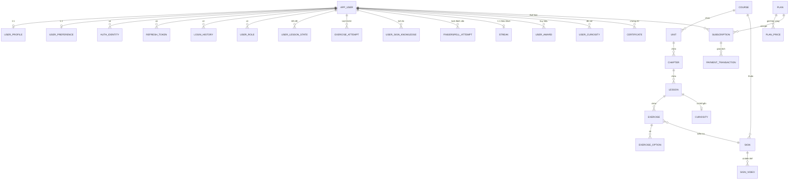

# LLD — SignLight

| Phiên bản | **v0.2** | Ngày | 2026-09-20 | Trạng thái | DRAFT — chờ GATE-3 |

**Tiền đề:** `docs/sa/HLD.md` (Modular monolith), `docs/ba/SRS.md`, `docs/sa/techstack.md`
**Nguồn sự thật:** tên bảng/trường trong tài liệu này là **nguồn sự thật** cho code và `api-spec.md`.

**Quy ước chung của data model:**
- Khoá chính: `UUID` (v7 — có thứ tự thời gian, thân thiện với chỉ mục), sinh ở tầng ứng dụng.
- Mọi bảng có `created_at TIMESTAMPTZ NOT NULL DEFAULT now()` và `updated_at TIMESTAMPTZ NOT NULL DEFAULT now()`; bảng có chỉnh sửa nghiệp vụ thêm `version INT NOT NULL DEFAULT 0` (khoá lạc quan).
- Đặt tên: bảng & cột `snake_case`, số nhiều **không** dùng (bảng là `user`, không phải `users` → dùng `app_user` vì `user` là từ khoá SQL).
- Xoá mềm: cột `deleted_at TIMESTAMPTZ NULL` cho bảng nội dung; **không** xoá cứng nội dung đã xuất bản (BR-A76).
- Tiền tệ: lưu **số nguyên ở đơn vị nhỏ nhất** (`amount_minor BIGINT`) + `currency CHAR(3)`.
- Thời gian: **luôn** `TIMESTAMPTZ`, lưu UTC; múi giờ người dùng ở `user_preference.timezone`.

---

## 1. Data model

### 1.1 ERD tổng quan



### 1.2 Module `identity`

| Bảng | Cột | Kiểu & độ dài | Null? | Khóa (PK/FK) | Chỉ mục | Mặc định | Nhạy cảm? | Mô tả/ràng buộc |
|------|-----|---------------|:-----:|--------------|---------|----------|:---------:|-----------------|
| `app_user` | `id` | UUID | N | PK | | — | | v7 |
| | `email` | VARCHAR(254) | N | | `uq_user_email_ci` UNIQUE trên `lower(email)` | | **PII** | Mã hoá khi lưu nghỉ ở mức ổ đĩa; lưu chữ thường |
| | `email_verified_at` | TIMESTAMPTZ | Y | | | NULL | | BR-A02 |
| | `password_hash` | VARCHAR(255) | Y | | | NULL | **Nhạy cảm** | Argon2id; NULL nếu chỉ đăng nhập OAuth |
| | `status` | VARCHAR(24) | N | | `idx_user_status` | `'PENDING_VERIFICATION'` | | `PENDING_VERIFICATION`/`ACTIVE`/`SUSPENDED`/`PENDING_DELETION`/`DELETED` |
| | `deletion_requested_at` | TIMESTAMPTZ | Y | | `idx_user_deletion` | NULL | | Mốc tính 30 ngày ân hạn (FR-08) |
| | `failed_login_count` | SMALLINT | N | | | 0 | | Reset khi đăng nhập thành công |
| | `locked_until` | TIMESTAMPTZ | Y | | | NULL | | BR khoá 15 phút (FR-02 2b) |
| `user_profile` | `user_id` | UUID | N | PK, FK→`app_user.id` | | | | |
| | `display_name` | VARCHAR(50) | N | | | | **PII** | 2–50 ký tự (FR-01) |
| | `avatar_object_key` | VARCHAR(512) | Y | | | NULL | **PII** | Khoá trong object storage; đã xoá EXIF |
| | `timezone` | VARCHAR(64) | N | | | `'Asia/Ho_Chi_Minh'` | | IANA; cơ sở tính streak (BR-A44) |
| `user_preference` | `user_id` | UUID | N | PK, FK→`app_user.id` | | | | |
| | `active_course_id` | UUID | Y | FK→`course.id` | | NULL | | FR-10; **đổi khoá không mất tiến độ** (BR-A15) |
| | `daily_goal_minutes` | SMALLINT | N | | | 10 | | CHECK ∈ (5,10,15,20) |
| | `pending_goal_minutes` | SMALLINT | Y | | | NULL | | Mục tiêu mới, hiệu lực **từ ngày mai** (BR-A52) |
| | `learning_reason` | VARCHAR(20) | Y | | | NULL | | Enum 7 giá trị (FR-05) |
| | `ui_locale` | VARCHAR(10) | N | | | `'vi'` | | |
| | `video_speed` | NUMERIC(3,2) | N | | | 1.00 | | CHECK ∈ (0.50,0.75,1.00) — AC-11.2 |
| | `marketing_email_opt_in` | BOOLEAN | N | | | false | | BR-A87 |
| `auth_identity` | `id` | UUID | N | PK | | | | |
| | `user_id` | UUID | N | FK→`app_user.id` | `idx_authid_user` | | | |
| | `provider` | VARCHAR(20) | N | | UNIQUE(`provider`,`provider_user_id`) | | | `GOOGLE` |
| | `provider_user_id` | VARCHAR(255) | N | | | | **PII** | `sub` của OIDC |
| `refresh_token` | `id` | UUID | N | PK | | | | |
| | `user_id` | UUID | N | FK→`app_user.id` | `idx_rt_user` | | | |
| | `token_hash` | CHAR(64) | N | | UNIQUE | | **Nhạy cảm** | SHA-256 của token; **không lưu token thô** |
| | `family_id` | UUID | N | | `idx_rt_family` | | | Phát hiện tái sử dụng → thu hồi cả họ (BR-A04) |
| | `expires_at` | TIMESTAMPTZ | N | | `idx_rt_expires` | | | 30 ngày |
| | `revoked_at` | TIMESTAMPTZ | Y | | | NULL | | |
| `login_history` | `id` | UUID | N | PK | | | | |
| | `user_id` | UUID | N | FK→`app_user.id` | `idx_lh_user_time` (`user_id`,`created_at` DESC) | | | |
| | `ip_hash` | CHAR(64) | Y | | | | **PII** | Băm; **ẩn danh sau 30 ngày** (NFR-13) |
| | `user_agent_hash` | CHAR(64) | Y | | | | | |
| | `result` | VARCHAR(16) | N | | | | | `SUCCESS`/`FAILED`/`LOCKED` |
| `user_role` | `user_id` | UUID | N | PK(`user_id`,`role`), FK | | | | |
| | `role` | VARCHAR(24) | N | | | | | 7 vai trò ở SRS §2.2 |
| `email_verification_token` | `id` | UUID | N | PK | | | | Token OTP xác thực email 6 số |
| | `user_id` | UUID | N | FK→`app_user.id` | `idx_evt_user` | | | |
| | `token_hash` | VARCHAR(64) | N | | UNIQUE (`uq_evt_hash`) | | **Nhạy cảm** | SHA-256 mã OTP, TTL 15 phút, dùng 1 lần |
| | `expires_at` | TIMESTAMPTZ | N | | `idx_evt_expires` | | | |
| | `used_at` | TIMESTAMPTZ | Y | | | | NULL | |
| | `created_at` | TIMESTAMPTZ | N | | | now() | | |
| `password_reset_token` | `id` | UUID | N | PK | | | | Token đặt lại mật khẩu ngẫu nhiên |
| | `user_id` | UUID | N | FK→`app_user.id` | `idx_prt_user` | | | |
| | `token_hash` | VARCHAR(64) | N | | UNIQUE (`uq_prt_hash`) | | **Nhạy cảm** | SHA-256 token ngẫu nhiên, TTL 60 phút, dùng 1 lần |
| | `expires_at` | TIMESTAMPTZ | N | | `idx_prt_expires` | | | |
| | `used_at` | TIMESTAMPTZ | Y | | | | NULL | |
| | `created_at` | TIMESTAMPTZ | N | | | now() | | |
| `onboarding_answer` | `id` | UUID | N | PK | | | | |
| | `onboarding_token` | UUID | Y | | `idx_onb_token` | | | Khách chưa có tài khoản; TTL 24h |
| | `user_id` | UUID | Y | FK→`app_user.id` | | | | |
| | `payload` | JSONB | N | | | `'{}'` | | Câu trả lời 11 bước (FR-05) |

### 1.3 Module `content`

| Bảng | Cột | Kiểu | Null? | Khóa | Chỉ mục | Mặc định | Ràng buộc |
|------|-----|------|:-----:|------|---------|----------|-----------|
| `course` | `id` | UUID | N | PK | | | |
| | `code` | VARCHAR(16) | N | | UNIQUE | | Ví dụ `VSL`, `ASL` |
| | `name` | VARCHAR(150) | N | | | | |
| | `status` | VARCHAR(16) | N | | `idx_course_status` | `'DRAFT'` | Vòng đời nội dung (SRS §5.2) |
| | `alphabet_letters` | VARCHAR(64) | N | | | | Bảng chữ cái của khoá — validate `letter` ở FR-18 |
| `unit` | `id` | UUID | N | PK | | | |
| | `course_id` | UUID | N | FK→`course.id` | `idx_unit_course_order` (`course_id`,`order_index`) | | |
| | `order_index` | INT | N | | UNIQUE(`course_id`,`order_index`) | | ≥ 0 |
| | `is_free` | BOOLEAN | N | | | false | Unit 1 = true (FR-30) |
| `chapter` | `id` | UUID | N | PK | | | |
| | `unit_id` | UUID | N | FK→`unit.id` | UNIQUE(`unit_id`,`order_index`) | | |
| | `order_index` | INT | N | | | | |
| | `quiz_pass_percent` | SMALLINT | N | | | 80 | BR-A23 |
| `lesson` | `id` | UUID | N | PK | | | |
| | `chapter_id` | UUID | N | FK→`chapter.id` | UNIQUE(`chapter_id`,`order_index`) | | |
| | `order_index` | INT | N | | | | Đổi thứ tự **không** ảnh hưởng tiến độ (BR-A78) |
| | `type` | VARCHAR(20) | N | | | `'STANDARD'` | `STANDARD`/`QUIZ`/`MILESTONE`/`DIALOGUE` |
| | `estimated_minutes` | SMALLINT | N | | | 5 | |
| | `curiosity_id` | UUID | Y | FK→`curiosity.id` | | NULL | FR-15 |
| | `status` | VARCHAR(20) | N | | `idx_lesson_status` | `'DRAFT'` | |
| `exercise` | `id` | UUID | N | PK | | | |
| | `lesson_id` | UUID | N | FK→`lesson.id` | `idx_ex_lesson_order` | | |
| | `order_index` | INT | N | | | | |
| | `type` | VARCHAR(28) | N | | | | 6 loại ở FR-12 |
| | `sign_id` | UUID | Y | FK→`sign.id` | `idx_ex_sign` | | Ký hiệu được kiểm tra |
| | `prompt_text` | VARCHAR(500) | Y | | | | |
| | `correct_answer_text` | VARCHAR(200) | Y | | | | Dùng cho `TYPE_WHAT_YOU_SEE`; **KHÔNG BAO GIỜ trả ra client** (BR-A19) |
| | `accepted_answers` | JSONB | Y | | | `'[]'` | Danh sách từ đồng nghĩa chấp nhận |
| | `correct_order` | JSONB | Y | | | | Dùng cho `SENTENCE_ORDER`; **không trả ra client** |
| `exercise_option` | `id` | UUID | N | PK | | | |
| | `exercise_id` | UUID | N | FK→`exercise.id` | `idx_opt_exercise` | | |
| | `is_correct` | BOOLEAN | N | | | false | **KHÔNG BAO GIỜ serialize ra client** (AC-12.4) |
| | `label_text` | VARCHAR(200) | Y | | | | |
| | `sign_video_id` | UUID | Y | FK→`sign_video.id` | | | Lựa chọn dạng video |
| `sign` | `id` | UUID | N | PK | | | |
| | `course_id` | UUID | N | FK→`course.id` | UNIQUE(`course_id`,`word`,`meaning`) | | BR CMS FR-33 |
| | `word` | VARCHAR(100) | N | | | | |
| | `meaning` | VARCHAR(255) | Y | | | | Phân biệt từ đồng âm |
| | `word_class` | VARCHAR(24) | Y | | | | `NOUN`/`VERB`/`DIRECTIONAL_VERB`/… |
| | `topic` | VARCHAR(64) | Y | | `idx_sign_topic` | | Duyệt theo chủ đề (FR-21) |
| | `cefr_level` | VARCHAR(4) | Y | | | | A1/A2… |
| | `search_vector` | TSVECTOR | Y | | **GIN** `idx_sign_fts` | | Sinh từ `unaccent(word) \|\| meaning \|\| topic` (ADR-05) |
| | `status` | VARCHAR(20) | N | | `idx_sign_status` | `'DRAFT'` | Chỉ `PUBLISHED` mới ra kết quả tìm kiếm (BR-A42) |
| `sign_video` | `id` | UUID | N | PK | | | |
| | `sign_id` | UUID | N | FK→`sign.id` | `idx_sv_sign` | | |
| | `storage_provider` | VARCHAR(32) | N | | `idx_sv_storage` | `'GDRIVE'` | `'GDRIVE'` (mặc định), `'MINIO'`, `'S3'` |
| | `drive_file_id` | VARCHAR(128) | Y | | `idx_sv_drive_id` | NULL | Google Drive File ID phát qua CDN `lh3.googleusercontent.com` |
| | `direct_url` | VARCHAR(1024) | Y | | | NULL | URL video stream trực tiếp |
| | `object_key` | VARCHAR(512) | Y | | | NULL | Khoá object storage (tuỳ chọn khi dùng MinIO/S3) |
| | `hls_manifest_key` | VARCHAR(512) | Y | | | NULL | Sinh sau chuyển mã |
| | `status` | VARCHAR(16) | N | | `idx_sv_status` | `'READY'` | `UPLOADED`/`TRANSCODING`/`READY`/`FAILED` |
| | `region_label` | VARCHAR(64) | Y | | | | Nhãn vùng miền (BR-A43) |
| | `signer_label` | VARCHAR(64) | Y | | | | Người ký hiệu |
| | `is_primary` | BOOLEAN | N | | | false | Biến thể hiển thị mặc định |
| | `duration_ms` | INT | Y | | | | CHECK ≤ 60000 (FR-33) |
| `curiosity` | `id` | UUID | N | PK | | | |
| | `title` | VARCHAR(150) | N | | | | **Không trả ra client nếu chưa mở** (BR-A29) |
| | `content` | TEXT | N | | | | |

### 1.4 Module `learning`

| Bảng | Cột | Kiểu | Null? | Khóa | Chỉ mục | Ràng buộc |
|------|-----|------|:-----:|------|---------|-----------|
| `user_lesson_state` | `user_id`,`lesson_id` | UUID | N | PK kép, FK | `idx_uls_user_course` | |
| | `status` | VARCHAR(16) | N | | | `NOT_STARTED`/`IN_PROGRESS`/`COMPLETED` |
| | `best_score_percent` | SMALLINT | Y | | | 0–100; điểm lần đầu (BR-A20) |
| | `first_try_perfect` | BOOLEAN | N | | | Cơ sở đếm `ZERO_MISS_WIZ` & cấp Freeze (BR-A21, BR-A54) |
| | `current_exercise_index` | SMALLINT | N | | | Vào lại đúng câu đang dở (FR-12 4a) |
| | `completed_at` | TIMESTAMPTZ | Y | | | |
| `exercise_attempt` | `id` | UUID | N | PK | `idx_ea_user_time` | |
| | `user_id`,`exercise_id` | UUID | N | FK | | |
| | `attempt_no` | SMALLINT | N | | | 1 = lần đầu (dùng tính điểm) |
| | `is_correct` | BOOLEAN | N | | | **Do server chấm** (BR-A19) |
| | `answer_payload` | JSONB | Y | | | Câu trả lời thô (đã khử HTML) |
| | `client_elapsed_ms` | INT | Y | | | Chỉ thống kê, không dùng chấm điểm |
| `lesson_completion` | `id` | UUID | N | PK | | |
| | `idempotency_key` | UUID | N | | UNIQUE(`user_id`,`idempotency_key`) | **BR-A31** — chống cộng dồn |
| | `effective_minutes` | NUMERIC(5,2) | N | | | Đã áp trần 15 phút/bài (BR-A46) |
| `quiz_attempt` | `id` | UUID | N | PK | `idx_qa_user_chapter` | |
| | `score_percent` | SMALLINT | N | | | |
| | `passed` | BOOLEAN | N | | | ≥ `chapter.quiz_pass_percent` |
| `milestone_result` | `user_id`,`unit_id` | UUID | N | PK kép, FK | | |
| | `best_stars` | SMALLINT | N | | | 1–5; **chỉ tăng** (BR-A26) |

### 1.5 Module `practice`

| Bảng | Cột | Kiểu | Null? | Khóa | Chỉ mục | Ràng buộc |
|------|-----|------|:-----:|------|---------|-----------|
| `user_sign_knowledge` | `user_id`,`sign_id` | UUID | N | PK kép, FK | `idx_usk_due` (`user_id`,`due_at`) | Trái tim của FR-17 |
| | `ease_factor` | NUMERIC(4,2) | N | | | Mặc định 2.50, **CHECK ≥ 1.30** |
| | `interval_days` | INT | N | | | Mặc định 0 |
| | `repetition_count` | SMALLINT | N | | | Reset về 0 khi sai |
| | `due_at` | TIMESTAMPTZ | N | | | Lấy 20 bản ghi `due_at` sớm nhất (BR-A32) |
| | `lapse_count` | SMALLINT | N | | | Số lần quên |
| `fingerspell_attempt` | `id` | UUID | N | PK | `idx_fa_user_time` | **TUYỆT ĐỐI KHÔNG có cột ảnh/video** (BR-A35) |
| | `letter` | CHAR(1) | N | | | Phải thuộc `course.alphabet_letters` |
| | `recognition_score` | NUMERIC(3,2) | N | | | CHECK 0.00–1.00 |
| | `duration_ms` | INT | N | | | CHECK ≤ 60000 |
| | `model_version` | VARCHAR(32) | N | | | Phải nằm trong danh sách hỗ trợ |
| `practice_session` | `id` | UUID | N | PK | `idx_ps_user_date` | |
| | `type` | VARCHAR(20) | N | | | `VOCAB`/`FINGERSPELL`/`NUMBER` |
| | `effective_minutes` | NUMERIC(5,2) | N | | | Cộng vào mục tiêu ngày (BR-A34) |
| | `session_date_local` | DATE | N | | UNIQUE(`user_id`,`type`,`session_date_local`,`seq`) | Đếm giới hạn 1 phiên/ngày cho free (BR-A33) |

### 1.6 Module `gamification`

| Bảng | Cột | Kiểu | Null? | Khóa | Ràng buộc |
|------|-----|------|:-----:|------|-----------|
| `streak` | `user_id`,`course_id` | UUID | N | PK kép, FK | Streak tính **theo khoá** |
| | `current_count` | INT | N | | ≥ 0 |
| | `longest_count` | INT | N | | **Chỉ tăng** (BR-A49) |
| | `freeze_count` | SMALLINT | N | | CHECK 0–3 (BR-A50) |
| | `last_goal_met_date_local` | DATE | Y | | Ngày cuối đạt mục tiêu, theo múi giờ người dùng |
| `daily_activity` | `user_id`,`course_id`,`activity_date_local` | — | N | PK ba khoá | |
| | `total_minutes` | NUMERIC(5,2) | N | | Tổng phút thực tế trong ngày (BR-A45) |
| | `goal_minutes` | SMALLINT | N | | **Chụp lại** mục tiêu của ngày đó (chống hạ mục tiêu cứu streak — BR-A52) |
| | `goal_met` | BOOLEAN | N | | `total_minutes >= goal_minutes` |
| `streak_event` | `id` | UUID | N | PK | |
| | `type` | VARCHAR(20) | N | | `INCREASED`/`FREEZE_USED`/`RESET`/`FREEZE_EARNED`/`COMPENSATED` |
| `user_award` | `user_id`,`award_code` | — | N | PK kép | 6 mã ở FR-25 |
| | `current_value` | INT | N | | Chỉ số tích luỹ |
| | `current_tier` | SMALLINT | N | | **Chỉ tăng** (BR-A53) |
| | `tier_celebrated` | SMALLINT | N | | Chống hiện lại màn chúc mừng (BR-A55, AC-25.3) |
| `user_curiosity` | `user_id`,`curiosity_id` | UUID | N | PK kép | Mở một lần (BR-A28) |
| `certificate` | `id` | UUID | N | PK | |
| | `verification_code` | VARCHAR(24) | N | UNIQUE | Tra ở trang công khai (BR-A59) |
| | `scope_payload` | JSONB | N | | Danh sách chương/Unit đã hoàn thành |
| | `pdf_object_key` | VARCHAR(512) | Y | | |

### 1.7 Module `billing` *(viết lại ở v0.2 cho VNPay + MoMo, không tự động gia hạn)*

| Bảng | Cột | Kiểu | Null? | Khóa | Ràng buộc |
|------|-----|------|:-----:|------|-----------|
| `plan` | `code` | VARCHAR(24) | N | PK | `PREMIUM_1M`/`PREMIUM_3M`/`PREMIUM_12M` |
| | `duration_days` | SMALLINT | N | | 30 / 90 / 365 (BR-A65) |
| | `is_active` | BOOLEAN | N | | |
| `plan_price` | `plan_code`,`currency` | — | N | PK kép | **Nguồn giá duy nhất** (BR-A60). GĐ1 chỉ `VND` (BR-A104) |
| | `amount_minor` | BIGINT | N | | VND: đơn vị là **đồng** (VND không có đơn vị nhỏ hơn) |
| `subscription` | `id` | UUID | N | PK | |
| | `user_id` | UUID | N | FK | **Partial UNIQUE** `WHERE status='ACTIVE'` — mỗi người tối đa 1 thuê bao hiệu lực |
| | `status` | VARCHAR(16) | N | | `ACTIVE` / `EXPIRED` / `REFUNDED` *(v0.2: **bỏ** `CANCELLED_AT_PERIOD_END` — không còn tự động gia hạn)* |
| | `expires_at` | TIMESTAMPTZ | N | `idx_sub_expires` | **Cơ sở kiểm paywall** (BR-A64); job hết hạn quét cột này (BR-A74) |
| | `activated_at` | TIMESTAMPTZ | N | | |
| | ~~`auto_renew`~~ | — | — | — | **Đã bỏ ở v0.2** — không có gia hạn tự động (BR-A69) |
| | `last_reminder_stage` | SMALLINT | Y | | 7 / 3 / 1 / 0 (sau hết hạn) — chống gửi nhắc trùng (AC-31.1, AC-31.5) |
| `payment_transaction` | `id` | UUID | N | PK | |
| | `order_code` | BIGINT | N | UNIQUE | Mã đơn hàng số nguyên 53-bit cho cổng payOS |
| | `order_ref` | VARCHAR(64) | N | UNIQUE | Mã tham chiếu giao dịch (`PAYOS-...` / `vnp_TxnRef`) |
| | `idempotency_key` | UUID | Y | UNIQUE(`user_id`,`idempotency_key`) | Chống tạo đơn trùng lặp |
| | `provider` | VARCHAR(16) | N | `idx_pt_provider` | `PAYOS` (mặc định), `VNPAY`, `MOMO` |
| | `amount` / `amount_minor` | INT / BIGINT | N | | Đơn vị VND (đồng), lấy từ bảng `plan` |
| | `status` | VARCHAR(24) | N | `idx_pt_status_created` | `PENDING`/`PAID`/`FAILED`/`CANCELLED`/`REFUNDED` |
| | `payment_link_id` | VARCHAR(128) | Y | | ID link thanh toán payOS |
| | `checkout_url` | VARCHAR(1024) | Y | | URL chuyển hướng trang thanh toán payOS VietQR |
| | `qr_code` | TEXT | Y | | Chuỗi VietQR payload thanh toán |
| | `account_number` | VARCHAR(64) | Y | | Số tài khoản nhận tiền thụ hưởng (VD: `V3CAS5111146929`) |
| | `account_name` | VARCHAR(128) | Y | | Tên chủ tài khoản thụ hưởng (VD: `PHAN BUI BA DAT`) |
| | `bin` | VARCHAR(16) | Y | | Mã BIN ngân hàng NAPAS (VD: `970418` - BIDV) |
| | `bank_name` | VARCHAR(128) | Y | | Tên ngân hàng thụ hưởng giải mã chuẩn NAPAS |
| | `description` | VARCHAR(256) | Y | | Nội dung chuyển khoản yêu cầu |
| | `provider_transaction_no` | VARCHAR(128) | Y | UNIQUE(`provider`,`provider_transaction_no`) | **Khoá idempotent của IPN** |
| | `paid_at` | TIMESTAMPTZ | Y | | Thời điểm IPN xác nhận — mốc tính hạn |
| | *(không có cột nào chứa dữ liệu thẻ/ví)* | — | — | — | **BR-A62 — bất biến** |
| `payment_webhook_log` | `id` | UUID | N | PK | |
| | `provider` | VARCHAR(16) | N | | `PAYOS` |
| | `webhook_type` | VARCHAR(32) | N | | `PAYMENT_SUCCESS` / `PAYMENT_CANCELLED` |
| | `raw_payload` | TEXT | N | | Lưu nguyên văn webhook IPN |
| | `signature_valid` | BOOLEAN | N | | Kết quả xác thực chữ ký HMAC SHA-256 |
| | `processed` | BOOLEAN | N | | Trạng thái xử lý nghiệp vụ thành công |
| `payment_event` | `id` | UUID | N | PK | |
| | `provider`,`provider_transaction_no` | — | N | UNIQUE kép | **Khoá idempotent** (BR-A63) |
| | `raw_payload` | JSONB | N | | Lưu **nguyên văn** IPN trước khi xử lý (BR-A73); lọc bỏ trường nhạy cảm (DR-05) |
| | `signature_valid` | BOOLEAN | N | | Ghi lại kết quả xác thực chữ ký để đối soát |
| | `processed_at` | TIMESTAMPTZ | Y | | NULL = chưa xử lý |
| `payment_anomaly` | `id` | UUID | N | PK | Bất thường cần người xem: `order_ref` không tồn tại, **số tiền lệch** (BR-A105), IPN không khớp |
| | `kind` | VARCHAR(32) | N | | `UNKNOWN_ORDER`/`AMOUNT_MISMATCH`/`DUPLICATE_CONFLICT`/`SIGNATURE_INVALID` |
| | `detail` | JSONB | N | | |
| | `resolved_at`, `resolved_by` | — | Y | | CSKH xử lý tay |

> **Ghi chú di trú:** so với v0.1, bảng `subscription` **bỏ** `auto_renew` và `provider_subscription_id`,
> đổi `current_period_end` → `expires_at`, thu gọn tập trạng thái. Đây là thay đổi **do quyết định Q3**,
> đã ghi vào hàng đợi `CR-002` của `PROJECT_STATE.md`.

### 1.7b Module `airecognition` 🤖 *(mới ở v0.2)*

| Bảng | Cột | Kiểu | Null? | Khóa | Ràng buộc |
|------|-----|------|:-----:|------|-----------|
| `ai_model_version` | `id` | UUID | N | PK | |
| | `version_code` | VARCHAR(32) | N | UNIQUE | Ví dụ `vsl-mvp30-v2-lite-transformer` |
| | `num_classes` | SMALLINT | N | | 30 (MVP-30) / 50 (MVP-50) |
| | `sequence_length` | SMALLINT | N | | **64** — phải khớp `config.json` của mô hình |
| | `feature_dim` | SMALLINT | N | | **327** — phải khớp `config.json` |
| | `schema_version` | VARCHAR(32) | N | | `v2_holistic_subset` |
| | `confidence_threshold` | NUMERIC(4,3) | N | | Mặc định lấy từ mô hình; **chỉnh được không cần triển khai lại** (BR-A112) |
| | `confidence_margin` | NUMERIC(4,3) | N | | Biên top1−top2 (BR-A113) |
| | `is_active` | BOOLEAN | N | Partial UNIQUE `WHERE is_active` | **Chỉ một phiên bản hoạt động tại một thời điểm** (BR-A127) |
| `ai_sign_label` | `id` | UUID | N | PK | |
| | `model_version_id` | UUID | N | FK | |
| | `label_index` | SMALLINT | N | UNIQUE(`model_version_id`,`label_index`) | Vị trí trong `labels.json` |
| | `raw_label` | VARCHAR(100) | N | | Nguyên văn, ví dụ `Cái bàn` |
| | `stable_sign_id` | VARCHAR(100) | N | `idx_aisl_stable` | Chuẩn hoá: NFKD, `đ→d`, bỏ dấu, chữ thường, `[^a-z0-9]+ → -` → `cai-ban` (BR-A124) |
| | `sign_id` | UUID | Y | FK→`sign.id` | **NULL = nhãn mồ côi** → không kích hoạt (BR-A125) |
| | `is_enabled` | BOOLEAN | N | | Chỉ `true` khi đã ánh xạ được và ký hiệu đã `PUBLISHED` |
| `sign_attempt` | `id` | UUID | N | PK | **TUYỆT ĐỐI KHÔNG có cột ảnh/video/landmark thô** (NFR-12) |
| | `user_id` | UUID | N | FK | |
| | `target_sign_id` | UUID | N | FK→`sign.id` | Ký hiệu người học đang luyện |
| | `model_version_id` | UUID | N | FK | Truy vết kết quả theo phiên bản mô hình |
| | `status` | VARCHAR(24) | N | `idx_sa_user_time` | 7 trạng thái ở SRS FR-42 |
| | `verified` | BOOLEAN | N | | **Do backend quyết định** (ADR-09) |
| | `predicted_sign_id` | UUID | Y | FK→`sign.id` | Ký hiệu AI nhận ra (phục vụ `wrong_target`) |
| | `confidence` | NUMERIC(4,3) | Y | | 0.000–1.000 |
| | `top3` | JSONB | Y | | `[{signId,label,confidence}×3]` |
| | `quality` | JSONB | Y | | `handFrameRatio`, `bothHandsRatio`, `poseDetected`… |
| | `duration_ms` | INT | Y | | CHECK ≤ 6000 |
| | `counted_against_quota` | BOOLEAN | N | | `false` với `no_hand`/`too_short`/`service_error` (FR-42) |
| | `inference_latency_ms` | INT | Y | | Đo NFR-04 / NFR-20 |
| `ai_daily_quota` | `user_id`,`quota_date_local` | — | N | PK kép | Hạn mức 5 lượt/ngày cho người dùng miễn phí (BR-A108) |
| | `used_count` | SMALLINT | N | | |
| `data_donation_consent` | `user_id` | UUID | N | PK, FK | FR-46 |
| | `granted_at` | TIMESTAMPTZ | Y | | NULL = **chưa đồng ý** (mặc định — BR-A130) |
| | `revoked_at` | TIMESTAMPTZ | Y | | Rút lại → job xoá trong 30 ngày (BR-A133) |
| | `consent_text_version` | VARCHAR(16) | N | | Ghi lại **phiên bản văn bản đồng ý** tại thời điểm đồng ý |
| | `pseudonym_id` | UUID | N | UNIQUE | Định danh giả dùng khi gắn nhãn dữ liệu (BR-A135) |
| `donated_clip` | `id` | UUID | N | PK | **Chỉ tồn tại khi có đồng ý hợp lệ** |
| | `pseudonym_id` | UUID | N | `idx_dc_pseudonym` | **Không** lưu `user_id` trực tiếp (BR-A135) |
| | `object_key` | VARCHAR(512) | N | | **Bucket RIÊNG**, quyền riêng (BR-A134) |
| | `target_sign_id` | UUID | N | FK | |
| | `purge_after` | TIMESTAMPTZ | N | `idx_dc_purge` | Job xoá theo hạn giữ |
| `missing_sign_request` | `id` | UUID | N | PK | FR-45 |
| | `normalized_key` | VARCHAR(100) | N | UNIQUE | Gộp yêu cầu trùng (BR-A128) |
| | `word` | VARCHAR(100) | N | | Nguyên văn lần đầu |
| | `request_count` | INT | N | | Tăng dần |
| | `status` | VARCHAR(16) | N | | `OPEN`/`PLANNED`/`PUBLISHED`/`REJECTED` |
| `missing_sign_requester` | `request_id`,`user_id` | — | N | PK kép | Để thông báo khi ký hiệu được bổ sung (BR-A129) |

### 1.8 Module `platform` & audit

| Bảng | Cột chính | Ghi chú |
|------|-----------|---------|
| `email_outbox` | `id`, `template_code`, `to_email_hash`, `payload JSONB`, `status`, `attempt_count`, `next_attempt_at` | BR-A89; **lưu email dạng băm + tham chiếu user_id**, dựng địa chỉ thật lúc gửi |
| `job_lock` | `job_name` PK, `locked_until`, `locked_by` | Khoá phân tán cho `@Scheduled` (HLD §7) |
| `audit_log` | `id`, `actor_user_id`, `action`, `target_type`, `target_id`, `reason`, `metadata JSONB` | `reason` **NOT NULL** với thao tác CSKH (BR-A83) |
| `content_audit_log` | `id`, `actor_user_id`, `content_type`, `content_id`, `from_status`, `to_status`, `note` | BR-A80 |
| `business_inquiry` | `id`, `organization_name`, `contact_email`, `seat_count`, `message`, `ip_hash` | FR-38; **PII** |
| `dictionary_search_log` | `id`, `user_id` (nullable), `query_normalized`, `result_count` | Không log IP thô; phục vụ cải thiện từ điển |

### 1.9 Chỉ mục quan trọng (phục vụ NFR-01)

| Chỉ mục | Bảng | Phục vụ truy vấn |
|---------|------|-------------------|
| `idx_usk_due` (`user_id`,`due_at`) | `user_sign_knowledge` | Lấy 20 ký hiệu đến hạn ôn — truy vấn nóng nhất của Trainer |
| `idx_uls_user_course` (`user_id`, `lesson_id`) INCLUDE(`status`) | `user_lesson_state` | Dựng lộ trình học (FR-09) trong 1 lần quét |
| GIN `idx_sign_fts` | `sign` | Tìm kiếm từ điển (FR-21) |
| `idx_sign_trgm` GIN (`word` gin_trgm_ops) | `sign` | Gợi ý khi gõ sai chính tả |
| Partial UNIQUE `subscription(user_id) WHERE status='ACTIVE'` | `subscription` | Chống hai thuê bao cùng hiệu lực |
| `idx_ea_user_time` (`user_id`,`created_at` DESC) | `exercise_attempt` | Thống kê tiến độ |
| `idx_outbox_pending` (`next_attempt_at`) WHERE `status='PENDING'` | `email_outbox` | Worker quét việc chờ gửi |

### 1.10 Dữ liệu nhạy cảm & xử lý PDPL

| Dữ liệu | Bảo vệ |
|---------|--------|
| `app_user.email` | Duy nhất theo chữ thường; mã hoá ổ đĩa; **băm khi ghi log**; ẩn danh khi xoá tài khoản |
| `password_hash` | Argon2id; không bao giờ đọc ra ngoài tầng `identity` |
| `refresh_token.token_hash`, các token | Lưu **băm SHA-256**, so sánh chống tấn công thời gian |
| `login_history.ip_hash` | Băm kèm salt riêng; ẩn danh sau 30 ngày bằng job nền |
| `user_profile.avatar_object_key` | Ảnh xoá EXIF lúc tải lên |
| **Khung hình camera** | **Không tồn tại trong bất kỳ bảng nào** — bất biến kiểm ở GATE-5. `sign_attempt` và `fingerspell_attempt` **chỉ chứa số** |
| **Landmark thô** | Không lưu. Tensor 64×327 đi qua bộ nhớ khi suy luận rồi **bị loại bỏ**; không ghi đĩa, không ghi log |
| **`donated_clip`** *(chỉ khi có đồng ý)* | **Dữ liệu nhạy cảm nhất hệ thống.** Bucket riêng · quyền riêng · gắn `pseudonym_id` không gắn `user_id` · có hạn xoá · xoá toàn bộ trong 30 ngày khi rút đồng ý (BR-A133→A135) |
| Dữ liệu thẻ/ví | **Không tồn tại trong hệ thống** (SAQ-A) |

---

## 2. Phân rã module/class

| Module/Class | Trách nhiệm | Giao diện public | Phụ thuộc | FR phục vụ |
|--------------|-------------|-------------------|-----------|------------|
| `IdentityFacade` | Cửa ngõ module identity | `getUserSummary(userId)`, `hasRole(userId, role)`, `getTimezone(userId)` | — | FR-01→08 |
| `AuthService` | Đăng ký, đăng nhập, token | `register(cmd)`, `login(cmd)`, `refresh(token)`, `logout(...)` | `PasswordHasher`, `TokenService`, `RateLimiter` | FR-01, 02, 04 |
| `OAuthService` | Đăng nhập Google | `handleCallback(code, state)` | Google OIDC | FR-03 |
| `AccountService` | Hồ sơ, đổi email/mật khẩu, xoá tài khoản | `updateProfile`, `changeEmail`, `changePassword`, `requestDeletion`, `cancelDeletion` | `EmailOutbox` | FR-06, 08 |
| `TokenService` | Phát hành/xoay vòng/thu hồi token | `issuePair`, `rotate`, `revokeFamily`, `revokeAllForUser` | Redis, `refresh_token` | FR-02, NFR-09 |
| `ContentFacade` | Cửa ngõ module content | `getLessonForLearner(lessonId, userId)`, `getCourseTree(courseId)`, `getSign(signId)` | — | FR-09→11 |
| `CourseTreeService` | Dựng & cache cây nội dung | `getTree(courseId)`, `evictCache(courseId)` | Redis | FR-09 |
| `LessonQueryService` | Lấy bài học **đã lọc đáp án đúng** | `getExercises(lessonId)` → DTO **không** có `isCorrect` | — | FR-12, ADR-04 |
| `SignVideoUrlService` | Sinh URL ký có hạn | `signedUrl(signVideoId, userId, ttl=15m)` | S3 | BR-A17, AC-11.3 |
| `ContentAuthoringService` | CRUD nội dung (CMS) | `createSign`, `updateLesson`, `reorder`, `submitForReview` | S3, chuyển mã | FR-33, 34 |
| `ContentPublishingService` | Duyệt & xuất bản | `approve(contentId, approverId)`, `unpublish(...)` | `content_audit_log` | FR-35, BR-A79 |
| `LearningFacade` | Cửa ngõ module learning | `getPathState(userId, courseId)`, `getCompletedLessonCount(userId)` | — | FR-09, 16 |
| `LessonProgressService` | Mở khoá, trạng thái, vào lại bài dở | `assertUnlocked(userId, lessonId)`, `saveProgress(...)` | `ContentFacade` | FR-09, BR-A12 |
| `ExerciseGradingService` | **Chấm bài ở server** | `grade(userId, exerciseId, answer)` → `GradeResult` | `content` | FR-12, BR-A19 |
| `LessonCompletionService` | Giao dịch hoàn thành bài | `complete(userId, lessonId, idempotencyKey)` | `practice`, `gamification` | FR-16, BR-A30, BR-A31 |
| `QuizService` | Quiz cuối chương | `startQuiz(chapterId)`, `submitQuiz(...)` | `content` | FR-13 |
| `MilestoneService` | Bài mốc & sao | `submitMilestone(...)` → sao; chỉ tăng | `gamification` | FR-14, BR-A26 |
| `PracticeFacade` | Cửa ngõ module practice | `scheduleReview(userId, signIds, correct)` | — | FR-17 |
| `SpacedRepetitionService` | Thuật toán SM-2 | `next(knowledge, wasCorrect)` → `knowledge'`, `dueSigns(userId, limit)` | — | FR-17, AC-17.1→3 |
| `FingerspellService` | Ghi nhận lượt đánh vần | `recordAttempt(cmd)` — **từ chối payload chứa ảnh** | — | FR-18, AC-18.6 |
| `DictionaryService` | Tìm kiếm & chi tiết | `search(q, filters, page)`, `detail(signId)` | PostgreSQL FTS, Redis | FR-21, 22 |
| `GamificationFacade` | Cửa ngõ gamification | `onLessonCompleted(event)`, `onPracticeCompleted(event)` | — | FR-23→27 |
| `StreakService` | Streak, Freeze, hoạt động ngày | `recordActivity(userId, minutes)`, `runMidnightRollover(timezone)` | `daily_activity` | FR-23, BR-A44→51 |
| `AwardService` | Cập nhật & lên cấp huy hiệu | `updateAwards(userId, deltas)` | — | FR-25 |
| `CertificateService` | Sinh & xác minh chứng chỉ | `issue(userId, chapterIds)`, `verify(code)` | PDFBox, S3 | FR-27 |
| `BillingFacade` | Cửa ngõ billing — **nguồn sự thật quyền Premium** | `isPremium(userId)`, `assertCanAccess(userId, lessonId)` | — | FR-30, BR-A64 |
| `CheckoutService` | Tạo phiên thanh toán | `createCheckout(userId, planCode, idempotencyKey)` | `PaymentProvider` | FR-29 |
| `PaymentProvider` *(interface)* | Trừu tượng nhà cung cấp — **ADR-07** | `createSession`, `verifyWebhook`, `cancelSubscription` | — | FR-29, 31, 32 |
| `SubscriptionService` | Vòng đời thuê bao | `activate`, `cancelAtPeriodEnd`, `expire`, `refund` | — | FR-31 |
| `WebhookService` | Xử lý webhook idempotent | `handle(rawPayload, signature, timestamp)` | `payment_event` | FR-32, BR-A63 |
| `PaywallService` | Kiểm ranh giới miễn phí/Premium | `checkLessonAccess`, `checkTrainerQuota` | `BillingFacade` | FR-30, BR-A67 |
| `SupportService` | Chức năng CSKH | `findUserByExactEmail`, `grantCompensatoryPremium(reason)`, `refundManual(reason)` | `audit_log` | FR-36, BR-A109 |
| **`AiRecognitionFacade`** 🤖 | Cửa ngõ module AI | `isSignRecognizable(signId)`, `getEnabledSignIds()` | — | FR-41, FR-44 |
| **`AiGuard`** 🤖 | Kiểm payload trước khi tốn tài nguyên | `validate(request)` — từ chối ảnh, sai kích thước tensor, sai `modelVersion` | — | FR-41, AC-41.x |
| **`AiQuotaService`** 🤖 | Hạn mức lượt thử theo ngày địa phương | `tryConsume(userId)`, `remaining(userId)` | `ai_daily_quota`, `BillingFacade` | FR-30, BR-A108 |
| **`SignRecognitionClient`** 🤖 | Gọi dịch vụ AI | `infer(features)` — **timeout 5s + circuit breaker (Resilience4j)** | Dịch vụ AI | NFR-20 |
| **`AiDecisionService`** 🤖 | **Áp luật nghiệp vụ lên kết quả AI** (ADR-09) | `decide(aiResult, targetSignId, modelConfig)` → `AttemptOutcome` | `ai_model_version` | BR-A112, BR-A113 |
| **`AiLabelSyncService`** 🤖 | Đồng bộ & ánh xạ vốn ký hiệu | `sync()`, `stableSignId(text)` — **phải khớp thuật toán của dịch vụ AI** | `ai_sign_label`, `content` | FR-44, BR-A124 |
| **`DataDonationService`** 🤖 | Đồng ý & vòng đời dữ liệu góp | `grant`, `revoke`, `storeClip`, `purgeExpired` | `data_donation_consent`, `donated_clip` | FR-46 |
| **`MissingSignService`** | Gộp & theo dõi yêu cầu bổ sung ký hiệu | `submit(word)`, `rank()` | `missing_sign_request` | FR-45 |
| **`SubscriptionLifecycleJob`** | Hết hạn + nhắc gia hạn | `run()` — chạy mỗi giờ | `subscription`, `email_outbox` | FR-31, BR-A74 |
| `EmailOutboxService` | Xếp & gửi email | `enqueue(template, userId, payload)`, `drain()` | Dịch vụ email | FR-39 |
| `SchedulerJobs` | Việc định kỳ | `midnightStreakRollover()` (mỗi giờ), `drainOutbox()` (mỗi phút), `anonymizeOldIps()` (hằng ngày), `purgeDeletedAccounts()` (hằng ngày) | `job_lock` | FR-08, 23, 39 |

**Ngoại lệ ranh giới được phép (khai báo theo HLD §2):**
`ProgressDashboardQuery` — truy vấn **chỉ đọc** gộp `learning` + `gamification` + `practice` để dựng trang
tiến độ (FR-26) trong một lần truy vấn. Được phép vì nếu gọi qua 3 Facade sẽ thành N+1 truy vấn.

---

## 3. Ánh xạ màn hình ↔ dữ liệu

| Màn hình (FSD) | Thành phần | Nguồn / đích dữ liệu | Điều kiện load |
|----------------|------------|----------------------|----------------|
| SCR-08 Lộ trình học | Cây Unit/Chapter/Lesson | `course_tree` (cache Redis) + `user_lesson_state.status` | `user_preference.active_course_id` |
| | Ổ khoá trên bài Premium | `unit.is_free` + `BillingFacade.isPremium()` | |
| | Nút "Tiếp tục học" | Bài `order_index` nhỏ nhất có `status != COMPLETED` | |
| SCR-10 Bài học | Trình phát video | `sign_video.hls_manifest_key` → URL ký 15 phút | `assertUnlocked` + `checkLessonAccess` |
| | Lựa chọn đáp án | `exercise_option.id`, `label_text`, `sign_video_id` — **KHÔNG** `is_correct` | |
| | Thanh tiến trình `i/n` | `user_lesson_state.current_exercise_index` / `count(exercise)` | |
| SCR-14 Trainer đánh vần | Chữ cái mục tiêu | `course.alphabet_letters` + `user_sign_knowledge.due_at` | Quyền camera |
| | Chỉ báo độ tin cậy | **Cục bộ**, không gọi API | |
| SCR-17 Từ điển | Kết quả tìm kiếm | `sign` WHERE `status='PUBLISHED'` AND `search_vector @@ query` | Giới hạn 10 lượt/ngày với khách |
| SCR-19 Tiến độ | Vòng mục tiêu hôm nay | `daily_activity.total_minutes` / `goal_minutes` | |
| | Biểu đồ 7/30 ngày | `daily_activity` theo khoảng ngày | |
| | Streak & Freeze | `streak.current_count`, `longest_count`, `freeze_count` | |
| | Huy hiệu | `user_award.current_tier` + bảng mốc tĩnh | |
| SCR-22 Gói Premium | Bảng giá | `plan_price` theo `region` suy từ IP/hồ sơ — **không từ client** | |
| SCR-25 CMS bài học | Trình soạn bài tập | `exercise` + `exercise_option` (editor **được** thấy `is_correct`) | vai trò `CONTENT_EDITOR`+ |

---

## 4. Sequence luồng chính

### 4.1 Chấm một bài tập (FR-12) — làm rõ ADR-04

```
FE  -> API : POST /api/v1/lessons/{lessonId}/exercises/{exerciseId}/answer
             { requestId, version, answerType, selectedOptionId | typedAnswer | orderedTokenIds, clientElapsedMs }
API -> LessonProgressService : assertUnlocked(userId, lessonId)      // 403 nếu chưa mở (AC-09.1)
API -> PaywallService        : checkLessonAccess(userId, lessonId)   // 062xx nếu cần Premium
API -> ExerciseGradingService: grade(userId, exerciseId, answer)
      ExerciseGradingService -> DB : SELECT exercise + option (KÈM is_correct — chỉ trong server)
      ExerciseGradingService       : so khớp theo loại bài tập
                                     TYPE_WHAT_YOU_SEE → chuẩn hoá (trim, lower, bỏ dấu câu) rồi so
                                                          với correct_answer_text + accepted_answers
                                     SENTENCE_ORDER    → so toàn bộ mảng với correct_order
                                     các loại chọn     → so selectedOptionId với option.is_correct
      ExerciseGradingService -> DB : INSERT exercise_attempt(attempt_no, is_correct)
API -> PracticeFacade        : scheduleReview(userId, signId, isCorrect)   // cập nhật SM-2
API -> FE  : { isCorrect, correctOptionId (CHỈ SAU KHI đã chấm), explanationVideoUrl }
```

**Rẽ nhánh & lỗi:** `exerciseId` không thuộc `lessonId` → `03101`; loại câu trả lời không khớp loại bài tập
→ `03102`; bài học chưa mở khoá → `00403`; cần Premium → `06203`.

### 4.2 Hoàn thành bài học — giao dịch đơn (FR-16)

```
API -> LessonCompletionService.complete(userId, lessonId, idempotencyKey)
  BEGIN TRANSACTION
    SELECT ... FROM lesson_completion WHERE user_id=? AND idempotency_key=?   -- BR-A31
    IF tồn tại -> trả kết quả cũ, COMMIT, KẾT THÚC (idempotent)
    tính scorePercent = số câu đúng attempt_no=1 / tổng câu                    -- BR-A20
    tính effectiveMinutes = min(thời gian có tương tác, 15 phút)               -- BR-A46
    UPSERT user_lesson_state(status=COMPLETED, best_score_percent, first_try_perfect)
    INSERT lesson_completion(idempotency_key, effective_minutes)
    GamificationFacade.onLessonCompleted(...)
        -> StreakService.recordActivity()    : UPSERT daily_activity, xét goal_met
        -> nếu first_try_perfect             : freeze_count = min(freeze_count+1, 3)   -- BR-A50
        -> AwardService.updateAwards()       : SIGNING_ENTHUSIAST, ZERO_MISS_WIZ, SIGNS_COLLECTOR, PATH_CONQUEROR
        -> nếu lesson.curiosity_id != NULL   : INSERT user_curiosity (ON CONFLICT DO NOTHING) -- BR-A28
    PracticeFacade.scheduleReview(...)       : cập nhật user_sign_knowledge
  COMMIT      -- bất kỳ lỗi nào -> ROLLBACK TOÀN BỘ (AC-16.2)
```

### 4.3 Tiến trình streak nửa đêm (FR-23)

```
SchedulerJobs.midnightStreakRollover()   // chạy mỗi giờ
  acquire job_lock('streak_rollover')                      -- an toàn khi nhiều bản sao
  FOR mỗi múi giờ vừa đi qua 00:00 trong giờ vừa rồi:
    FOR mỗi user có timezone đó, đang có streak.current_count > 0:
      d = ngày hôm qua theo múi giờ đó
      IF daily_activity(d).goal_met = true      -> bỏ qua (đã xử lý khi ghi hoạt động)
      ELSE IF streak.freeze_count > 0           -> freeze_count--, giữ nguyên current_count
                                                   INSERT streak_event(FREEZE_USED)      -- AC-23.2
                                                   enqueue email "Freeze đã cứu chuỗi của bạn"
      ELSE                                      -> longest_count = max(longest, current)  -- AC-23.4
                                                   current_count = 0
                                                   INSERT streak_event(RESET)
  release job_lock
```

### 4.3b 🤖 Chấm một lượt ký hiệu động (FR-41)

```
FE  -> API : POST /api/v1/ai/attempts
             { requestId, targetSignId, modelVersion, frameCount, durationMs,
               features: number[64][327], clientQuality: {...} }

API -> AiGuard          : 1) từ chối nếu payload có trường ảnh           -> 10103
                          2) kiểm kích thước tensor đúng 64×327          -> 10102
                          3) kiểm frameCount ∈ [8,32]                    -> 10104
                          4) kiểm modelVersion khớp bản đang hoạt động   -> 10101
API -> AiLabelService   : targetSignId có trong ai_sign_label (is_enabled)? -> 10201
API -> AiQuotaService   : còn hạn mức? (free 5/ngày, premium không giới hạn) -> 06204
API -> SignRecognitionClient.infer(features)      [timeout 5s, circuit breaker]
      lỗi/timeout -> 10301 / 10302, KHÔNG trừ hạn mức, KHÔNG ghi verified=false
      <- { label, confidence, top3[], status, quality }

API -> AiDecisionService : ÁP LUẬT NGHIỆP VỤ Ở ĐÂY (ADR-09)
        predictedSignId = map(stable_sign_id(label))
        margin = confidence(top1) - confidence(top2)
        IF status != "ok"                       -> giữ nguyên status của AI
        ELSE IF confidence < threshold          -> status = "low_confidence"
        ELSE IF margin < confidence_margin      -> status = "uncertain_intent"
        ELSE IF predictedSignId != targetSignId -> status = "wrong_target"
        ELSE                                    -> status = "ok", verified = true

API -> DB  : INSERT sign_attempt (CHỈ số liệu — không ảnh, không landmark)
API -> PracticeFacade : scheduleReview(userId, targetSignId, verified)   // SM-2
API -> AiQuotaService : tăng bộ đếm NẾU counted_against_quota = true
API -> FE  : { verified, status, confidence, predictedLabel, top3, qualityHints[] }
```

**Vì sao đặt `AiDecisionService` ở backend chứ không ở dịch vụ AI:** ngưỡng tin cậy và biên **chắc chắn sẽ
phải hiệu chỉnh** sau khi đo trên webcam thật (rủi ro R-02). Để ở backend thì chỉnh bằng cấu hình trong
`ai_model_version`; để ở dịch vụ AI thì phải đóng gói và triển khai lại mô hình mỗi lần chỉnh một con số.

### 4.4 Webhook IPN & Quy trình xác thực thanh toán payOS VietQR (FR-29, FR-32)

```
Cổng payOS -> API : POST /api/v1/billing/ipn/payos (hoặc /api/v1/billing/webhook)

API -> BillingController -> BillingService.handlePayOsWebhook(payload, rawPayload)
  1. Đọc RAW PAYLOAD và signature từ header/body.
  2. payOsClient.verifyWebhookSignature(data, signature):
        Sắp xếp các khoá trong object `data` theo bảng chữ cái A-Z, dựng chuỗi query string "k1=v1&k2=v2...",
        tính HMAC SHA-256 với payos.checksum-key và so khớp hằng số thời gian với payload.signature.
        sai   -> ghi payment_webhook_log(valid=false, "Chữ ký HMAC không hợp lệ") -> reject (400)
                 *** KHÔNG THAY ĐỔI DỮ LIỆU GIAO DỊCH GÌ *** (BR-A72)
  3. Ghi payment_webhook_log(valid=true, rawPayload, signature).
  4. Kiểm tra orderCode:
        nếu orderCode null / webhook test từ Dashboard -> ghi log test_success, phản hồi HTTP 200.
  5. Tìm payment_transaction theo orderCode:
        không thấy -> ghi log "unmatched orderCode", HTTP 200 (chống cổng retry).
  6. Nếu tx.status == "PAID" -> idempotency: đã xử lý trước đó -> HTTP 200.
  7. Kích hoạt giao dịch (activateSubscriptionForTransaction):
        BEGIN TRANSACTION
          payment_transaction: status = "PAID", paid_at = now(), webhook_signature = signature
          SubscriptionService:
             nếu user đã có gói ACTIVE -> expires_at = activeSub.expiresAt + durationDays (cộng dồn)
             nếu chưa có / đã hết hạn -> expires_at = now() + durationDays
             INSERT subscription (status = "ACTIVE")
          authService.upgradeToPremium(userId) -> cấp quyền ROLE_LEARNER_PREMIUM
        COMMIT
  8. Trả về {"code":"00","desc":"Success"} cho payOS.

--- Luồng Polling & Xác thực chủ động (Active Verification / Anti-Bypass) ---
1. Khi ở môi trường phát triển / mạng nội bộ webhook chưa trỏ tới được:
   - Frontend thực hiện polling mỗi 2 giây: GET /api/v1/billing/status/{orderCode}
   - Backend (BillingService.syncAndGetTransactionStatus) chủ động gọi payOsClient.getPaymentLinkInformation(orderCode)
     để đồng bộ trạng thái thực từ cổng payOS và tự kích hoạt Premium ngay khi payOS báo PAID.
2. Khi người dùng nhấn nút "Tôi đã thanh toán trên payOS":
   - Frontend gửi: POST /api/v1/billing/confirm/{orderCode}
   - Backend gọi trực tiếp API tra cứu của payOS (/v2/payment-requests/{orderCode}).
   - Chỉ khi payOS trả về trạng thái PAID thì mới chuyển giao dịch sang PAID và cấp quyền.
   - Nếu payOS vẫn trả về PENDING / CANCELLED, ném mã lỗi 06101 (PAYMENT_NOT_COMPLETED), ngăn chặn hoàn toàn gian lận bypass.
```

**Lưu ý bảo mật:** Client hoặc returnUrl tuyệt đối không có quyền tự kích hoạt giao dịch thành PAID nếu chưa qua kiểm chứng chữ ký số webhook hoặc qua truy vấn đối soát API trực tiếp từ máy chủ payOS.

### 4.4b Job hết hạn & nhắc gia hạn (FR-31) *(mới ở v0.2)*

```
SchedulerJobs.subscriptionLifecycle()      // chạy MỖI GIỜ
  acquire job_lock('subscription_lifecycle')

  -- 1. Hết hạn
  UPDATE subscription SET status='EXPIRED'
   WHERE status='ACTIVE' AND expires_at < now();
  -> gỡ vai trò LEARNER_PREMIUM   (tiến độ học GIỮ NGUYÊN — AC-31.2)

  -- 2. Nhắc gia hạn, mỗi mốc đúng MỘT lần (AC-31.1, AC-31.5)
  FOR mốc IN (7, 3, 1):
     SELECT ... WHERE status='ACTIVE'
                  AND expires_at BETWEEN now() AND now() + mốc*1 day
                  AND (last_reminder_stage IS NULL OR last_reminder_stage > mốc)
     -> email_outbox(REMINDER_<mốc>D) + thông báo trong ứng dụng
     -> UPDATE last_reminder_stage = mốc

  -- 3. Nhắc quay lại, 1 ngày sau khi hết hạn
     SELECT ... WHERE status='EXPIRED'
                  AND expires_at BETWEEN now() - 25h AND now() - 23h
                  AND last_reminder_stage <> 0
     -> email_outbox(WIN_BACK) ; UPDATE last_reminder_stage = 0
     -> SAU MỐC NÀY KHÔNG GỬI THÊM GÌ NỮA (BR: chống làm phiền)

  release job_lock
```

---

## 5. Xử lý lỗi & Trạng thái

### 5.1 Bảng mã lỗi (theo `error-code-convention.md` — 5 ký tự `[MM][T][NN]`)

| Mã | Module | Loại | HTTP | Ý nghĩa | errorMessage (vi) |
|----|--------|------|:----:|---------|-------------------|
| `00000` | chung | thành công | 200/201 | Thành công | Success |
| `00101` | chung | validate | 400 | Payload không hợp lệ / chứa trường bị cấm | Yêu cầu không hợp lệ. |
| `00105` | chung | validate | 429 | Vượt giới hạn tần suất | Bạn thao tác quá nhanh, vui lòng thử lại sau. |
| `00401` | chung | — | 401 | Chưa xác thực | Vui lòng đăng nhập để tiếp tục. |
| `00403` | chung | — | 403 | Không có quyền | Bạn không có quyền thực hiện thao tác này. |
| `00404` | chung | nghiệp vụ | 404 | Không tìm thấy tài nguyên | Không tìm thấy nội dung yêu cầu. |
| `00499` | chung | nội bộ | 500 | Lỗi hệ thống | Hệ thống đang gặp sự cố, vui lòng thử lại sau. |
| `01101` | identity | validate | 400 | Dữ liệu đăng ký sai định dạng | Thông tin đăng ký chưa hợp lệ, vui lòng kiểm tra lại. |
| `01102` | identity | validate | 400 | Mật khẩu quá phổ biến | Mật khẩu này quá phổ biến, vui lòng chọn mật khẩu khác. |
| `01103` | identity | validate | 400 | Chưa đồng ý Điều khoản | Bạn cần đồng ý Điều khoản sử dụng để tiếp tục. |
| `01104` | identity | nghiệp vụ | 400 | Email đã xác nhận trước đó | Email này đã được xác nhận trước đó. |
| `01105` | identity | validate | 400 | Mã OTP không đúng | Mã OTP không đúng, vui lòng kiểm tra lại. |
| `01106` | identity | validate | 400 | Mã OTP đã hết hạn | Mã OTP đã hết hiệu lực, vui lòng yêu cầu gửi lại. |
| `01107` | identity | validate | 400 | Token đặt lại mật khẩu không hợp lệ | Liên kết đặt lại mật khẩu không hợp lệ. |
| `01108` | identity | validate | 400 | Token đặt lại mật khẩu hết hạn | Liên kết đặt lại mật khẩu đã hết hiệu lực, vui lòng thực hiện lại. |
| `01109` | identity | validate | 429 | Gửi OTP quá tần suất (cooldown 60s) | Vui lòng chờ ít nhất 60 giây trước khi gửi lại mã. |
| `01201` | identity | nghiệp vụ | 400 | Sai thông tin đăng nhập | Email hoặc mật khẩu không đúng. |
| `01202` | identity | nghiệp vụ | 400 | Tài khoản tạm khoá do sai nhiều lần | Bạn đã nhập sai quá nhiều lần. Vui lòng thử lại sau 15 phút. |
| `01203` | identity | nghiệp vụ | 400 | Tài khoản bị đình chỉ | Tài khoản đang bị tạm khoá. Vui lòng liên hệ hỗ trợ. |
| `01204` | identity | nghiệp vụ | 401 | Refresh token bị tái sử dụng (Token reuse) | Phiên đăng nhập không hợp lệ hoặc đã bị dùng lại. Vui lòng đăng nhập lại. |
| `01301` | identity | nghiệp vụ | 400 | `state` OAuth không khớp | Đăng nhập Google thất bại, vui lòng thử lại. |
| `01302` | identity | nghiệp vụ | 400 | Email Google chưa xác thực | Tài khoản Google chưa xác thực email. |
| `01401` | identity | nghiệp vụ | 400 | Token đặt lại hết hạn/đã dùng | Liên kết đặt lại đã hết hạn hoặc đã được dùng. |
| `01601` | identity | nghiệp vụ | 400 | Sai mật khẩu hiện tại | Mật khẩu hiện tại không đúng. |
| `01602` | identity | validate | 400 | Tệp ảnh không hợp lệ | Ảnh phải là JPG/PNG/WebP, tối đa 2 MB. |
| `02201` | content | nghiệp vụ | 404 | Nội dung chưa xuất bản | Nội dung này hiện chưa có. |
| `03101` | learning | validate | 400 | Bài tập không thuộc bài học | Bài tập không hợp lệ. |
| `03102` | learning | validate | 400 | Loại câu trả lời không khớp | Loại câu trả lời không khớp bài tập. |
| `03201` | learning | nghiệp vụ | 400 | Bài học chưa mở khoá | Bạn cần hoàn thành bài trước đó. |
| `03202` | learning | nghiệp vụ | 400 | Quiz chưa đạt | Bạn cần đạt tối thiểu 80% để hoàn thành chương. |
| `04201` | dictionary | nghiệp vụ | 400 | Khách vượt hạn mức tra cứu | Bạn đã hết lượt tra cứu miễn phí hôm nay. Đăng ký để tra không giới hạn. |
| `05201` | gamification | nghiệp vụ | 400 | Chưa hoàn thành phần yêu cầu chứng chỉ | Bạn chưa hoàn thành phần này. |
| `06101` | billing | nghiệp vụ | 400 | Giao dịch thanh toán chưa hoàn tất trên payOS | Chưa nhận được thanh toán từ ngân hàng hoặc giao dịch chưa hoàn tất. Vui lòng thử lại sau. |
| `06103` | billing | nghiệp vụ | 400 | Chưa xác thực email | Vui lòng xác thực email trước khi nâng cấp. |
| ~~`06104`~~ | billing | — | — | **ĐÃ BỎ ở v0.2** — mua khi đang còn hạn là **hành vi hợp lệ** (gia hạn cộng dồn, BR-A66b). **Không tái dùng mã này.** | — |
| `06201` | billing | nghiệp vụ | 400 | Hết hạn mức Trainer miễn phí | Bạn đã dùng hết lượt luyện tập miễn phí hôm nay. |
| `06202` | billing | nghiệp vụ | 400 | Chứng chỉ yêu cầu Premium | Tải chứng chỉ là tính năng của gói Premium. |
| `06203` | billing | nghiệp vụ | 400 | Nội dung yêu cầu Premium | Nội dung này thuộc gói Premium. |
| `06301` | billing | tích hợp | 502 | Cổng thanh toán lỗi/timeout | Không kết nối được cổng thanh toán, vui lòng thử lại. |
| `07101` | cms | validate | 400 | Tệp video không hợp lệ | Video phải là MP4/WebM, tối đa 100 MB và 60 giây. |
| `07103` | cms | validate | 400 | Thiếu lý do thao tác CSKH | Vui lòng nhập lý do thực hiện. |
| `07201` | cms | nghiệp vụ | 400 | Không xoá được ký hiệu đang dùng | Ký hiệu đang được dùng trong bài học đã xuất bản. |
| `07202` | cms | nghiệp vụ | 400 | Nội dung chưa đủ điều kiện xuất bản | Nội dung chưa đủ điều kiện xuất bản. |
| `08301` | platform | tích hợp | 502 | Dịch vụ email lỗi | *(không hiển thị cho người dùng — ghi log + thử lại)* |
| **`03203`** | learning | nghiệp vụ | 400 | **Trainer chưa mở khoá theo tiến độ** *(khác hẳn lỗi cần Premium)* | *(theo bảng BR-A33, ví dụ)* "Hoàn thành Chương 1 để mở phần luyện từ vựng." |
| **`06204`** | billing | nghiệp vụ | 400 | Hết hạn mức lượt thử AI trong ngày | Bạn đã dùng hết 5 lượt luyện AI hôm nay. Nâng cấp để luyện không giới hạn. |
| **`10101`** | airecognition | validate | 400 | Phiên bản mô hình không được hỗ trợ | Đã có phiên bản mới, vui lòng tải lại trang. |
| **`10102`** | airecognition | validate | 400 | Tensor đặc trưng sai kích thước (≠ 64×327) hoặc chứa giá trị không hợp lệ | Dữ liệu chuyển động không hợp lệ. |
| **`10103`** | airecognition | validate | 400 | Payload chứa dữ liệu ảnh/video *(bị cấm)* | Yêu cầu không hợp lệ. |
| **`10104`** | airecognition | validate | 400 | Số khung hữu ích ngoài khoảng 8–32 | Hãy thực hiện trọn động tác trong khoảng hai giây. |
| **`10201`** | airecognition | nghiệp vụ | 400 | Ký hiệu không nằm trong vốn AI | Ký hiệu này chưa được hỗ trợ chấm tự động. |
| **`10202`** | airecognition | nghiệp vụ | 400 | Chưa có đồng ý góp dữ liệu nhưng yêu cầu lưu clip | Bạn chưa bật tính năng góp dữ liệu. |
| **`10301`** | airecognition | tích hợp | **503** | Dịch vụ AI không phản hồi / circuit breaker mở | Hệ thống chấm tự động đang bận, bạn thử lại sau ít phút nhé. |
| **`10302`** | airecognition | tích hợp | **504** | Dịch vụ AI vượt timeout 5 giây | Chấm tự động mất nhiều thời gian hơn thường lệ, vui lòng thử lại. |
| **`10401`** | airecognition | nội bộ | 500 | Lỗi nội bộ khi xử lý kết quả AI | Hệ thống đang gặp sự cố, vui lòng thử lại sau. |

> **Quy tắc quan trọng cho nhóm `103xx`:** đây là lỗi **của hệ thống, không phải của người học** →
> **không trừ hạn mức**, **không** ghi `sign_attempt` với `verified = false`, **không** ảnh hưởng lịch ôn
> tập (NFR-20, AC-41.6).

### 5.2 Chiến lược retry / timeout / idempotency

| Tình huống | Chiến lược |
|------------|------------|
| Gọi cổng thanh toán | Timeout 10 giây; thử lại 3 lần luỹ thừa (1s/2s/4s) **chỉ với thao tác đọc**; thao tác tạo dùng `idempotencyKey` |
| Webhook thanh toán | Idempotent theo `provider_event_id`; trả 200 với sự kiện trùng để cổng ngừng gửi lại |
| Gửi email | Outbox, tối đa 5 lần, giãn cách luỹ thừa tới 1 giờ; hết lượt → `FAILED` + cảnh báo |
| Hoàn thành bài học | Idempotent theo `(user_id, idempotency_key)` (BR-A31) |
| Chuyển mã video | Webhook; hết hạn 2 giờ không phản hồi → `FAILED`, biên tập tải lại |
| Lỗi CSDL tạm thời | Không tự thử lại ở tầng service; trả `00499`, để client thử lại có kiểm soát |

---

## 6. Bảo mật ở mức thiết kế

| Hạng mục | Thiết kế |
|----------|----------|
| **Kiểm soát đầu vào** | Bean Validation ở DTO + kiểm nghiệp vụ ở service; mọi chuỗi hiển thị lại đều khử HTML ở **đầu ra**; JSONB chỉ nhận theo lược đồ đã định |
| **Phân quyền theo endpoint** | `@PreAuthorize` theo vai trò **và** kiểm quyền sở hữu (`userId` trong token phải khớp chủ tài nguyên) — chống IDOR |
| **Chống lộ đáp án** | DTO trả ra client **không có** trường `is_correct`/`correct_answer_text`/`correct_order`; có unit test khẳng định điều này (AC-12.4) |
| **Chống dò tài khoản** | Phản hồi & thời gian đồng nhất ở FR-01/02/04 (NFR-08) |
| **Mã hoá dữ liệu nhạy cảm** | Mật khẩu Argon2id; token lưu băm; email mã hoá ở mức lưu trữ |
| **Log thao tác trọng yếu** | `audit_log` cho: đổi vai trò, cấp/thu Premium thủ công, xoá tài khoản, xuất bản nội dung, xem PII đầy đủ (BR-A84) |
| **Bảo vệ file tải lên** | Kiểm **magic bytes**, giới hạn kích thước, đổi tên ngẫu nhiên, lưu ngoài thư mục web, quét mã độc, phục vụ qua CDN với `Content-Type` cố định |
| **URL video** | Ký theo người dùng + hạn 15 phút → chống chia sẻ lại (AC-30.2) |
| **Camera** | `Permissions-Policy: camera=(self)`; giải phóng `MediaStream` khi rời màn (BR-A37); **API từ chối mọi payload chứa dữ liệu ảnh** (AC-18.6) |
| **Chống CSRF** | Refresh token trong cookie SameSite=Strict + token chống CSRF cho endpoint làm mới |
| **Tuân chuẩn** | Đối chiếu `ST.TIM.ITC.16` ở B5; checklist secure-coding Java & Next.js ở B4 |

---

## 7. Truy vết

| Thành phần thiết kế | FR/NFR phục vụ |
|---------------------|----------------|
| `app_user`, `auth_identity`, `refresh_token`, `AuthService`, `TokenService` | FR-01→04, NFR-07, NFR-08, NFR-09 |
| `user_profile`, `user_preference`, `AccountService` | FR-05, 06, 07, 08, 10, 24 |
| `course`→`exercise_option`, `sign`, `sign_video`, `ContentAuthoringService`, `ContentPublishingService` | FR-09, 11, 33, 34, 35 |
| `user_lesson_state`, `exercise_attempt`, `lesson_completion`, `ExerciseGradingService`, `LessonCompletionService` | FR-12, 13, 14, 16 |
| `user_sign_knowledge`, `SpacedRepetitionService` | FR-17, 19 |
| `fingerspell_attempt`, `FingerspellService` | FR-18, NFR-12 |
| `sign.search_vector`, `DictionaryService` | FR-21, 22, NFR-01 |
| `streak`, `daily_activity`, `streak_event`, `user_award`, `user_curiosity`, `certificate` | FR-15, 23, 24, 25, 26, 27 |
| `plan`, `plan_price`, `subscription`, `payment_*`, `PaywallService`, `IpnController`, `SubscriptionLifecycleJob` | FR-28→32, NFR-11 |
| `ai_model_version`, `ai_sign_label`, `sign_attempt`, `ai_daily_quota`, `AiGuard`, `AiDecisionService`, `SignRecognitionClient` | **FR-41→44, NFR-04, NFR-12, NFR-19, NFR-20** |
| `data_donation_consent`, `donated_clip`, `DataDonationService` | **FR-46, NFR-12, NFR-13** |
| `missing_sign_request`, `MissingSignService` | **FR-45** |
| `audit_log`, `content_audit_log`, `SupportService` | FR-35, 36, NFR-13 |
| `email_outbox`, `job_lock`, `SchedulerJobs` | FR-08, 23, 39, NFR-17 |
| Chỉ mục §1.9, cache Redis | NFR-01, NFR-06 |
| §1.10 + §6 | NFR-07, 09, 10, 12, 13 |

**Không có bảng/lớp nào trong tài liệu này không phục vụ ít nhất một FR hoặc NFR.**
